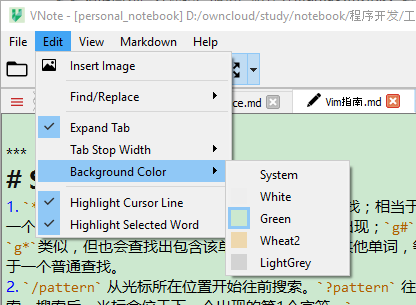
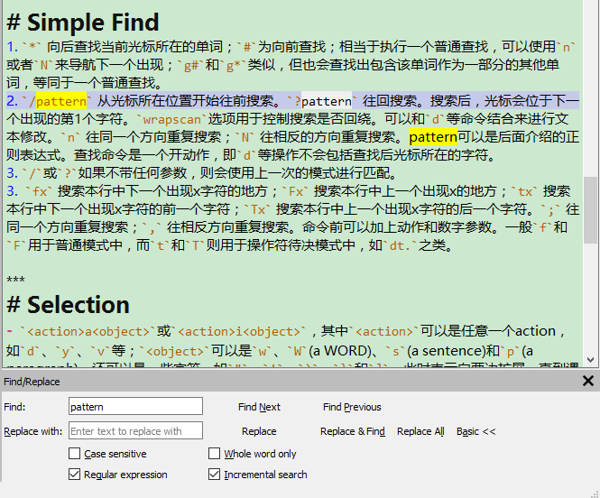

# VNote
**VNote** is a Vim-inspired note-taking application, designed specially for **Markdown**.

**VNote** 是一个受Vim启发开发的专门为 **Markdown** 而优化、设计的笔记软件。


***
# Downloads (下载)
You could download stable tagged releases or latest rolling build.

VNote提供定期释出的稳定版本，以及总是保持最新的滚(wen)动(ding)构建版本。

## Windows


- Tagged releases: [Github Release](https://github.com/tamlok/vnote/releases)
- Rolling build: [AppVeyor Artifacts](https://ci.appveyor.com/project/tamlok/vnote/build/artifacts)


- 稳定版本: [Github Release](https://github.com/tamlok/vnote/releases)
- 滚动构建版本: [AppVeyor Artifacts](https://ci.appveyor.com/project/tamlok/vnote/build/artifacts)


## Linux
[](https://travis-ci.org/tamlok/vnote)

**NOT** ready yet! Please help yourself to compile and build it from sources.

## MacOS

***
# Description (简介)
**VNote** is a Qt-based, free and open source note-taking application, focusing on Markdown. VNote is designed to provide comfortable edit experience.

Utilizing Qt, VNote could run on **Linux**, **Windows** and MacOS (not tested yet). Android support will be on the road soon.

**VNote**是一个基于Qt框架的、免费的开源笔记软件。VNote专注于Markdown的编辑与阅读，以提供舒适的编辑体验为设计目标。

基于Qt框架，VNote能够在主流操作系统上运行，包括 **Linux**, **Windows** 以及MacOS（未测试）。Android客户端目前也在开发计划内，敬请期待。


***
# Support (支持)
- [Github Issues](https://github.com/tamlok/vnote/issues)
- Email: tamlokveer at gmail.com
- QQ群: **487756074** (VNote使用和开发)

***
# Why VNote (开发VNote的动机)
## Markdown Editor & Note-Taking (Markdown编辑器与笔记管理)
VNote tries to be a Markdown editor with notes management, or a note-taking application with pleasant Markdown support.

Some popular note-taking applications provide Markdown support, such as WizNote, Youdao Note. But most of them provide poor Markdown experience (especially on Linux).

There are always many powerful Markdown editors. But most of them lack the functionality to manage all your notes. During the design and implementation, VNote references to [CuteMarked](https://github.com/cloose/CuteMarkEd/) a lot.

VNote设计为带有笔记管理功能的Markdown编辑器，或者有良好Markdown支持的笔记软件。

目前一些流行的笔记软件也提供Markdown的支持，比如为知笔记、有道云笔记等，但是大多数都只是简(liao)单(sheng)支(yu)持(wu)，特别是在Linux平台上更是体(can)验(bu)不(ren)佳(du)。

当然，目前也有很多非常强大的专注于Markdown的编辑器。但是，大多数都不会提供笔记管理功能（作为一个编辑器，也没有必要提供），或者只是提供一个简单的文件系统浏览器。其中，CuteMarked就是一个流行的Markdown编辑器之一，VNote在实现的过程中也在很多地方参考借鉴了该软件。

## Pleasant Markdown Experience (舒适的Markdown体验)
VNote tries to minimize the gap between the edit and view of Markdown. Instead of using two panels to edit and preview simultaneously, VNote utilizes syntax highlight to help keeping track of the content. VNote also preview images in place when editing. It is said that you won't want to exit the edit mode when using VNote.

VNote also learns a lot from Vim and Shell to provide many convenient and efficient shortcuts. VNote does not provide a pure Vim mode because it is likely that users will edit sequentially when writting notes, which is different from coding.

VNote尝试尽量减小Markdown与生俱来的编辑和阅读之间的割裂感。目前很多编辑器通过左右两栏来同时编辑和预览Markdown，但是编辑和阅读还是割裂明显。VNote利用准确有意义的语法高亮来帮助用户追踪、辨认笔记内容，使得Markdown在编辑的时候也能和阅读一样提供良好的视觉、排版效果。同时，VNote支持编辑时原地预览图片，进一步减小割裂感。使用VNote后，你一定会更想留在编辑模式。

另外，VNote也借鉴了Vim和Shell来提供很多非常方便高效的快捷键。VNote目前没有提供真正的Vim模式，这是因为和编写代码不一样，在编辑笔记的时候用户一般都是顺序编写的。

***
# Features (功能)
## Notebook-Based Notes Management (基于笔记本的管理)
VNote uses **notebooks** to hold your notes. Like OneNote, a notebook can be hosted on any location in your system. A notebook is designed to represent one account. For example, you could have one notebook hosted on local file system and another notebook hosted on an OwnCloud server. This is really useful when notes require different levels of security.

A notebook corresponds to a self-contained folder in the file system. You could copy the folder to another location (or on another computer) and import it into VNote.

A notebook could have infinite levels of directories. VNote supports copying or moving directories or notes within or between notebooks.

VNote使用 **笔记本** 来管理笔记。类似于OneNote，一个笔记本可以保存在系统上的任意位置。一个笔记本对应于一个账户的概念。例如，你可以在本地文件系统上有一个笔记本，另外在某台OwnCloud服务器上保存另一个笔记本。当不同的笔记有不同的保密要求时，独立的笔记本就非常适用了。

一个笔记本对应于文件系统上的一个独立完整的文件夹。你可以将该文件夹拷贝到其他位置（或者另一台计算机上），然后将其导入到VNote中。

VNote支持一个笔记本中包含无限层级的文件夹。VNote支持在笔记本内或笔记本间拷贝或剪切文件夹和笔记。


## Simple Notes Management (直观的笔记管理)
All your notes are managed by a plaintext configuration files and stored as plaintext files. You could access your notes without VNote. You could use external file synchronization services to synchronize your notes and import them on another machine.

VNote supports both Markdown (suffix `md`) and rich text notes.

所有笔记被保存为纯文本而且通过纯文本的配置文件进行管理。即使没有VNote，你也能方便访问你的数据。这样，你也可以使用第三方的文件同步服务来同步你的笔记，并在另一台计算机上导入到VNote中。

VNote支持Markdown和富文本笔记，其中Markdown笔记必须以`md`为后缀名。

## Minimum Gap Between Edit and View (最小化编辑与阅读的鸿沟)
VNote tries to provide the best-effort *WYSIWYG* for Markdown by utilizing proper syntax highlight and other features.

通过使用有意义的语法高亮和其他一些功能，VNote尽可能为Markdown提供 *所见即所得* 的体验。

### Syntax Highlight (语法高亮)
VNote supports accurate syntax highlight for Markdown. Tuning the style of the highlight, VNote enable you to keep track of your document easily.

VNote支持精确的Markdown语法高亮。通过精心调试的高亮样式，VNote使得你能够轻松跟踪和阅读你的文档。


### Live Image Preview (实时图片预览)
VNote supports previewing the image link while editing. With this, you could just stay in edit mode as much as possible.

You could select the image to copy it.

VNote支持在编辑时预览图片链接。这样一来，你就能尽可能地留在编辑模式，避免频繁切换。

如果想要拷贝图片，可以选取该图片，然后复制。


### Pleasant Image Experience (良好的图片体验)
Just paste your image into the Markdown note, VNote will manage all other stuffs. VNote stores images in the `images` folder in the same directory with the note. VNote will pop up a window to preview the image when you insert an image. Furthermore, VNote will delete the image file automatically after you remove the image link.

编辑时，支持像其他富文本编辑器一样直接粘贴插入图片，VNote会帮你管理所插入的图片。VNote将这些图片保存在和笔记同一目录下的 `images` 子目录中。插入图片时，VNote会弹出一个窗口预览即将要插入的图片。另外，当你移除笔记中的图片链接时，VNote会自动删除对应的图片。


### Interactive Outline Viewer for Edit and View Mode (编辑和阅读时交互式大纲视图)
VNote provides a user-friendly outline viewer for both edit and view mode. The outline viewer is a responsive item tree instead of a segment of HTML.

VNote为编辑和预览模式都提供了一个用户友好的大纲视图。该大纲视图是一个项目树，而不是简单地插入一段HTML。


### Edit and View Synchronization (同步编辑与阅读模式)
Lose where you are while alternating between edit and view mode? VNote will locate to the same section after toggling edit or view mode to help keep track of where you are.

切换编辑或阅读模式后，经常找不到原来的位置？在切换编辑或阅读模式后，VNote会定位到同一个小节下面，帮助你快速定位到原来所在的位置。

## Powerful Shortcuts (强大的快捷键)
VNote supports many pleasant shortcuts which facilitate your editing.

Some Examples:

- `Ctrl+W` to enter edit mode; `Ctrl+R` to save and enter read mode; `Ctrl+E` to maximize edit area;
- `Ctrl+D` to enter a simple Vim mode temporarily (such as `hjkl` to move the cursor);
- `Ctrl+B`, `Ctrl+I`, `Ctrl+O` to insert bold, italic and inline-code texts.

VNote提供很多快捷键，从而提供一个愉悦的编辑体验。

一些例子：

- `Ctrl+W` 进入编辑模式；`Ctrl+R` 保存并进入阅读模式；`Ctrl+E` 最大化编辑区；
- `Ctrl+D` 进入暂时Vim模式（比如支持`hjkl`移动光标）；
- `Ctrl+B`, `Ctrl+I`, `Ctrl+O` 插入粗体、斜体和行内代码。

## Window Split (窗口分割)
VNote supports infinite horizontal window split, facilitating notes management and writing.

VNote支持无限水平窗口分割，方便你进行笔记的整理和撰写。


## Highly Configurable (高度可定制)
In VNote, almost everything is configurable, such as background color, font, and Markdown style. VNote uses a plaintext file to record all your configuration, so you could just copy that file to initialize a new VNote on another computer.

VNote中，几乎一切都是可以定制的，例如背景颜色、字体以及Markdown样式等。VNote使用一个纯文本文件来记录你的所有配置，因此通过拷贝该文件就能够很快地在另一台电脑上初始化一个新的VNote。



## Others (其他)
VNote also support many other features, like:

- Highlight current cursor line;
- Highlight selected text;
- Powerful search within note;

VNote还支持其他很多的功能，比如：

- 高亮当前行；
- 高亮所选择的文本；
- 强大的页内查找；



***
# Build & Development (构建与开发)
## Clone & Init (克隆代码仓库)
```
git clone https://github.com/tamlok/vnote.git vnote.git
cd vnote.git
git submodule update --init
```

## Download Qt & Have Fun (下载Qt)
Download [Qt 5.7.0](http://info.qt.io/download-qt-for-application-development) and open `VNote.pro` as a project.

下载[Qt 5.7.0](http://info.qt.io/download-qt-for-application-development)，导入`VNote.pro`创建一个工程。

### Linux Command Line (Linux命令行)
If you prefer command line on Linux, you could follow these steps.

```
cd vnote.git
mkdir build
cd build
# May need to use the qmake in your downloaded Qt.
qmake ../VNote.pro
make
sudo make install
```

***
# Dependencies (依赖)
- [Qt 5.7](http://qt-project.org) (L-GPL v3)
- [PEG Markdown Highlight](http://hasseg.org/peg-markdown-highlight/) (MIT License)
- [Hoedown 3.0.7](https://github.com/hoedown/hoedown/) (ISC License)
- [Marked](https://github.com/chjj/marked) (MIT License)
- [Highlight.js](https://github.com/isagalaev/highlight.js/) (BSD License)
- [Ionicons 2.0.1](https://github.com/driftyco/ionicons/) (MIT License)

***
# License (代码许可)
VNote is licensed under the [MIT license](http://opensource.org/licenses/MIT).

