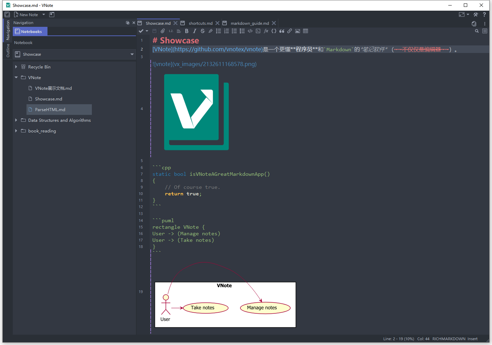

# vnote
  

A pleasant note-taking platform.

> At early 2019, I decided to refactor VNote as VNoteX. Now a fresh VNote is ready!  
> VNoteX is closed source and is intended to keep several premium features compared to VNote. Most of VNoteX's code base will be open source as VNote 3.0, so VNote will share most of the code base with VNoteX and continue to be open source from 3.0.  
> **Welcome to VNoteX and VNote 3.0!**

**ATTENTION**:

* The notebook format of VNote 3.0 is not compatible with that of earlier versions of VNote. Feel free to decide the right time to jump to VNote 3.0.
* Features supported by VNote 3.0 now is NOT on par with VNote 2.0. The [migration](https://github.com/vnotex/vnote/projects/1) takes time.

The obsolete code base of VNote 2.0 is available at the [vnote2.0](https://github.com/vnotex/vnote/tree/vnote2.0) branch.

For more information, please visit [**VNote's Homepage**](https://vnotex.github.io/vnote).

## Description
**VNote** is a Qt-based, free and open source note-taking application, focusing on Markdown now. VNote is designed to provide a pleasant note-taking platform with excellent editing experience.

VNote is **NOT** just a simple editor for Markdown. By providing notes management, VNote makes taking notes in Markdown simpler. In the future, VNote will support more formats besides Markdown.

Utilizing Qt, VNote could run on **Linux**, **Windows**, and **macOS**.

## Downloads
Continuous builds on `master` branch could be found at the [Continuous Build](https://github.com/vnotex/vnote/releases/tag/continuous-build) release.

Latest stable builds could be found at the [latest release](https://github.com/vnotex/vnote/releases/latest). Alternative download services are available:

* [Tianyi Netdisk](https://cloud.189.cn/t/Av67NvmEJVBv)

## Supports
* [GitHub Issues](https://github.com/vnotex/vnote/issues);
* Email: `tamlokveer at gmail.com`;
* [Slack](https://join.slack.com/t/vnote/shared_invite/enQtNDg2MzY0NDg3NzI4LTVhMzBlOTY0YzVhMmQyMTFmZDdhY2M3MDQxYTBjOTA2Y2IxOGRiZjg2NzdhMjkzYmUyY2VkMWJlZTNhMTQyODU);
* [Telegram](https://t.me/vnotex);
* WeChat Public Account: vnotex;

## Donate
You could help VNote's development in many ways.

* Keep monitoring VNote and sending feedback for improvement.
* Spread and promote VNote to your friends. Popularity is a strong power to drive developers.
* Participate in the development of VNote and send [Pull Request](https://github.com/vnotex/vnote/pulls) to make VNote perfect.
* Last, really appreciate your donations to VNote if VNote does help.

**PayPal**: [PayPal.Me/vnotemd](https://www.paypal.me/vnotemd)

**Alipay**: `tamlokveer@gmail.com`

**WeChat**

Thank [users who donated to VNote](https://github.com/vnotex/vnote/wiki/Donate-List)!

## License
VNote is licensed under [GNU LGPLv3](https://opensource.org/licenses/LGPL-3.0). Code base of VNote could be used freely by VNoteX.
