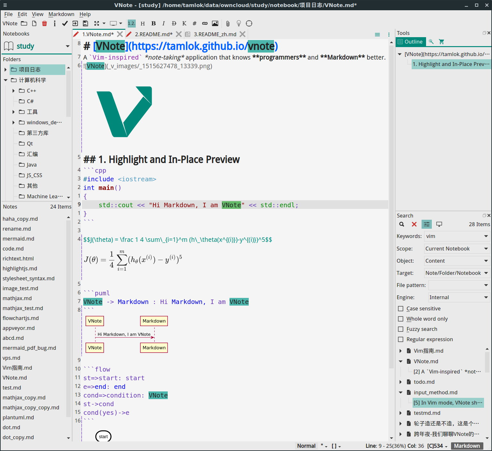
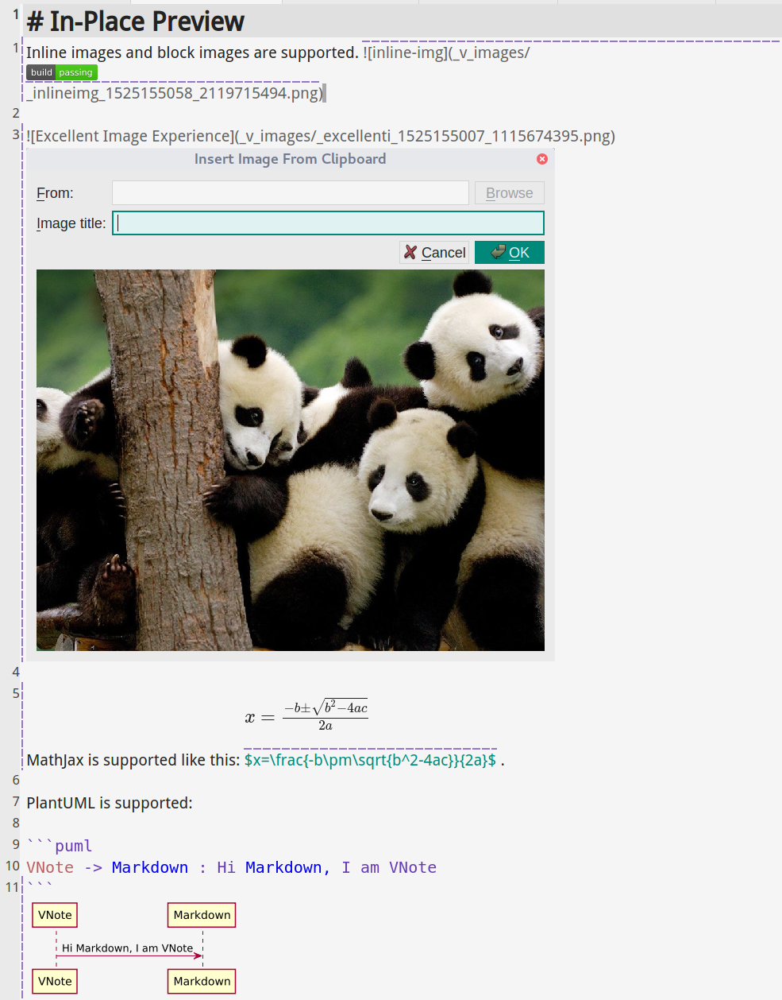

# VNote
[中文 Chinese](./README_zh.md) | [日本語 Japanese](./README_ja.md)

**VNote is a note-taking application that knows programmers and Markdown better.**

For more information, please visit [**VNote's Homepage**](https://tamlok.github.io/vnote).

Check this [showcase screencast](https://www.youtube.com/watch?v=EFCmCFZKxJ4) to know what you could do with VNote!


# Downloads
Users from China can download the latest release of VNote from [Tianyi Netdisk](https://cloud.189.cn/t/Av67NvmEJVBv).

## Windows
### Official Zip


- [Github releases](https://github.com/tamlok/vnote/releases)
- Latest builds on master: [  ](https://bintray.com/tamlok/vnote/vnote/_latestVersion)

**NOT** supported in XP since QtWebEngineProcess used by VNote could not work in XP.

### Scoop
VNote can be installed from `extras` bucket of Scoop.

```shell
scoop bucket add extras
scoop install vnote
scoop update vnote
```

## Linux
### AppImage
[](https://travis-ci.org/tamlok/vnote)

There is an AppImage format standalone executable of VNote for major Linux distributions. **Any help for packaging and distribution on Linux is appreciated!**

- [Github releases](https://github.com/tamlok/vnote/releases)
- Latest builds on master: [  ](https://bintray.com/tamlok/vnote/vnote/_latestVersion)

### openSUSE
Currently `vnote` on openSUSE Tumbleweed can be installed from `home:opensuse_zh` project on OBS. You can execute the following command directly:

```shell
sudo zypper ar https://download.opensuse.org/repositories/home:/opensuse_zh/openSUSE_Tumbleweed/ home:opensuse_zh
sudo zypper ref
sudo zypper in vnote
```

For other architectures, please search for `vnote` at [software.opensuse.org](https://software.opensuse.org).

We don't support Leap 42 and below due to the Qt version. Please use AppImage or build it yourself.

### Arch Linux
VNote on Arch Linux can be installed from the AUR as [vnote](https://aur.archlinux.org/packages/vnote-bin/):

```shell
git clone https://aur.archlinux.org/vnote-bin.git
cd vnote-bin
makepkg -sic
```

There is also a development version that tracks the latest master [vnote-git](https://aur.archlinux.org/packages/vnote-git/).

### NixOS
Thank @kuznero for packaging VNote in NixOS. It should be available in `unstable` and `unstable-small` channels.

## MacOS
[](https://travis-ci.org/tamlok/vnote)

- [Github releases](https://github.com/tamlok/vnote/releases)
- Latest builds on master: [  ](https://bintray.com/tamlok/vnote/vnote/_latestVersion)

You can also install VNote using homebrew, through the cask tap:

```shell
brew cask install vnote
```

# Description
**VNote** is a Qt-based, free and open source note-taking application, focusing on Markdown. VNote is designed to provide a comfortable editing experience, especially for programmers.

VNote is **NOT** just a simple editor for Markdown. By providing notes management, VNote makes taking notes in Markdown simpler and more pleasant.

Utilizing Qt, VNote could run on **Linux**, **Windows**, and **macOS**.



# Supports
- [Github issues](https://github.com/tamlok/vnote/issues);
- Email: `tamlokveer at gmail.com`;
- [Slack](https://join.slack.com/t/vnote/shared_invite/enQtNDg2MzY0NDg3NzI4LTVhMzBlOTY0YzVhMmQyMTFmZDdhY2M3MDQxYTBjOTA2Y2IxOGRiZjg2NzdhMjkzYmUyY2VkMWJlZTNhMTQyODU);
- [Telegram](https://t.me/vnotex);
- WeChat Public Account: VNote笔记 (vnote_md);  


# Highlights
- Powerful **full-text search**;
- **Universal Entry** to reach anything just by typing;
- Inserting images directly from clipboard;
- Syntax highlights of fenced code blocks in both **edit** and **read** mode;
- Powerful **In-Place Preview** for images, diagrams, and formulas;
- Side-by-side live preview for diagrams;
- Outline in both edit and read mode;
- Custom styles in both edit and read mode;
- **Vim** mode and a set of powerful shortcuts;
- Infinite levels of folders;
- Multiple tabs and splitting windows;
- [Mermaid](http://knsv.github.io/mermaid/), [Flowchart.js](http://flowchart.js.org/), [MathJax](https://www.mathjax.org/), [PlantUML](http://plantuml.com/), and [Graphviz](http://www.graphviz.org/);
- Supports HiDPI;
- Attachments of notes;
- Themes and dark mode;
- Rich and extensible export, such as HTML, PDF, PDF (All In One), and images;
- GitHub and WeChat image hosting;

# Donate
You could help VNote's development in many ways.

- Keep monitoring VNote and sending feedback for improvement.
- Spread and promote VNote to your friends. Popularity is a strong power to drive developers.
- Participate in the development of VNote and send PullRequest to make VNote perfect.
- Last, really appreciate your donate to VNote if you think VNote really helps you and you want to help VNote.

**PayPal**: [PayPal.Me/vnotemd](https://www.paypal.me/vnotemd)

**Alipay**: `tamlokveer@gmail.com`


**WeChat**


Thank [users who donated to VNote](https://github.com/tamlok/vnote/wiki/Donate-List)!

# Why VNote
## Markdown Editor & Notes Management
VNote tries to be a powerful Markdown editor with notes management, or a note-taking application with pleasant Markdown support. If you are a fan of Markdown and enjoy writing Markdown notes for study, work, and life, VNote is the right tool for you.

## Pleasant Markdown Experience
### Insights About Markdown
Markdown, as a simple mark language, unlike rich text, was born with a **gap between edit and read**. There are about three ways to handle this gap:

1. As one extreme, some editors just treat Markdown as **plain text**. Users may lose themselves in the messy black characters. It is hard to keep track of the information of the note.
2. Most Markdown editors use two panels to **edit and preview Markdown notes simultaneously**. It makes things easier since users could see a pleasant typesetting and layout while editing the text. However, two panels may occupy the whole screen and users keep moving eyes left and right which will be a big distraction.
3. As another extreme, some editors convert the Markdown elements in place immediately after the typing, which makes editing Markdown just like editing rich text document in Word.

Since most editors choose the second way to handle the gap, people always think of preview when it comes to Markdown. It may be a misunderstanding about Markdown. Designed as a simple mark language, Markdown is intended to help to keep track of the information of the text when editing and provide a beautiful typesetting when reading after being converted to HTML.

### Tradeoff: VNote's Way
VNote tries to minimize the gap and provide the best-effort *WYSIWYG* for Markdown via tuned **syntax highlights** and some other features. By helping to keep track of the content, there is no need to preview or alter the text immediately after being typed.

# Features
## Notebook-Based Notes Management
VNote uses **notebooks** to hold your notes. Like OneNote, a notebook can be hosted on any location on your system. A notebook is designed to represent one account. For example, you could have one notebook hosted on local file system and another notebook hosted on an OwnCloud server. This is really useful when notes require different levels of security.

A notebook corresponds to a self-contained folder (called the *Root Folder* of the notebook) in the file system. You could copy the folder to another location (or on another computer) and import it into VNote.

A notebook could have infinite levels of folders. VNote supports copying or moving folders or notes within or between notebooks.

## Simple Notes Management
All your notes are managed by some plaintext configuration files and stored as plaintext files. You could access your notes without VNote. You could use external file synchronization services to synchronize your notes and import them on another machine.

VNote supports both Markdown (suffix `md`) and rich text notes.

## Syntax Highlight
VNote supports accurate syntax highlight for Markdown. Tuning the style of the highlight, VNote enables you to keep track of your document easily.

VNote also supports **syntax highlight for fenced code blocks** in edit mode in Markdown, which is **superior** than almost all current Markdown editors.


## In-Place Preview
VNote supports powerful **in-place preview** for images, diagrams, and formulas in edit mode.



## Pleasant Image Experience
Just paste your image into the Markdown note, VNote will manage all other stuffs. VNote stores images in a specified folder in the same folder with the note. VNote will pop up a window to preview the image when you insert an image. Furthermore, VNote will delete the useless image files automatically after you remove the image links.

## Universal Entry & Full-Text Search
VNote has powerful built-in full-text search with **Regular Expression** and **Fuzzy Search** support. The search could be executed within all notebooks, current notebook, or current folder, targeted at name or content.

Like the `CtrlP` in Vim, VNote supports **Universal Entry** to reach anything by typing in a simple input.


## Interactive Outline Viewer In Read & Edit Mode
VNote provides a user-friendly outline viewer for both edit and view mode. The outline viewer is a responsive item tree instead of a segment of HTML.

## Powerful Shortcuts
VNote supports many pleasant and powerful shortcuts which facilitate your editing, including **Vim Mode**, **Captain Mode**, and **Navigation Mode** which enable you to work without the mouse.

Please refer to the [shortcuts help](src/resources/docs/shortcuts_en.md) in the help menu for more details.

## Highly Configurable
In VNote, almost everything is configurable, such as background color, font, and Markdown style. VNote uses a plaintext file to record all your configuration, so you could just copy that file to initialize a new VNote on another computer.

# Dependencies
- [Qt 5.9](http://qt-project.org) (L-GPL v3)
- [PEG Markdown Highlight](http://hasseg.org/peg-markdown-highlight/) (MIT License)
- [Hoedown 3.0.7](https://github.com/hoedown/hoedown/) (ISC License)
- [Marked 0.5.1](https://github.com/markedjs/marked) (MIT License)
- [Highlight.js](https://github.com/isagalaev/highlight.js/) (BSD License)
- [Ionicons 2.0.1](https://github.com/driftyco/ionicons/) (MIT License)
- [markdown-it 8.3.1](https://github.com/markdown-it/markdown-it) (MIT License)
- [markdown-it-headinganchor 1.3.0](https://github.com/adam-p/markdown-it-headinganchor) (MIT License)
- [markdown-it-task-lists 1.4.0](https://github.com/revin/markdown-it-task-lists) (ISC License)
- [markdown-it-footnote](https://github.com/markdown-it/markdown-it-footnote) (MIT License)
- [markdown-it-sub](https://github.com/markdown-it/markdown-it-sub) (MIT License)
- [markdown-it-sup](https://github.com/markdown-it/markdown-it-sup) (MIT License)
- [markdown-it-front-matter](https://github.com/craigdmckenna/markdown-it-front-matter) (MIT License)
- [markdown-it-imsize](https://github.com/tatsy/markdown-it-imsize) (Unknown) (Thanks @Kinka for help)
- [markdown-it-emoji](https://github.com/markdown-it/markdown-it-emoji) (MIT License)
- [markdown-it-texmath](https://github.com/goessner/markdown-it-texmath) (MIT License)
- [markdown-it-container 2.0.0](https://github.com/markdown-it/markdown-it-container) (MIT License)
- [mermaid 7.0.0](https://github.com/knsv/mermaid) (MIT License)
- [MathJax](https://www.mathjax.org/) (Apache-2.0)
- [showdown](https://github.com/showdownjs/showdown) (MIT License)
- [flowchart.js](https://github.com/adrai/flowchart.js) (MIT License)
- [PlantUML](http://plantuml.com/) (MIT License)
- [dom-to-image](https://github.com/tsayen/dom-to-image) (MIT License)
- [turndown](https://github.com/domchristie/turndown) (MIT License)

# License
VNote is licensed under the [MIT license](http://opensource.org/licenses/MIT).
