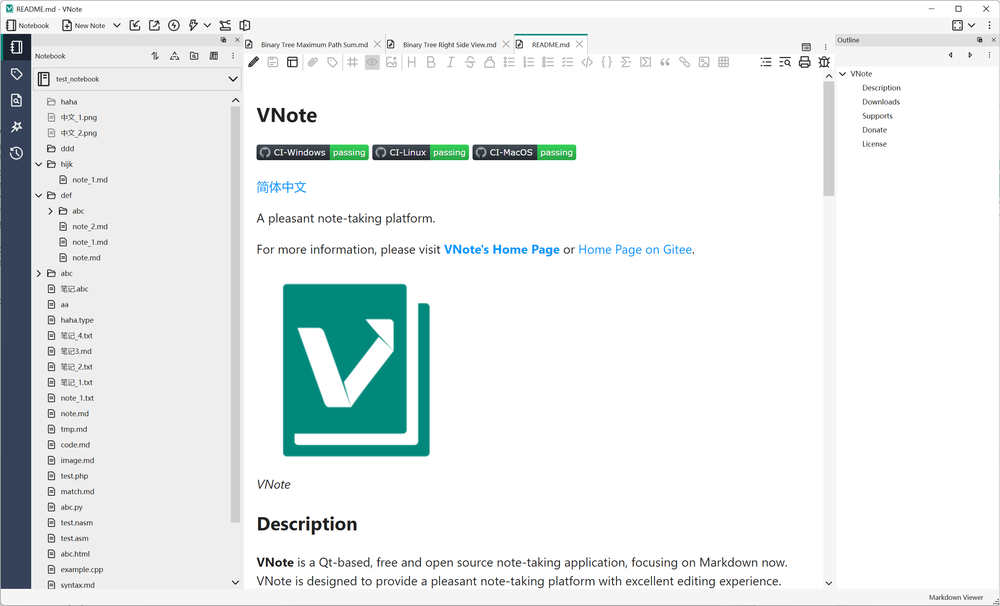

# VNote
  

[简体中文](README_zh_CN.md)

A pleasant note-taking platform.

For more information, please visit [**VNote's Home Page**](https://vnotex.github.io/vnote) or [Home Page on Gitee](https://tamlok.gitee.io/vnote).

## Description
**VNote** is a Qt-based, free and open source note-taking application, focusing on Markdown now. VNote is designed to provide a pleasant note-taking platform with excellent editing experience.

VNote is **NOT** just a simple editor for Markdown. By providing notes management, VNote makes taking notes in Markdown simpler. In the future, VNote will support more formats besides Markdown.

Utilizing Qt, VNote could run on **Linux**, **Windows**, and **macOS**.

## Downloads
Continuous builds on `master` branch could be found at the [Continuous Build](https://github.com/vnotex/vnote/releases/tag/continuous-build) release.

Latest stable builds could be found at the [latest release](https://github.com/vnotex/vnote/releases/latest). Alternative download services are available:

* [Tianyi Netdisk](https://cloud.189.cn/t/Av67NvmEJVBv)
* [Baidu Netdisk](https://pan.baidu.com/s/1Fou1flmBsQUQ8Qs9V_M6Aw) with the code `note`

## Supports
* [GitHub Issues](https://github.com/vnotex/vnote/issues);
* Email: `tamlokveer at gmail.com`;
* [Slack](https://join.slack.com/t/vnote/shared_invite/enQtNDg2MzY0NDg3NzI4LTVhMzBlOTY0YzVhMmQyMTFmZDdhY2M3MDQxYTBjOTA2Y2IxOGRiZjg2NzdhMjkzYmUyY2VkMWJlZTNhMTQyODU);
* [Telegram](https://t.me/vnotex);
* WeChat Public Account: vnotex;

## Donate
You could help VNote's development in many ways.

* Keep monitoring VNote and sending feedback for improvement.
* Spread and promote VNote to your friends. Popularity is a strong power to drive developers.
* Participate in the development of VNote and send [Pull Request](https://github.com/vnotex/vnote/pulls) to make VNote perfect.
* Last, really appreciate your donations to VNote if VNote does help.

**PayPal**: [PayPal.Me/vnotemd](https://www.paypal.me/vnotemd)

**Alipay**: `tamlokveer@gmail.com`

**WeChat**

Thank [users who donated to VNote](https://github.com/vnotex/vnote/wiki/Donate-List)!

## License
VNote is licensed under [GNU LGPLv3](https://opensource.org/licenses/LGPL-3.0). Code base of VNote could be used freely by VNoteX.
