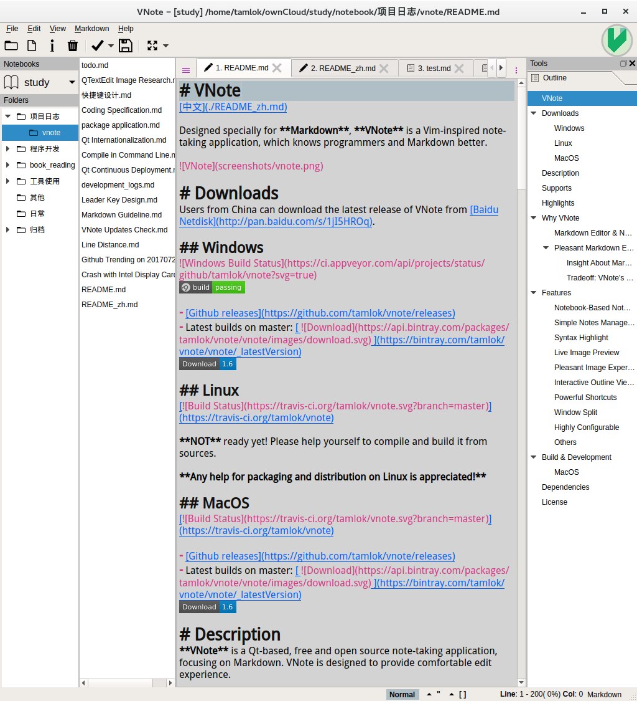
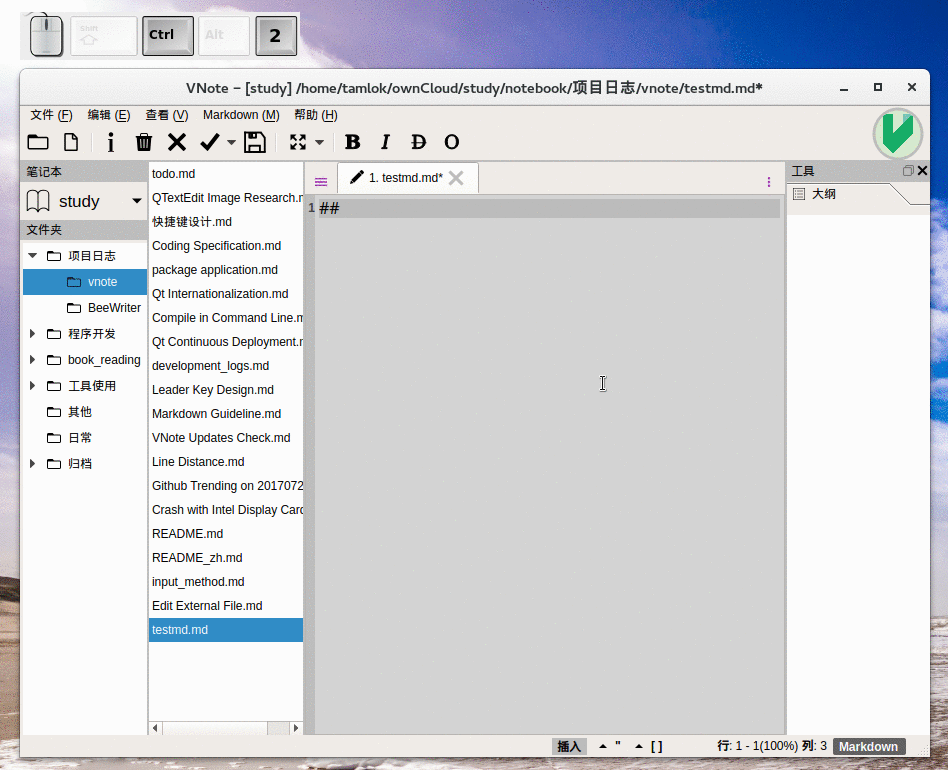
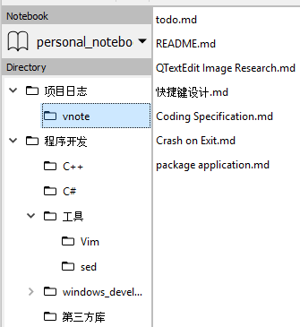
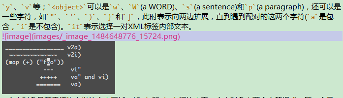
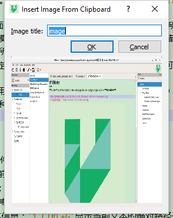
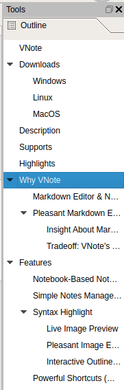
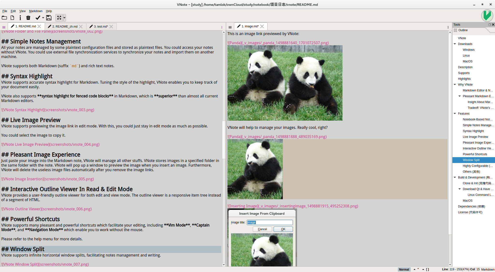

# VNote
[中文](./README_zh.md)

Designed specially for **Markdown**, **VNote** is a Vim-inspired note-taking application, which knows programmers and Markdown better.


# Downloads
Users from China can download the latest release of VNote from [Baidu Netdisk](http://pan.baidu.com/s/1jI5HROq).

## Windows


- [Github releases](https://github.com/tamlok/vnote/releases)
- Latest builds on master: [  ](https://bintray.com/tamlok/vnote/vnote/_latestVersion)

**NOT** supported in XP since QtWebEngineProcess used by VNote could not work in XP.

## Linux
[](https://travis-ci.org/tamlok/vnote)

There is an AppImage format standalone executable of VNote for major Linux distributions. **Any help for packaging and distribution on Linux is appreciated!**

- [Github releases](https://github.com/tamlok/vnote/releases)
- Latest builds on master: [  ](https://bintray.com/tamlok/vnote/vnote/_latestVersion)

## MacOS
[](https://travis-ci.org/tamlok/vnote)

- [Github releases](https://github.com/tamlok/vnote/releases)
- Latest builds on master: [  ](https://bintray.com/tamlok/vnote/vnote/_latestVersion)

# Description
**VNote** is a Qt-based, free and open source note-taking application, focusing on Markdown. VNote is designed to provide comfortable edit experience.

VNote is **NOT** just a simple editor for Markdown. By providing notes management, VNote makes taking notes in Markdown simpler and more pleasant.

Utilizing Qt, VNote could run on **Linux**, **Windows**, and **macOS** (due to the quite different interaction logics on macOS, VNote is not fully tested on macOS and we need more feedbacks to help improving VNote).



# Supports
- [Github issues](https://github.com/tamlok/vnote/issues);
- Email: tamlokveer at gmail.com;
- QQ group: 487756074;  


# Highlights
- Supports inserting images directly from clipboard;
- Supports syntax highlights of fenced code blocks in both **edit** and **read** mode;
- Supports outline in both edit and read mode;
- Supports custom styles in both edit and read mode;
- Supports Vim mode and a set of powerful shortcuts;
- Supports infinite levels of folders;
- Supports multiple tabs and splitting windows;
- Supports [Mermaid](http://knsv.github.io/mermaid/), [Flowchart.js](http://flowchart.js.org/), and [MathJax](https://www.mathjax.org/);
- Supports HiDPI;
- Supports attachments of notes.



# Why VNote
## Markdown Editor & Notes Management
VNote tries to be a powerful Markdown editor with notes management, or a note-taking application with pleasant Markdown support. If you are a fan of Markdown and enjoy writing Markdown notes for study, work, and life, VNote is the right tool for you.

## Pleasant Markdown Experience
### Insight About Markdown
Markdown, as a simple mark language, unlike rich text, was born with a **gap between edit and read**. There are about three ways to handle this gap:

1. As one extreme, some editors just tread Markdown as **plain text**. Users may lose themselves in the messy black characters. It is hard to keep track of the information of the note.
2. Most Markdown editors use two panels to **edit and preview Markdown notes simultaneously**. It makes things easier since users could see a pleasant typesetting and layout while editing the text. However, two panels may occupy the whole screen and users keep moving eyes left and righti which will be a big distraction.
3. As another extreme, some editors convert the Markdown elements in place immediately after the typing, which makes editing Markdown just like editing rich text document in Word.

Since most editors choose the second way to handle the gap, people always think of preview when it comes to Markdown. It may be a misunderstanding about Markdown. Designed as a simple mark language, Markdown is intended to help to keep track of the information of the text when editing and provide a beautiful typesetting when reading after being converted to HTML.

### Tradeoff: VNote's Way
VNote tries to minimize the gap and provide the best-effort *WYSIWYG* for Markdown via tuned **syntax highlights** and some other features. By helping to keep track of the content, there is no need to preview or alter the text immediately after being typed.

# Features
## Notebook-Based Notes Management
VNote uses **notebooks** to hold your notes. Like OneNote, a notebook can be hosted on any location on your system. A notebook is designed to represent one account. For example, you could have one notebook hosted on local file system and another notebook hosted on an OwnCloud server. This is really useful when notes require different levels of security.

A notebook corresponds to a self-contained folder (called the *Root Folder* of the notebook) in the file system. You could copy the folder to another location (or on another computer) and import it into VNote.

A notebook could have infinite levels of folders. VNote supports copying or moving folders or notes within or between notebooks.



## Simple Notes Management
All your notes are managed by some plaintext configuration files and stored as plaintext files. You could access your notes without VNote. You could use external file synchronization services to synchronize your notes and import them on another machine.

VNote supports both Markdown (suffix `md`) and rich text notes.

## Syntax Highlight
VNote supports accurate syntax highlight for Markdown. Tuning the style of the highlight, VNote enables you to keep track of your document easily.

VNote also supports **syntax highlight for fenced code blocks** in edit mode in Markdown, which is **superior** than almost all current Markdown editors.


## Live Image Preview
VNote supports previewing the image link in edit mode. With this, you could just stay in edit mode as much as possible.

You could select the image to copy it.



## Pleasant Image Experience
Just paste your image into the Markdown note, VNote will manage all other stuffs. VNote stores images in a specified folder in the same folder with the note. VNote will pop up a window to preview the image when you insert an image. Furthermore, VNote will delete the useless image files automatically after you remove the image links.



## Interactive Outline Viewer In Read & Edit Mode
VNote provides a user-friendly outline viewer for both edit and view mode. The outline viewer is a responsive item tree instead of a segment of HTML.



## Powerful Shortcuts
VNote supports many pleasant and powerful shortcuts which facilitate your editing, including **Vim Mode**, **Captain Mode**, and **Navigation Mode** which enable you to work without the mouse.

Please refer to the [shortcuts help](src/resources/docs/shortcuts_en.md) in the help menu for more details.

## Window Split
VNote supports infinite horizontal window splits, facilitating notes management and writing.



## Highly Configurable
In VNote, almost everything is configurable, such as background color, font, and Markdown style. VNote uses a plaintext file to record all your configuration, so you could just copy that file to initialize a new VNote on another computer.

## Others
VNote also supports many other features, like:

- Highlight current cursor line;
- Highlight selected text;
- Powerful search within the note;
- Auto indent and auto list;

# Build & Development
VNote needs Qt 5.7 or above to build.

1. Clone & Init
    ```
    git clone https://github.com/tamlok/vnote.git vnote.git
    cd vnote.git
    git submodule update --init
    ```
2. Download Qt & Have Fun  
Download [Qt 5.7.0](http://info.qt.io/download-qt-for-application-development) and open `VNote.pro` as a project.

## Linux
If your distribution does not have Qt 5.7 or above, you need to add it from other sources. In Ubuntu, you could do this:

```
sudo add-apt-repository ppa:beineri/opt-qt571-trusty -y
sudo apt-get update -qq
sudo apt-get -y install qt57base qt57webengine qt57webchannel qt57svg qt57location qt57tools qt57translations
source /opt/qt*/bin/qt*-env.sh
```

After Qt and some necessary modules are ready, you could follow these steps to build VNote

```
cd vnote.git
mkdir build
cd build
qmake ../VNote.pro
make
sudo make install
```

For details, you could reference [.travis_linux.sh](.travis_linux.sh) in the source root.

## MacOS
If you prefer command line on macOS, you could follow these steps.

1. Install Xcode and Homebrew;
2. Install Qt5.7 via Homebrew:
    ```
    brew install qt@5.7
    ```
3. In the project directory, create `build_macos.sh` like this:
    ```sh
    QTDIR="/usr/local/opt/qt@5.7"
    PATH="$QTDIR/bin:$PATH"
    LDFLAGS=-L$QTDIR/lib
    CPPFLAGS=-I$QTDIR/include

    mkdir -p build
    cd build
    qmake -v
    qmake CONFIG-=debug CONFIG+=release ../VNote.pro
    make -j2
    ```
4. Make `build_macos.sh` executable and run it:
    ```sh
    chmod +x build_macos.sh
    ./build_macos.sh
    ```
5. Now you got the bundle `path/to/project/build/src/VNote.app`. Enjoy yourself!

# Dependencies
- [Qt 5.9](http://qt-project.org) (L-GPL v3)
- [PEG Markdown Highlight](http://hasseg.org/peg-markdown-highlight/) (MIT License)
- [Hoedown 3.0.7](https://github.com/hoedown/hoedown/) (ISC License)
- [Marked](https://github.com/chjj/marked) (MIT License)
- [Highlight.js](https://github.com/isagalaev/highlight.js/) (BSD License)
- [Ionicons 2.0.1](https://github.com/driftyco/ionicons/) (MIT License)
- [markdown-it 8.3.1](https://github.com/markdown-it/markdown-it) (MIT License)
- [markdown-it-headinganchor 1.3.0](https://github.com/adam-p/markdown-it-headinganchor) (MIT License)
- [markdown-it-task-lists 1.4.0](https://github.com/revin/markdown-it-task-lists) (ISC License)
- [mermaid 7.0.0](https://github.com/knsv/mermaid) (MIT License)
- [MathJax](https://www.mathjax.org/) (Apache-2.0)
- [showdown](https://github.com/showdownjs/showdown) (Unknown)
- [flowchart.js](https://github.com/adrai/flowchart.js) (MIT License)

# License
VNote is licensed under the [MIT license](http://opensource.org/licenses/MIT).
