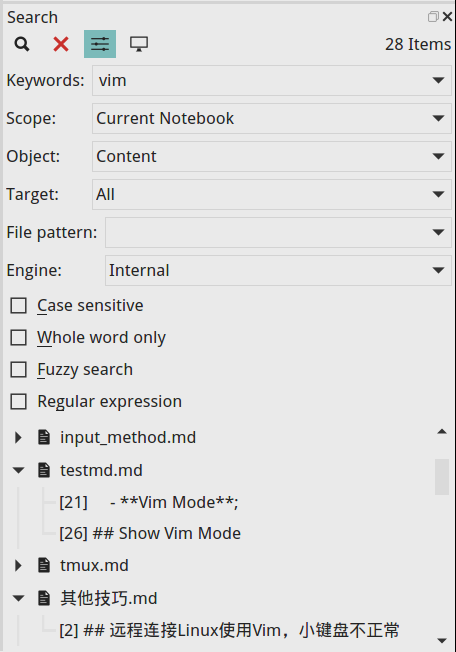

# VNote
[英文 English](./README.md)

[VNote主页](https://tamlok.github.io/vnote)

[文档](http://vnote.readthedocs.io/en/latest/)

[使用截图](https://tamlok.github.io/vnote/gallery.html)

**VNote** 是一个受Vim启发开发的专门为 **Markdown** 而优化、设计的笔记软件。VNote是一个更了解程序员和Markdown的笔记软件。


# 下载
国内的用户可以尝试在[百度云盘](http://pan.baidu.com/s/1jI5HROq)下载VNote的最新发行版本。

## Windows


- [Github releases](https://github.com/tamlok/vnote/releases)
- master分支的最新构建：[  ](https://bintray.com/tamlok/vnote/vnote/_latestVersion)

VNote不支持**XP**，因为QtWebEngineProcess无法在XP上运行。

## Linux

### AppImage
[](https://travis-ci.org/tamlok/vnote)

VNote当前为主要Linux发行版提供了一个AppImage格式的独立可执行文件。希望了解Linux系统下打包发布的开发人员能提供这方面进一步的帮助！

- [Github releases](https://github.com/tamlok/vnote/releases)
- master分支的最新构建：[  ](https://bintray.com/tamlok/vnote/vnote/_latestVersion)

### openSUSE
目前 openSUSE Tumbleweed 可以通过 OBS 上的 `home:opensuse_zh` 源直接安装。您可以直接执行以下命令：

```shell
sudo zypper ar https://download.opensuse.org/repositories/home:/opensuse_zh/openSUSE_Tumbleweed/ home:opensuse_zh
sudo zypper ref
sudo zypper in vnote
```

其他架构请直接在 [software.opensuse.org](https://software.opensuse.org) 搜索 `vnote`。

由于 Leap 42 及以下版本的 Qt 版本过低，我们无法在 OBS 上进行打包。请使用 AppImage 或自行构建。

### Arch Linux
Arch Linux可以通过AUR中的 [vnote](https://aur.archlinux.org/packages/vnote/) 进行安装：

```shell
git clone https://aur.archlinux.org/vnote.git
cd vnote
makepkg -sic
```

AUR也提供一个和最新master分支同步的开发版本 [vnote-git](https://aur.archlinux.org/packages/vnote-git/) 。

## MacOS
[](https://travis-ci.org/tamlok/vnote)

- [Github releases](https://github.com/tamlok/vnote/releases)
- master分支的最新构建：[  ](https://bintray.com/tamlok/vnote/vnote/_latestVersion)

也可以通过 homebrew cask 进行安装：

```shell
brew cask install vnote
```

# 简介

**VNote**是一个基于Qt框架的、免费的开源笔记软件。VNote专注于Markdown的编辑与阅读，以提供舒适的编辑体验为设计目标。

VNote不是一个简单的Markdown编辑器。通过提供笔记管理功能，VNote使得编写Markdown笔记更简单和舒适！

基于Qt框架，VNote能够在主流操作系统上运行，包括 **Linux**, **Windows** 以及 **macOS** 。


# 支持
- [Github issues](https://github.com/tamlok/vnote/issues)；
- 邮箱: tamlokveer at gmail.com；
- 微信公众号: VNote笔记（vnote_md）；  


# 亮点
- 强大的**全文搜索**；
- **通用入口**，通过按键操控一切；
- 直接从剪切板插入图片；
- 编辑和阅读模式下代码块的语法高亮；
- 强大的**原地预览**，包括图片、图表和公式；
- 针对图表的两边实时预览；
- 编辑和阅读模式下的大纲；
- 自定义编辑和阅读模式的样式；
- Vim模式以及一系列强大的快捷键；
- 无限层级的文件夹；
- 多个标签页和窗口分割；
- [Mermaid](http://knsv.github.io/mermaid/)、 [Flowchart.js](http://flowchart.js.org/)、 [MathJax](https://www.mathjax.org/)、 [PlantUML](http://plantuml.com/) 和 [Graphviz](http://www.graphviz.org/)；
- 支持高分辨率；
- 笔记附件；
- 主题以及深色模式；
- 丰富、可扩展的导出，包括HTML、PDF、PDF（多合一）和图片；

# 捐赠
您可以通过很多途径帮助VNote的开发。

- 持续关注VNote并反馈。
- 向您的朋友们推广和传播VNote。普及度是驱动开发者的一股强大力量。
- 参与到VNote的开发中，发送PullRequest来帮助VNote变得更完美。
- 最后，如果您觉得VNote真的帮助到您并且想回馈VNote，非常感谢您的捐赠。
    - PayPal: [PayPal.Me/vnotemd](https://www.paypal.me/vnotemd)
    - 支付宝: `tamlokveer@gmail.com`  
    
    - 微信  
    

非常感谢这些对VNote的 [捐赠者](https://github.com/tamlok/vnote/wiki/Donate-List) !

# 开发VNote的动机
## Markdown编辑器与笔记管理
VNote设计为带有笔记管理功能的Markdown编辑器，或者有良好Markdown支持的笔记软件。如果您喜欢Markdown并经常在学习、工作和生活中使用Markdown记录笔记，那么VNote就是一个适合您的工具。

## 舒适的Markdown体验
### Markdown的本质
Markdown作为一个简单标记语言，不像富文本，它的编辑和阅读有着与生俱来的隔阂。一般目前大概有三类方法来处理这个隔阂：

1. 作为一个极端，一些编辑器只是将Markdown作为无格式的纯文本处理。用户很容易在密密麻麻的黑漆漆的一片文字中找不着方向。
2. 大部分编辑器使用两个面板来同时编辑和预览Markdown笔记。从而，用户可以在编辑的同时看到优美的排版和布局。但是，两个面板基本会占据了整个屏幕，而用户的目光焦点左右频繁移动，往往也会使得用户无法专注编辑。
3. 作为另一个极端，一些编辑器在用户输入文本后立即将Markdown的标记转换为HTML元素，使得编写Markdown如同在Word文档里面编写富文本一样。

由于几乎所有的编辑器都选择第二种方法来处理隔阂，一提到Markdown人们往往会想起预览。这可能是对Markdown的一个最大的误解了。设计为一个简单的标记语言，Markdown的设计初衷就是为了在编辑的时候方便帮助跟踪文本的信息，而又能在阅读的时候被转换为HTML为发布提供美观的排版输出。所以，Markdown本身就应该在编辑的时候能够方便地跟踪和掌控文本的信息和脉络，而不需要通过预览这种接近饮鸩止渴的方法来方便编辑。

### 折中：VNote的方案
VNote尝试通过精心调配的**语法高亮**和其他一些特性，来最大程度地减小Markdown的这种割裂感，尽可能地提供一个*所见即所得*的编辑体验。用户在编辑的时候就能有效第把握内容脉络，也就没有必要进行预览或者强制更改文本为HTML元素了。

# 功能
## 基于笔记本的管理
VNote使用 **笔记本** 来管理笔记。类似于OneNote，一个笔记本可以保存在系统上的任意位置。一个笔记本对应于一个账户的概念。例如，您可以在本地文件系统上有一个笔记本，另外在某台OwnCloud服务器上保存另一个笔记本。当不同的笔记有不同的保密要求时，独立的笔记本就非常适用了。

一个笔记本对应于文件系统上的一个独立完整的文件夹（称为笔记本的 **根目录** ）。您可以将该文件夹拷贝到其他位置（或者另一台计算机上），然后将其导入到VNote中。

VNote支持一个笔记本中包含无限层级的文件夹。VNote支持在笔记本内或笔记本间拷贝或剪切文件夹和笔记。

## 直观的笔记管理
所有笔记被保存为纯文本而且通过纯文本的配置文件进行管理。即使没有VNote，您也能方便访问您的数据。这样，您也可以使用第三方的文件同步服务来同步您的笔记，并在另一台计算机上导入到VNote中。

VNote支持Markdown和富文本笔记，其中Markdown笔记必须以`md`为后缀名。

## 语法高亮
VNote支持精确的Markdown语法高亮。通过精心调试的高亮样式，VNote使得您能够轻松跟踪和阅读您的文档。

VNote还支持Markdown编辑模式中代码块的语法高亮。目前的Markdown编辑器中绝大部分都尚不支持该特性。


## 原地预览
VNote支持在编辑时原地预览图片、图表和公式。


## 良好的图片体验
编辑时，支持像其他富文本编辑器一样直接粘贴插入图片，VNote会帮您管理所插入的图片。VNote将这些图片保存在和笔记同一目录下的一个指定目录中。插入图片时，VNote会弹出一个窗口预览即将要插入的图片。另外，当您移除笔记中的图片链接时，VNote会自动删除对应的图片文件。


## 通用入口和全文搜索
VNote内置强大的全文搜索，支持**正则表达式**和**模糊搜索**。搜索可以指定范围，包括全部笔记本、当前笔记本和当前文件夹，也可以指定目标，如名字或内容。



类似于Vim中的`CtrlP`，VNote支持**通用入口**，可以在一个输入框中进行搜索或跳转。


## 编辑和阅读模式中的交互式大纲视图
VNote为编辑和预览模式都提供了一个用户友好的大纲视图。该大纲视图是一个项目树，而不是简单地插入一段HTML。

## 强大的快捷键
VNote提供很多快捷键，从而提供一个愉悦的编辑体验。其中包括 **Vim模式**、**舰长模式** 和 **导航模式**，它们能让您完全摆脱鼠标进行操作。

更多细节请参考帮助菜单中的[快捷键帮助](src/resources/docs/shortcuts_zh.md)。

## 高度可定制
VNote中，几乎一切都是可以定制的，例如背景颜色、字体以及Markdown样式等。VNote使用一个纯文本文件来记录您的所有配置，因此通过拷贝该文件就能够很快地在另一台电脑上初始化一个新的VNote。

# 依赖
- [Qt 5.9](http://qt-project.org) (L-GPL v3)
- [PEG Markdown Highlight](http://hasseg.org/peg-markdown-highlight/) (MIT License)
- [Hoedown 3.0.7](https://github.com/hoedown/hoedown/) (ISC License)
- [Marked](https://github.com/chjj/marked) (MIT License)
- [Highlight.js](https://github.com/isagalaev/highlight.js/) (BSD License)
- [Ionicons 2.0.1](https://github.com/driftyco/ionicons/) (MIT License)
- [markdown-it 8.3.1](https://github.com/markdown-it/markdown-it) (MIT License)
- [markdown-it-headinganchor 1.3.0](https://github.com/adam-p/markdown-it-headinganchor) (MIT License)
- [markdown-it-task-lists 1.4.0](https://github.com/revin/markdown-it-task-lists) (ISC License)
- [markdown-it-footnote](https://github.com/markdown-it/markdown-it-footnote) (MIT License)
- [markdown-it-sub](https://github.com/markdown-it/markdown-it-sub) (MIT License)
- [markdown-it-sup](https://github.com/markdown-it/markdown-it-sup) (MIT License)
- [markdown-it-front-matter](https://github.com/craigdmckenna/markdown-it-front-matter) (MIT License)
- [markdown-it-imsize](https://github.com/tatsy/markdown-it-imsize) (Unknown) (Thanks @Kinka for help)
- [markdown-it-emoji](https://github.com/markdown-it/markdown-it-emoji) (MIT License)
- [mermaid 7.0.0](https://github.com/knsv/mermaid) (MIT License)
- [MathJax](https://www.mathjax.org/) (Apache-2.0)
- [showdown](https://github.com/showdownjs/showdown) (Unknown)
- [flowchart.js](https://github.com/adrai/flowchart.js) (MIT License)
- [PlantUML](http://plantuml.com/) (MIT License)
- [dom-to-image](https://github.com/tsayen/dom-to-image) (MIT License)

# 代码许可
VNote使用[MIT许可](http://opensource.org/licenses/MIT)。
