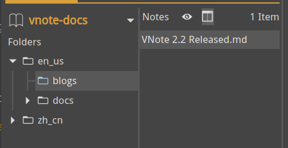
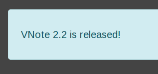

# VNote 2.2 Released
After nearly two months, I am glad to announce the release of VNote 2.2!

Before touching the thrilling updates of 2.2, I want to tell you that VNote now has a new [website](https://tamlok.github.io/vnote). From now on, we could combine the home page and documentatioin together in one place. It is generated by [Viki](https://tamlok.github.io/viki), another open source project that I wrote for VNote.

Viki does not need a server and could recognize the structure of VNote's notebook. Just put some files of Viki into your notebook, then you can show your notebook as an elegant website to everyone.

Now let me show you what VNote 2.2 could now accomplish!

## Table
Many users have requested to improve the edit experience of table since the very beginning. Now it comes!

There is now a tool button to insert table.

Syntax highlight and auto-alignment of GFM table:


Easy to add cells, columns, or rows:


In future releases, I will add shortcuts and context menu for table edit.

## Auto Scroll Cursor Line
Now you could have VNote's cursor line being locked at the center of the editor while editing, even at the end of the document.


## WaveDrom
VNote now supports WaveDrom for digital timing diagram.


## Others
VNote now supports spliting the note list out from the folder tree:



Several handy configurations in Settings:

- Editor font to override the style configuration;
- OpenGL option on Windows (now you don't need to declare environment variable);

For editor:

- VNote will try to guess image title from its file name when inserting image;
- Support `~~~` as the fenced code block marker;

For MathJax:

- Support equation number;
- Support `\begin` and `\end` directly without `$$`;
- Support `$..$` in the `\text{}` within `$$..$$`;

VNote now supports alert text via [markdown-it-container](https://github.com/markdown-it/markdown-it-container) plugin. The following lines will generate an alert box:

```
::: alert-info

VNote 2.2 is released!

:::
```

Like this:

