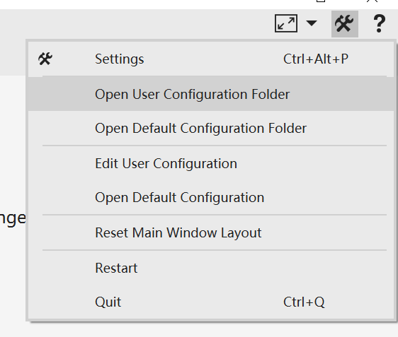

# Configuration
There are three main configurations for VNote.

* Default configuration;  
This is the application's default configuration. You should not change any of these files, since they will be overwritten on version update. To custom configuration, you could copy files to the **user configuration** folder and change them.
* User configuration;  
This is the user's configuration which will overrides the default configuration.
* Session configuration;    
This is configuration about session, such as notebook list, geometry state of the main window, and so on. It is the `session.json` file locating in the *user configuration* folder. To modify this file, you need to first close VNote since VNote will write to this file on close.



## Components of Configuration
There are several folders and files under the configuration folder:

```
.
├── dicts (dictionaries for spellcheck)
├── docs (docs used by VNote to provide help)
├── syntax-highlighting (syntax highlighting files for text editor from Kate)
├── themes (themes of VNote)
├── web (resources used for read mode)
└── vnotex.json (configuration file)
```

For the `vnotex.json` file, please refer to the one in the default configuration folder, which contains comments about each field.

## Make VNote Portable
Users may want to bundle the configuration files alongside with the executable file. Follow these steps to migrate the configuration folders:

1. Close VNote first;
2. Copy the default configuration folder `VNote` to the same folder as the executable file (such as `vnote.exe`) and rename it to `vnotex_files`;
3. Copy the user configuration folder `VNote` to the same folder as the executable file and rename it to `user_files`;