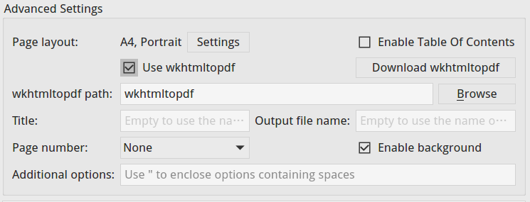
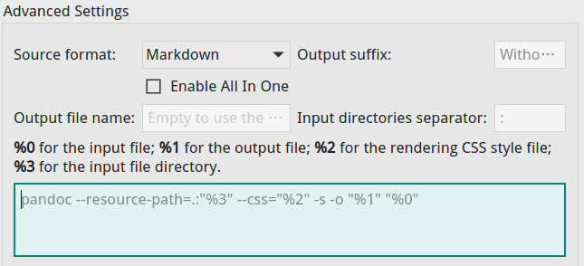

# Export
VNote supports rich and extensible export.


## Sources
There are four sources to select which notes to export.

- **Current Note**
    - Export current note;
- **Current Folder**
    - Export all the notes within current folder;
    - Support export subfolders recursively;
- **Current Notebook**
    - Export all the notes of current notebook;
- **Cart**
    - Cart is a tool to collect random notes for further processing.

## Options
We could specify **Markdown renderer**, **Markdown rendering background**, **Markdown rendering style**, and **Markdown rendering code block style** for the export. For example, we could specify a *transparent* background when we export PDFs.

## Formats
### Markdown
We could export a Markdown note as Markdown format. For a note named `vnote.md`, VNote will create a folder named `vnote_md`, then copy the `vnote.md` to this folder, then copy local images of this note, then copy the attachments of this note. After this, we could compress this folder and share it.

### HTML
When exporting a note as HTML format, VNote will first render the Markdown note and then output the HTML as a file. Advanced settings of HTML format includes:

- **Embed CSS styles**
    - Embed CSS styles in the exported HTML file.
- **Complete page**
    - When checked, VNote will also export related images besides the HTML file. If not checked, you may lose local images.
- **MIME HTML**
    - Export the MIME HTML format.

### PDF
VNote supports exporting notes as PDF files. Page size and margins are configurable. There are two engines to choose to do the export.

#### Built-In Engine
The built-in engine works better with the content, but lacks the bookmark in the generated PDF file.

#### wkhtmltopdf
[wkhtmltopdf](https://wkhtmltopdf.org/) is a third-party tool to convert HTML to PDF. You need to install this extra tool which will be used by VNote. When using this engine, VNote will first convert the Markdown notes to HTML format, and then call *wkhtmltopdf* with the generated HTML files as input.



Advanced settings includes:

- **wkhtmltopdf path**
    - Path of the wkhtmltopdf executable.
- **Title**
    - Title of the generated PDF. It is only valid when **All In One** is enabled.
- **Output file name**
    - The name of the generated PDF file. It is only valid when All In One is enabled.
- **Page Number**
    - Whether append page number to every page and the position of it.
- **Enable background**
    - Whether enable the background of the HTML.
- **Additional options**
    - Additional global options which will be passed to wkhtmltopdf. For available options, please reference the documentation of wkhtmltopdf.

### PDF (All In One)
When choosing this format, VNote will utilize the wkhtmltopdf tool to convert multiple Markdown notes into **one** PDF file. To make this work well, a good practice in using VNote is to turn on **Heading Sequence** starting from level 2 and insert the title as level 1 heading for each note.

### Custom
The **Custom** format enable users to choose whatever tool they like to process notes.



Advanced settings:

- **Source format**
    - VNote supports using Markdown or HTML format as the inputs to your tool.
- **Output suffix**
    - The suffix of the output file, such as `docx`, `pdf`, or `ppt`.
- **Enable All In One**
    - Whether put multiple notes as the input once to your tool. They are separated by spaces.
- **Output file name**
    - The file name of the output. It is only valid when All In One is enabled.
- **Input directories separator**
    - VNote could pass the directories of the input notes to your tool. You could use these directories as the resource folders. This option specifies the separator to concatenate these directories.
- Command
    - The command executed by VNote. Some special place holder you could use:
        - `%0`: the input files;
        - `%1`: the output file;
        - `%2`: the rendering CSS style file to be used;
        - `%3`: the input file directories;
        - `%4`: the rendering code block CSS style file to be used;

An example to use [Pandoc](http://pandoc.org) to export notes:

```sh
pandoc --resource-path=.:"%3" --css="%2" --css="%4" -s -o "%1" "%0"
```

::: alert-info

On Windows, you need to change the separator from `:` to `;` according to Pandoc.

:::

If the output suffix is `pdf`, it will generate the PDF file; if it is `docx`, it will generate the DOCX file; and if it is `pptx`, it will generate the PPTX file.