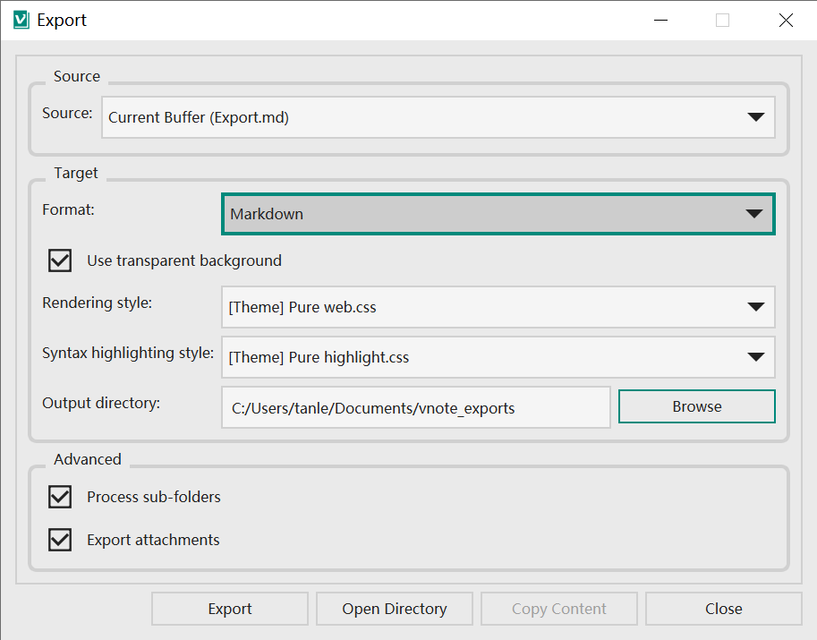
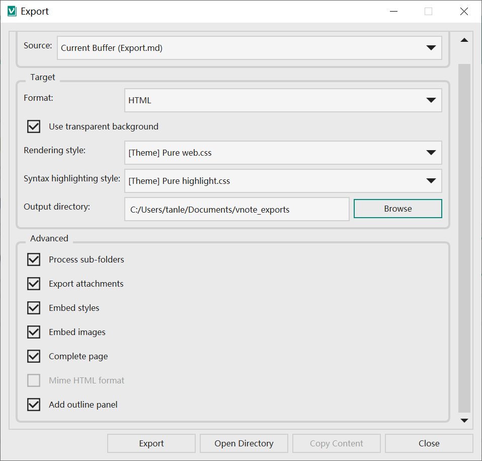
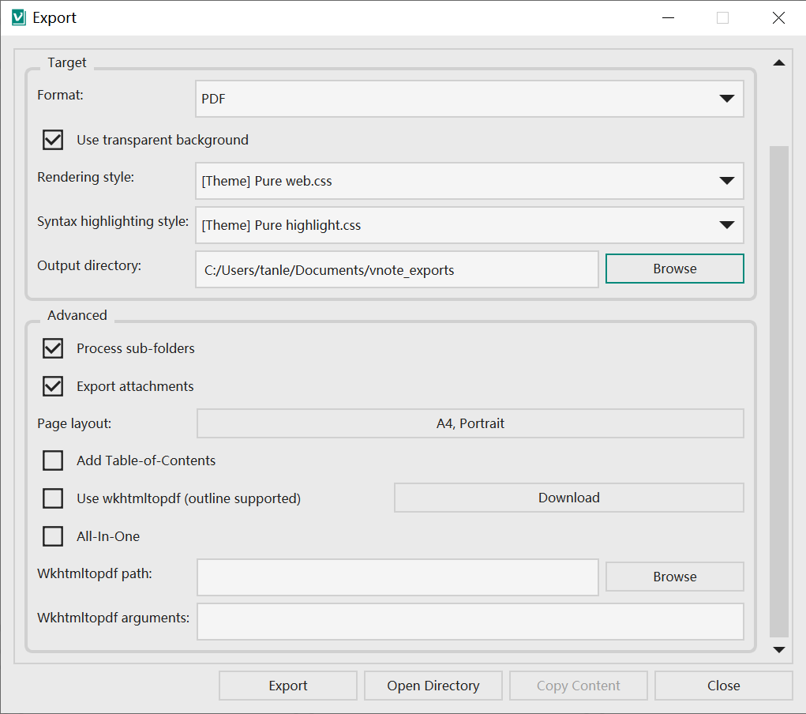
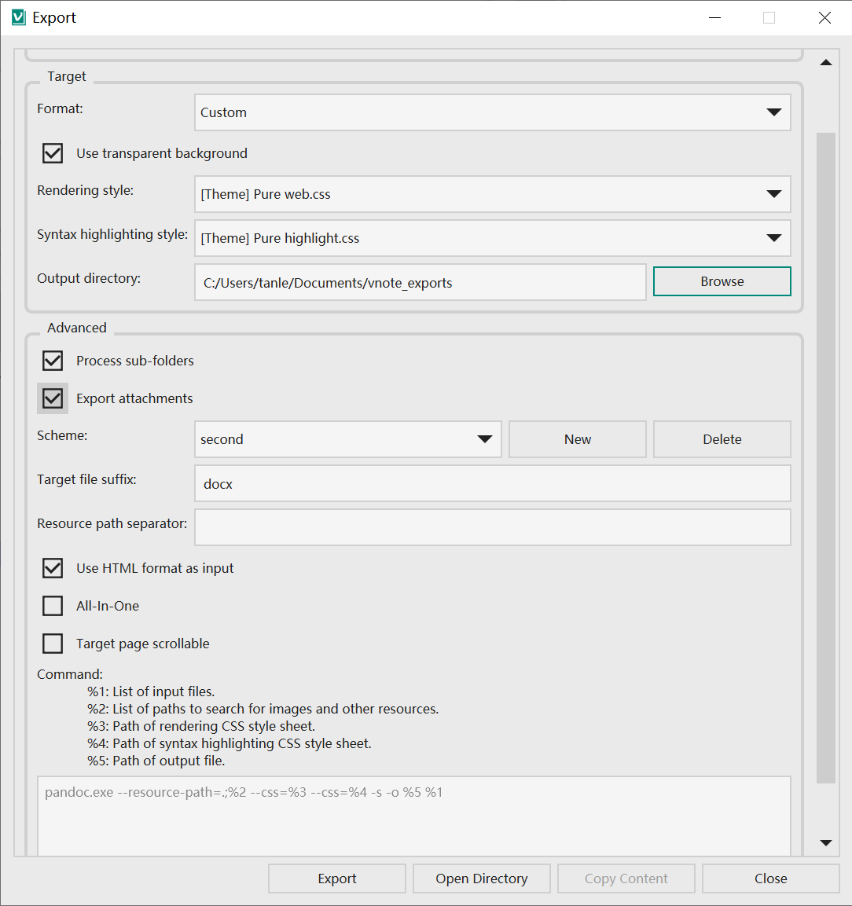

# Export
VNote supports exporting notes to multiple formats, such as `Markdown`, `PDF`, and `HTML`. With [Pandoc](https://pandoc.org/), more target formats are supported.

## General Settings


* VNote allows exporting current note, notes in current folder, and notes in current notebook.
* Target formats are `Markdown`, `HTML`, `PDF`, and `Custom`.
* VNote allows specifying different rendering styles in export.

## Markdown
VNote will export the file into `Markdown` format within one single folder, with its images and attachments.

## HTML


VNote allows to export file into one single `HTML` page, with its styles and images embedded, so it is easier to share it to others.

## PDF


VNote supports exporting to `PDF` directly or using `wkhtmltopdf` tool to export. With `wkhtmltopdf`, outline is supported.

`All-In-One` option allows to export and combine multiple source files into one target file.

## Custom


VNote allows to export files using customized command. It is common to use `pandoc` tool to convert to other formats. Please refer to the documentation of `pandoc` for details. You could even use a script to handle it in your own way.

The following command on Windows could export to nearly every format via `pandoc`. Just change the `Target file suffix` into `docx`, `epub`, and so on.

```
"c:\your\path\to\the\downloaded\executable\pandoc.exe" --resource-path=.;%2 --css=%3 --css=%4 -s -o %5 %1
```

On non-Windows platforms, please change the separator from `;` to `:`.
