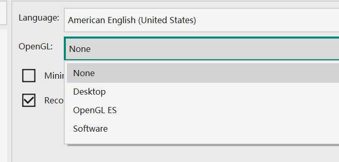

# Frequently Asked Questions
## How to Specify Custom MathJax Script?
VNote uses MathJax 3 to render math formulas. To specify the MathJax script to use, do the following steps:

1. Open the default configuration folder, and copy `web/js/mathjax.js` to the user configuration folder as `web/js/mathjax.js`, then you could modify the copied `mathjax.js` file here. VNote will use this file instead of the default one.
2. Edit the `mathjax.js` file. The MathJax script to use is given by:
    ```js
            this.mathJaxScript = 'https://cdn.jsdelivr.net/npm/mathjax@3/es5/tex-svg.js';
    ```

You could download the MathJax ([howto](https://docs.mathjax.org/en/latest/web/hosting.html)) and specify a local copy of the MathJax to use:

```js
this.mathJaxScript = 'file://c:/Users/foo/mathjax/tex-svg.js';
```

## Crash After Version Update
This often happens if the update crosses multiple versions. Open user configuration folder and delete `vnotex.json`.

## Interface Is Freezed
## Cursor Is Not Visible in Edit Mode
## Crash When Opening A Note
All the above 3 issues may be caused by the driver of the display card only on Windows. Steps to solve it:

1. Try to update the display card driver;
2. Try to schedule VNote to run with integrated display card;
3. If it does not works, try to set the `OpenGL`value one by one in the `Settings` dialog.  


Restart of VNote is needed after each step to check if it takes effect.
