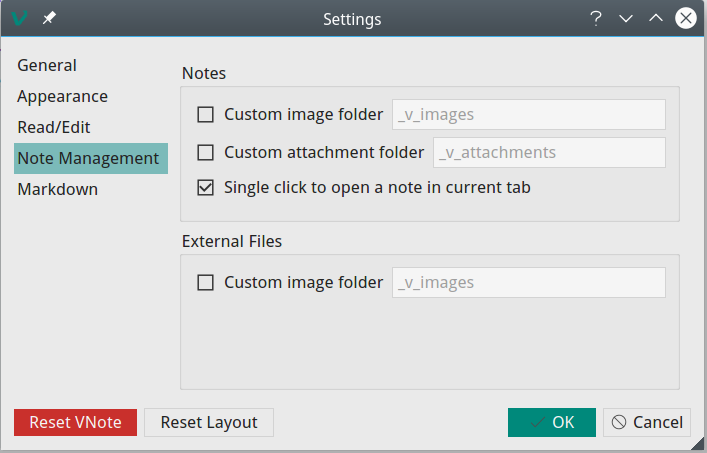

# Frequently Asked Questions
## How to specify customized MathJax script?
VNote supports a configuration `[web]/mathjax_javascript` which specifies the location of the MathJax and its configuration to use. The default value may look like this:

```ini
[web]
; Location and configuration for Mathjax
mathjax_javascript=https://cdnjs.cloudflare.com/ajax/libs/mathjax/2.7.2/MathJax.js?config=TeX-MML-AM_CHTML
```

You could download the MathJax ([howto](http://docs.mathjax.org/en/latest/installation.html)) and specify a local copy of the MathJax to use, like `mathjax_javascript="file:///home/tamlok/Downloads/MathJax-2.7.2/MathJax.js?config=TeX-MML-AM_CHTML"`.

You could also specify customized script in GUI settings dialog:


Notes:

- Need to prepend `file://` to the local path;
- Using local path may get the fonts wrong. I think a better way is to run a light HTTP server locally.

## How to make VNote more "portable"?
VNote will read and store configuration files in the common directory of the operating system to store application data. If you prefer to put these configuration files along with the VNote executable, you coulud copy or create the `vnote.ini` file in the directory containing VNote executable. VNote will first try to read `vnote.ini` from where the executable exists.

However, please notice that VNote will store the notebook's path in the configuration file, so it may read a wrong path and complain about errors if you copy VNote to another computer.

## How to draw diagrams using Mermaid or Flowchart.js?
1. Enable `Mermaid Diagram` and `Flowchart.js` in the `Markdown` menu;
2. Re-open opened tabs to let it take effect;
3. For Mermaid, write a fenced code block specified with language `mermaid`;
4. For Flowchart.js, write a fenced code block specified with language `flowchart` or `flow`;

Mermaid example:

    ```mermaid
    graph TD;
    A-->B;
    A-->C;
    B-->D;
    C-->D;
    ```

Flowchart.js example:

    ```flowchart
    st=>start: Start:>http://www.google.com[blank]
    e=>end:>http://www.google.com
    op1=>operation: My Operation
    sub1=>subroutine: My Subroutine
    cond=>condition: Yes
    or No?:>http://www.google.com
    io=>inputoutput: catch something...

    st->op1->cond
    cond(yes)->io->e
    cond(no)->sub1(right)->op1
    ```

## How to open a note in another tab?


When `Single click to open a note in current tab` is enabled, single-click in the note list to open the note in current tab, while double-click to open it in a new tab.

## Interface is freezed
## Cursor is not visible in edit mode
## Crash when opening a note
## Menu does not work in fullscreen mode
All the above 4 issues may be caused by the driver of the display card. Steps to solve it:

1. On Windows, try to update the display card driver;
2. Try to schedule VNote to run with integrated display card;
3. If not works, try to declare a system environment variable named `QT_OPENGL` and set its value to `desktop`, or `angle`, or `software`.

Restart of VNote is needed after the action.