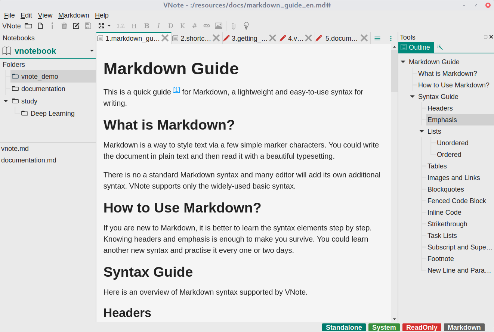

# Get Started
VNote is distributed on **Linux**, **Windows**, and **macOS**. You could always download standalone packages from the [Downloads](https://github.com/tamlok/vnote#downloads) page.

It is recommended to download and use the **stable releases** of VNote. If you prefer to use some latest features of VNote, you could try the latest continuous build from `master` branch.

Besides the standalone packages, some package managers may already package and distribute VNote, such as *AUR*, and *homebrew cask*.

## Main Interface
Here is a snapshot of VNote's main interface.

### Menubar and Toolbar
VNote provides some settings via **Menubar** at the top of the window and provides some handy shortcuts via **Toolbar** right below the menubar. Place mouse over the menu item or button, there is a tooltip or status tip to help illustrating the function of that item or button.

### Notebooks, Folders, and Notes
VNote uses **Notebooks**, **Folders**, and **Notes** hierarchy for note management. The left-side panel is used to navigate through your notebooks, folders, and notes.

At the first time you launch VNote, you will be prompted to create your first notebook. A notebook corresponds to a directory in your file system. You should choose an empty directory as your *Notebook Root Folder*. All the contents of this notebook will be stored whthin the Notebook Root Folder.

Once you have a notebook, you could create folders in this notebook. VNote supports infinite levels of folders.

The bottom panel at the left side will list all the notes of current folder. You could create a new note via the context menu.

### Content Area
The middle area which occupies most of the space is the **Content Area**, which is used to read and edit notes. VNote supports opening multiple notes by tabs.

### Tools Dock Widget
At the right-side panel, there are multiple tools to facilitate your reading and editing, such as **Outline** and **Snippets**.

## Ready To Go
That is it! Now you could read, edit, and mange your notes in VNote!