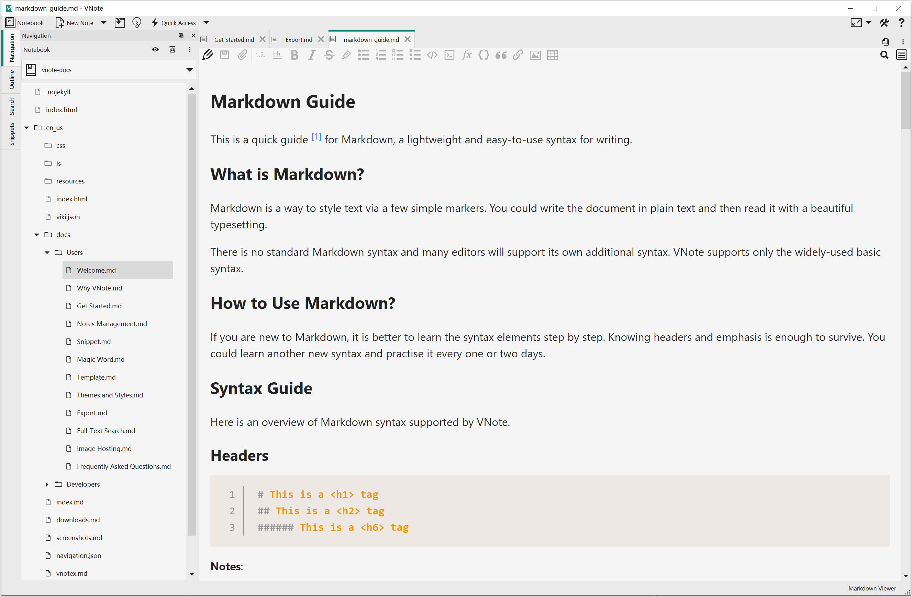

# Get Started
VNote is distributed on **Linux**, **Windows**, and **macOS**. You could always download standalone packages from the [Downloads](https://github.com/vnotex/vnote#downloads) page.

It is recommended to download and use the **stable releases** of VNote. If you prefer to use some latest features of VNote, you could try the latest continuous build from `master` branch.

Besides the standalone packages, some package managers may already package and distribute VNote, such as *AUR*, and *homebrew cask*.

## Main Interface
Here is a snapshot of VNote's main interface.

### Notebooks, Folders, and Notes
VNote uses **Notebooks**, **Folders**, and **Notes** hierarchy for note management. The left-side panel is used to navigate through your notebooks, folders, and notes.

A notebook corresponds to a directory in your file system. You should choose an empty directory as your *Notebook Root Folder*. All the contents of this notebook will be stored within the Notebook Root Folder.

Once you have a notebook, you could create folders in this notebook. VNote supports infinite levels of folders.

### Content Area
The middle area which occupies most of the space is the **Content Area**, which is used to read and edit notes. VNote supports opening multiple notes by tabs.

### Dock Widgets
At the left side, there are several dock widgets, including **Navigation**, **Outline**, **Search** and so on. They could be dragged and dropped freely and placed at the left/top/right/bottom of the main window.

## Ready To Go
That is it! Now you could read, edit, and mange your notes in VNote!