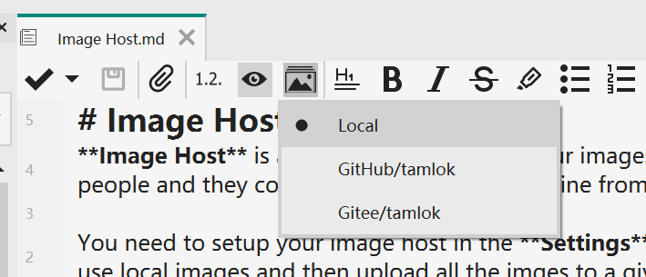
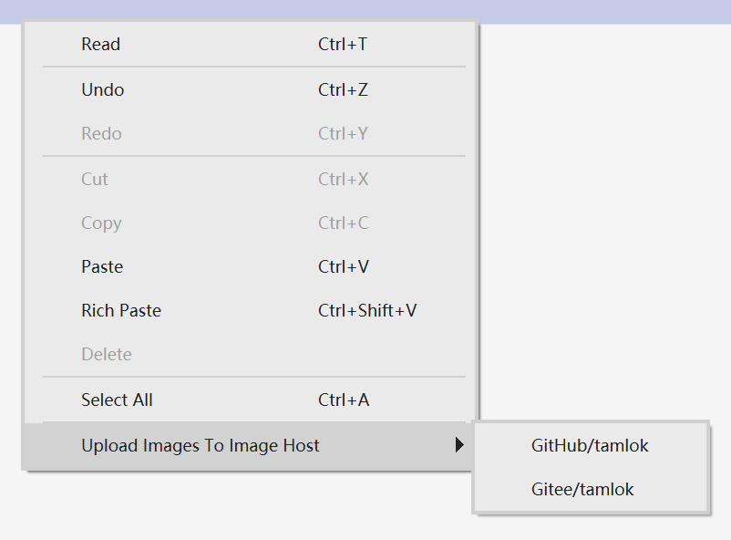
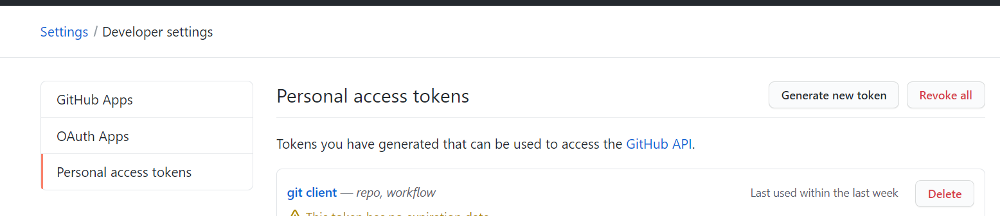
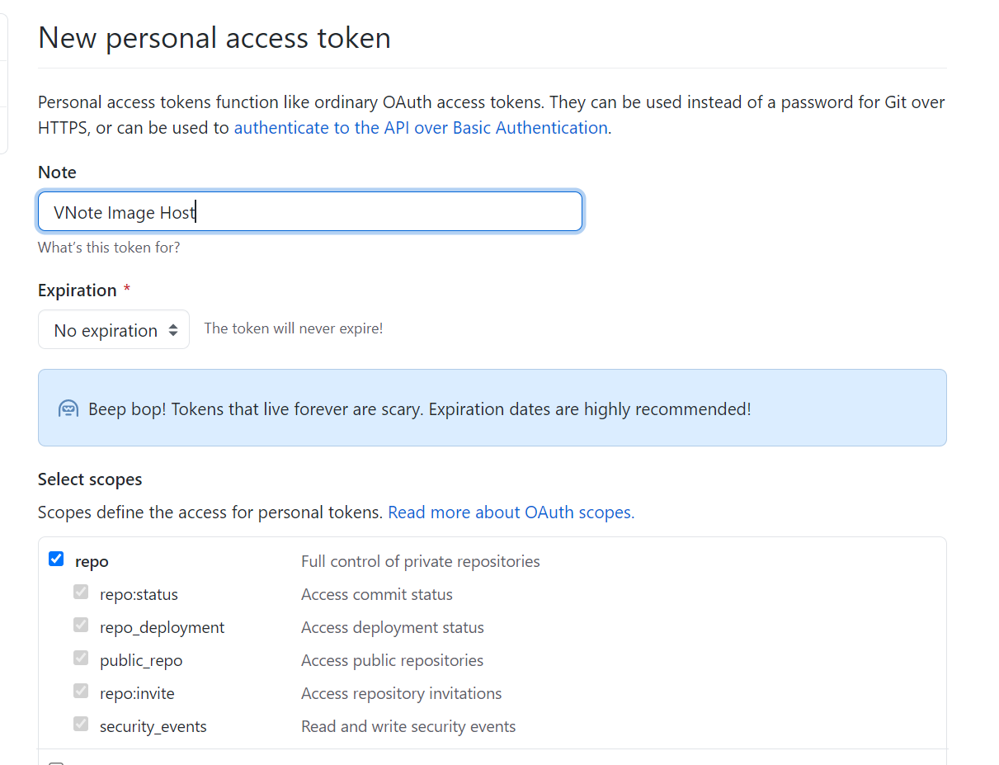

# Image Host
**Image Host** is a online service to hold your images. Different from local images, with image host, you could just share your plain text Markdown file wihtout any image files to people and they could access your images online from anywhere.

You need to setup your image host in the **Settings** dialog at first. Then you could choose to use local images or image host at the editor. If network is poor, you could also first use local images and then upload all the imges to a given image host at the end.

## Configuration
### GitHub/Gitee
Gitee shares the similar process with GitHub. Let's take GitHub as an example.

1. Go to the GitHub `Settings`, `Developer settings` and generate a new `Personal access tokens`.
    
2. Select the `repo` scopes and generate the token. Copy it.
    
3. Create a **public** repository to hold the images. Remember to generate the default `README` file to create the first commit.
4. New a image host in VNote and fill in the **Personal Access Token**, **User Name** and the **Repository Name**.