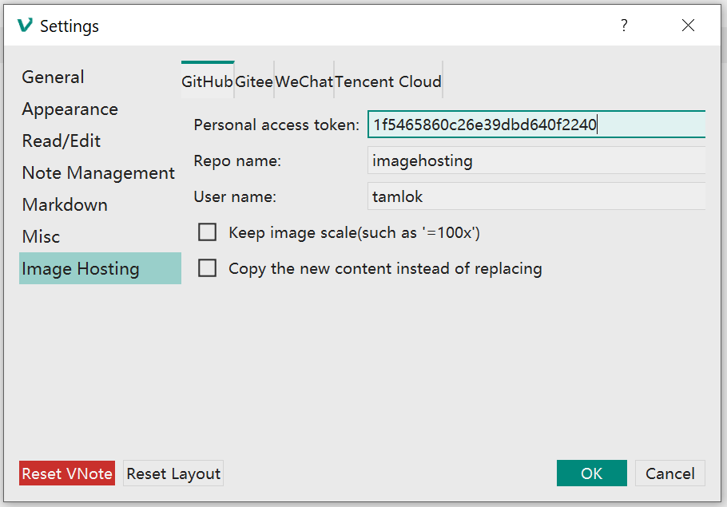
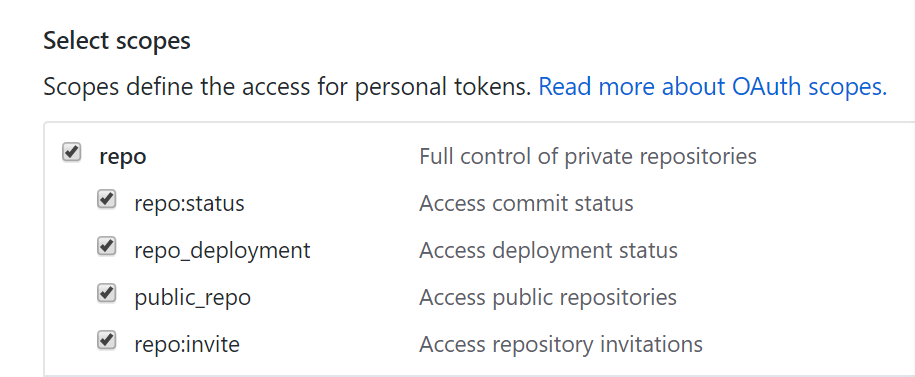
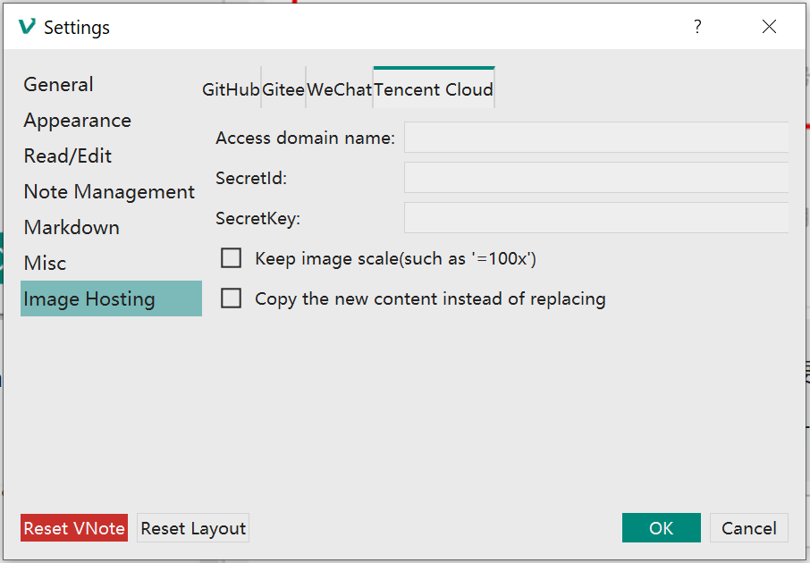
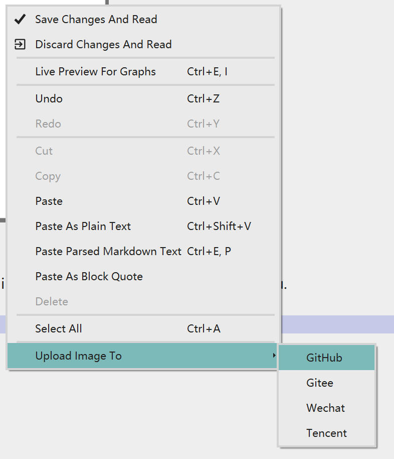

# Image Hosting
From v2.8, VNote supports several image hosting services. Now VNote could upload local images to cloud services.

There are 4 services now VNote supports:

- GitHub;
- Gitee;
- Wechat;
- Tencent Cloud;

For each service, you need to configure the service provider and provide some kind of tokens to VNote to enable VNote access the service.

There are two common options for each service:

- `Keep image scale`: Whether keep the scaling of the images in the new links;
- `Copy the new content instead of replacing`: After uploading images, just copy the content with new links, without touching the original file;

## Configurations
### GitHub

For GitHub, you need to provide:

- `Personal access token`: Go to the `Settings` of GitHub, then `Developer Settings`, then `Personal Access Tokens`, and generate a new token with full control of repo.  
    
- `Repo name`: Name of the repository in GitHub to hold your images;
- `User name`: User name of GitHub;

### Gitee
Gitee is quite the same as GitHub.

### Wechat

Go to [Wechat Public Platform](https://mp.weixin.qq.com/), then `Development`, then `Basic Settings`, and get your `AppID` and `AppSecret`.

One more step is to write your IP address into the `IP Whitelist` to allow uploading images from your local host.

The `markdown2WechatToolUrl` is a link which you want VNote to open automatically after copying the new content.

### Tencent Cloud

1. Go to [Tencent Cloud Platform](https://console.cloud.tencent.com/) and select the `Object Store` product;
2. Go to the `Keys Management` and generate a new API key (`SecretId` and `SecretKey`);
3. Go back to the `Object Store` panel and select the `Store Bucket List` to create a store bucket (with the `Access Permission` being `Public Read Private Write`);
4. Click the `Basic Settings` on the left and get the `Access Domain`;
5. In the same page, add a rule to the `CORS Settings`;  

## How to use
After you finish writing a note, you could choose to upload images to image hosting service in the context menu (in Edit mode).

VNote will go through all the local images and upload them to chosen service.

- If you choose to replace image links in the original file, the content will be modified after finishing uploading. VNote will prompt to delete unused local images when you save the note.
- Otherwise, VNote will copy the new content with new image links and leave the original note untouched.

Thanks @fengwenhua for this pull request!