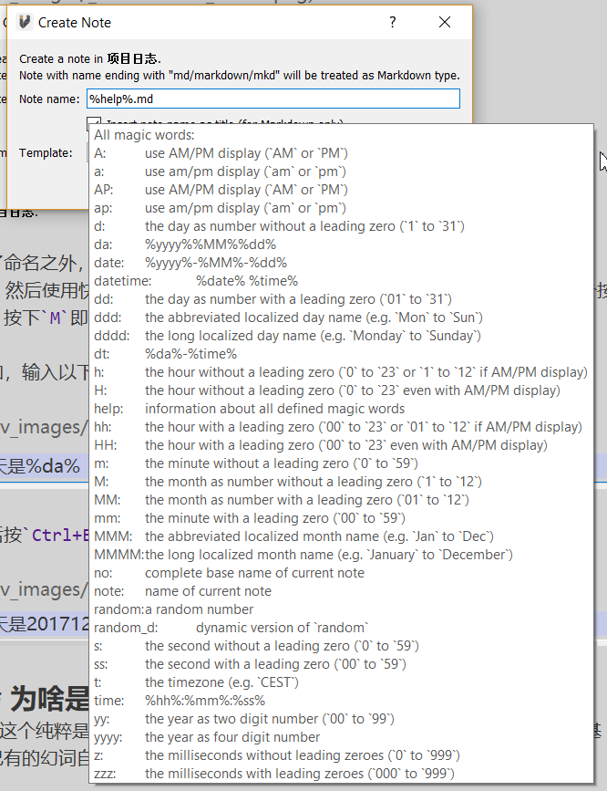
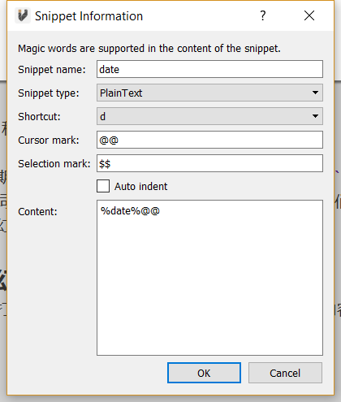

# Magic Word
**Magic Words** are some characters that have special meanings. They will be evaluated to some pre-defined characters. For one simple example, `date` could be evaluated to the date of today.

VNote support snippets in most of the input widgets. For example, you could use snippet for the note name when creating a note.

`%da% work log.md` will be evaluated as `20180128 work log.md` since `%da%` is a magic word which is defined as the date of today in the form `YYYYMMDD`.

In the editor, you could type `%da%`, and then press shortcut `Ctrl+E M`, which will evaluate the word under cursor as magic word.

For example, type following words:

```
Today is %da%
```

Then press `Ctrl+E M`, it will be changed to:

```
Today is 20180128
```

## Built-In Magic Words
VNote has defined lots of magic words. In the input dialog, type `%help%` to show a list of defined magic words.



## Custom Magic Words
Edit the `vnote.ini` file in configuration folder like this:

```ini
[magic_words]
1\name=vnote
1\definition="vnote is a great tool! -- Written %datetime%"
2\name=hw
2\definition="hello world!"
size=2
```

Now we got two magic words `vnote` (based on another magic word `datetime`) and `hw`.

## Magic Word In Snippet
[Snippet](snippet.html) also supports magic word. Now we could define a snippet to insert current date like this:



Now in edit mode, we could hit `Ctrl+E S D` to insert current date.