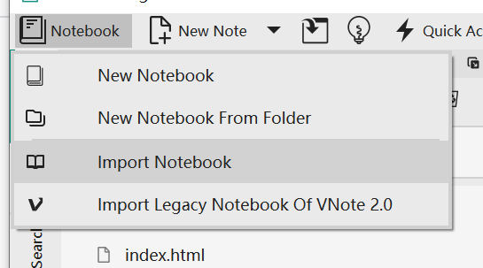
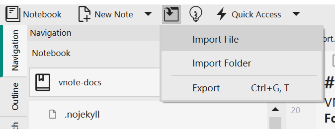

# Notes Management
VNote adopts **notebooks-folders-notes** hierarchy for notes management. A notebook corresponds to a directory in the file system, which is called **Notebook Root Folder**. Folders of a notebook correspond to directories within the Notebook Root Folder. Notes inside a folder corresponds to files within that directory.

VNote may use some index files to keep track of all the notes within a notebook, so it is recommended to manage your notes within VNote.

## Notebook
Notebook is an independent, self-explanatory container in VNote. A notebook is a **Notebook Root Folder** in the file system. The root folder contains all the notes and configuration files of that notebook.

### Create A Notebook
You could create a notebook directly from an empty Notebook Root Folder.

If you have already many Markdown files before using VNote, you could **New Notebook From Folder** to construct a notebook from existing folder.

### Migrate and Import A Notebook
A notebook is an independent directory in the file system, so you could just copy or synchronize the *Notebook Root Folder* to migrate a notebook.

You could import an existing notebook into VNote by selecting its *Notebook Root Folder*. VNote will try to read the configuration files to restore the notebook.

Combining these, you could create your notebooks in a directory which is synchronized via third-party service, such as Dropbox and OneDrive, and then on another computer, you could import that directory into VNote as a notebook. With this, you could use VNote to edit and manage your notes, which will be synchronized by other trusted services, both at home and at work.

### Import Files and Folders
You could import external files and folders into existing notebook.

