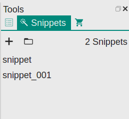

# Snippet
Snippet is designed to facilitate the repeated input of some words.

## Snippet Management
You could manage snippets via the `Tools` dock widget.



In this panel, we could:

1. Create a snippet;
2. Open snippet folder;  
VNote uses a folder in the configuration folder to store all the snippets and use configuration file `snippet.json` for management. Each snippet corresponds to one file.
3. View and edit the information about a snippet;
4. Sort and delete snippets;
5. Apply (insert) a snippet into the editor;

## Define A Snippet
A snippet contains:

- Snippet Name
    - Identifies a snippet. It is also the name of the corresponding file in the snippet folder.
- Snippet Type
    - Plain text or HTML. Currently only plain text is supported.
- Shortcut
    - You could designate one of the 26 characters (`a` to `z`) to insert snippet quickly.
- Cursor Mark
    - VNote uses Cursor Mark to mark the position of the cursor after applying a snippet. Should appears only once in the `Content`.
- Selection Mark
    - VNote uses Selection Mark to mark the position to insert the selected text before applying a snippet. Selection mark could appear multiple times in the `Content`. After applying a snippet, all the selection marks will be replaced with the selected text.
- Content
    - The content of the snippet which will be inserted at the position of current cursor while applying a snippet.

## Apply A Snippet
### Snippet Panel
Place the cursor at the proper position and double click a snippet in the snippet panel to apply a snippet.

### Shortcuts
You could use **Captain Mode** to apply a snippet quickly. In edit mode, press `Ctrl+E S` to activate snippet selection dialog, which shows all the snippets **with shortcut defined**. Press the corresponding shortcut key to apply a snippet.

## Examples
### Insert Code Block with CPP
    ```cpp
    @@
    ```

### Comment Out Selected Text
```
<!-- $$@@ -->
```

### Tag for Color
```
<font color=red>$$@@</font>
```

Or:

```
<mark>$$@@</mark>
```