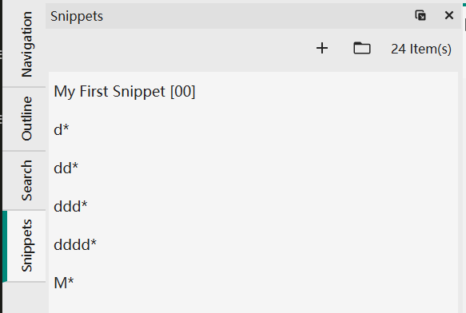
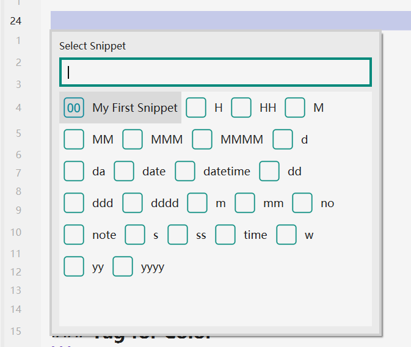

# Snippet
Snippet is designed to facilitate the repeated inputs of some words.

## Snippet Management
There is a `json` file for a user-defined snippet. There are some built-in snippets, such as inputting current date. Built-in snippets are read-only and there is a `*` suffix in after their names.



## Define A Snippet


- Snippet Name: The identifier of a snippet. It will be used to search for a snippet.
- Shortcut: You could assign a shortcut to s snippet to quickly locate a snippet. The shortcut is two digits.
- Cursor Mark: VNote uses Cursor Mark to mark the position of the cursor after applying a snippet. Should appears only once in the `Content`.
- Selection Mark: VNote uses Selection Mark to mark the position to insert the selected text before applying a snippet. Selection mark could appear multiple times in the `Content`. After applying a snippet, all the selection marks will be replaced with the selected text.

## Apply A Snippet
### Snippet Panel
Place the cursor at the proper position and double click a snippet in the snippet panel to apply a snippet.

### Shortcuts
In editor, press `Ctrl+G, I` will call out a panel containing all the snippets.

You could directly type `00` to apply `My First Snippet`. Or you could type keyword `my` to search snippets by name and press `Enter` to apply the first hit snippet.

You could press `Tab` to focus on the snippet list and use `Ctrl+H/J/K/L` to navigate through items and press `Enter` to apply the selected snippet.



### Symbol
Another simple way to apply a snippet is type `%snippet_name%` in the editor directly and press `Ctrl+G, I` to translate that symbol into snippet `snippet_name`.

Many line edit widgets in VNote also support snippet in this way, such as:

* New Note dialog;
* New Notebook dialog;
* Note template;

## Examples
### Insert Code Block with CPP
    ```cpp
    @@
    ```

### Comment Out Selected Text
```
<!-- $$@@ -->
```

### Tag for Color
```
<font color=red>$$@@</font>
```

Or:

```
<mark>$$@@</mark>
```