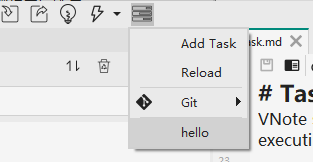

# Task
VNote supports a simple task system like [VSCode Tasks](https://code.visualstudio.com/docs/editor/tasks), which enables executing third-party programs easily.

## Loading Tasks
VNote will try to load tasks from three locations:

* `default_config_folder/tasks` for built-in tasks
* `user_config_folder/tasks` for user-defined tasks
* `notebook_config_folder/tasks` for tasks defined by this notebook

A task is defined by a `*.json` entry file.

## A Simple Task
Click the `Add Task` item on the task menu, which will open the user-defined tasks folder.


New a folder named `hello` and under it create a file named `hello.json`. Edit the JSON file as:

```json
{
    "command": "echo 'Hello Tasks'"
}
```

Reload tasks in the menu and we could see that a new task named `hello` is listed on the menu. Click it to run the task.




### Customize Menu Item
```json
{
    "label": "Hello",
    "icon": "tasks-solid.svg",
    "shortcut": "Alt+H, T",
    "command": "echo",
    "args": [
        "Hello tasks!"
    ]
}
```

The icon file `tasks-solid.svg` should be saved alongside the JSON entry file.

### Sub-Tasks
Tasks could be embedded infinitely. Sub-tasks will inherit most properties from parent.

```json
{
    "label": "Hello Tasks",
    "icon": "tasks-solid.svg",
    "shortcut": "Alt+H, T",
    "command": "echo",
    "args": ["Hello tasks!"],
    "tasks": [
        {
            "label": "Hello Cat",
            "icon": "cat-solid.svg",
            "shortcut": "Alt+H, C",
            "args": ["Hello cat!"]
        },
        {
            "label": "Hello Dove",
            "icon": "dove-solid.svg",
            "shortcut": "Alt+H, D",
            "args": ["Hello dove!"]
        },
        {
            "label": "Hello Fish",
            "icon": "fish-solid.svg",
            "shortcut": "Alt+H, F",
            "args": ["Hello fish!"]
        }
    ]
}
```

### Command Types
The `type` property of one task defines how the command will be executed.

* `shell`: Default， will run the command as a shell command
* `process`: Will run the command as a standalone program

```json
{
    "type": "process",
    "label": "Open File with",
    "args": ["${buffer}"],
    "tasks": [
        {
            "label": "Typora",
            "icon": "Typora.svg",
            "command": "C:\\Programs\\Typora0.9.98\\x64\\Typora.exe"
        },
        {
            "label": "VS Code",
            "icon": "vscode.svg",
            "command": "C:\\Users\\tootal\\AppData\\Local\\Programs\\Microsoft VS Code\\Code.exe"
        }
    ]
}
```

::: alert-info

Yep, `tootal` is the contributor who initiated the Task system of VNote!

:::

VNote does not provide a terminal. We may need to use `start` or `gnome-terminal` or `konsole` to run some programs in terminal.

```json
{
    "label": "Vim",
    "icon": "vim.svg",
    "type": "process",
    "command": "gnome-terminal",
    "args": [
        "--execute",
        "vim",
        "${buffer}"
    ]
}
```

### Localization and Platform-Specific Options
Provide a **locale string** JSON object to provide localization.

```json
{
    "label": {
        "en_US": "Hello",
        "zh_CN": "你好"
    }
}
```

We could use `windows`/`linux`/`osx` keyword to specify options for different platforms.

```json
{
    "type": "process",
    "label": "Open File with",
    "args": ["${buffer}"],
    "tasks": [
        {
            "label": "Typora",
            "icon": "Typora.svg",
            "windows": {
                "command": "C:\\Programs\\Typora0.9.98\\x64\\Typora.exe"
            },
            "linux": {
                "command": "/usr/bin/typora"
            }
        },
        {
            "label": "VS Code",
            "icon": "vscode.svg",
            "windows": {
                "command": "C:\\Users\\tootal\\AppData\\Local\\Programs\\Microsoft VS Code\\Code.exe"
            },
            "linux": {
                "command": "/usr/bin/code"
            }
        }
    ]
}
```

## Task Options
A task could have several options, some of them are mandatory.

We will use `[m]` to mark the mandatory options, `[l]` to mark the options supporting localization.

* `version`: the version of the task file
* `label[l]`: the name of the task
* `type`: the type of task; `shell`(default)/`process`
* `command[l]`: the command to execute
* `args[l]`: the arguments passed to the command
* `options`: options for runnig task
    * `cwd`: current working directory to run task; will try current notebook root folder, then current buffer folder, and then current task file folder in order if missing
    * `env`: environment variables for running task
    * `shell`: options for tasks of `shell` type
        * `executable`: the shell executable file; `Powershell.exe` by default on Windows and `/bin/bash` by default on Linux/macOS
        * `args`: the arguments to start shell
* `tasks`: define sub-tasks
* `inputs`: define input variables
    * `id[m]`: ID of the input variable
    * `type`: `promptString` (default, prompt for user input) or `pickString` (prompt for user selection)
    * `description[l]`: description of the input variable
    * `default[l]`: default value
    * `password`: whether use password mode for `promptString` type
    * `options[l]`: options defined for `pickString` type
* `windows`: options for Windows system
* `linux`: options for Linux system
* `osx`: options for macOS system

## Variables
A task could use variables provided by VNote in the form `${variableName}`. Variables could provide useful information to the task when running.

Variables could be used in options `command`/`args`/`options.cwd`/`options.env`.

### Built-In Variables
Notebook-related variables:

* `notebookFolder`: path of the notebook root folder
* `notebookFolderName`
* `notebookName`
* `notebookDescription`

Buffer-related variables:

* `buffer`: path of current buffer
* `bufferNotebookFolder`: path of the notebook root folder of the notebook of current buffer
* `bufferRelativePath`
* `bufferName`
* `bufferBaseName`
* `bufferDir`: folder of current buffer
* `bufferExt`: extension suffix of current buffer
* `selectedText`: selected text of current buffer view window

Task-related variables:

* `cwd`: current working directory
* `taskFile`: the path of the task entry file
* `taskDir`: the path of the directory containing the task entry file
* `exeFile`: the path of VNote executable file
* `pathSeparator`: the platform-dependent path separator
* `notebookTaskFolder`: the path of current notebook task folder
* `userTaskFolder`: the path of user task folder
* `appTaskFolder`: the path of default task folder
* `userThemeFolder`: the path of user theme folder
* `appThemeFolder`: the path of default theme folder
* `userDocsFolder`: the path of user docs folder
* `appDocsFolder`: the path of default docs folder

Other specifal variables:

* Call **snippets** of VNote via `${magic:snippet_name}`
* Access environment variable via `${env:env_name}`
* Access VNote's configurations via `${config:[main|session].json_object_path}`
    * `main` for the main configurations from `vnotex.json` and `session` for the session configurations from `session.json`
    * Use `arr[index]` to access a JSON array
    * `${config:main.core.shortcuts.FullScreen}` will get the shortcut of `FullScreen`

#### Input Variables
A task could use **input variables** to prompt for user inputs via `${input:input_id}`.

There are now two types of input variables:

* `promptString`
* `pickString`

```json
{
    "command": "echo",
    "args": ["${input:what}"],
    "inputs": [
        {
            "id": "what",
            "type": "promptString",
            "description": "Type something, it will show in output panel."
        }
    ]
}
```

#### Shell Variables
A task could execute a shell command and get its output via **shell variables** like `${shell:shell_command}`.

*   `${shell:git rev-parse --abbrev-ref HEAD}` → `master`
*   `${shell:whoami}` → `tootal`
*   `${shell:dig github.com -4 +short}` → `52.69.186.44`

## Examples
There is a built-in task named `Git` which locates in the default configuration task folder.

Compile and run:

```json
{
    "command": "g++ \"${buffer}\" -o \"${bufferBaseName}\"; if ($?) { start cmd \"/c `\"${bufferBaseName}`\" & pause\" }"
}
```

Run a HTTP server:

```json
{
    "command": "start cmd.exe \"/c python -m http.server\" ; start http://localhost:8000"
}
```
