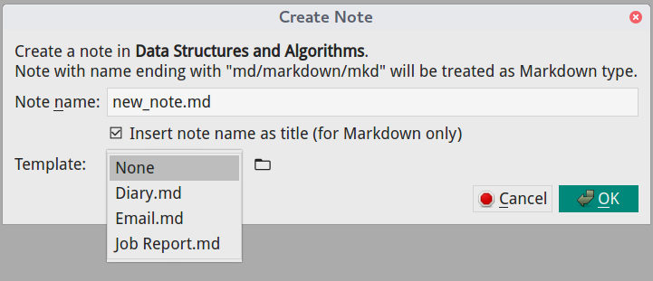

# Template
VNote supports creating a note from a template.

When creating a note, you could choose one template in the dialog.



VNote stores template files in the `templates` subfolder of the configuration folders. One file corresponds to one template. You could access the template folder by clicking the "folder" icon  besides the combo box.

You could add or delete template files in the template folder via system's file browser.

VNote supports **Magic Word** in template. For example, you could write a template like this:

```md
# %no%
This is a template using **Magic Word** to insert note name as the title automatically.
```

`%no%` is a magic word which will be evaluated to the note name (without suffix). Hence if the note name is `week report.md`, then the new note will look like this:

```md
# week report
This is a template using **Magic Word** to insert note name as the title automatically.
```