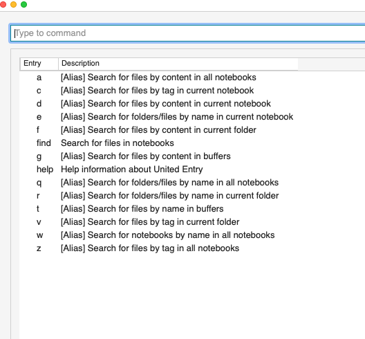
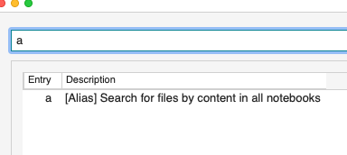
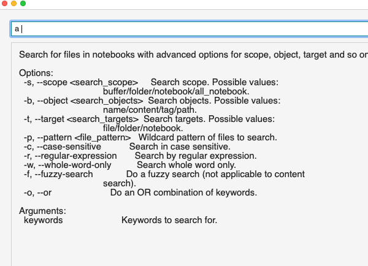
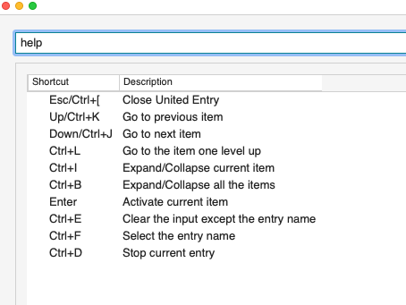
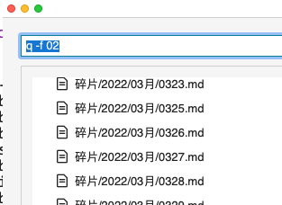
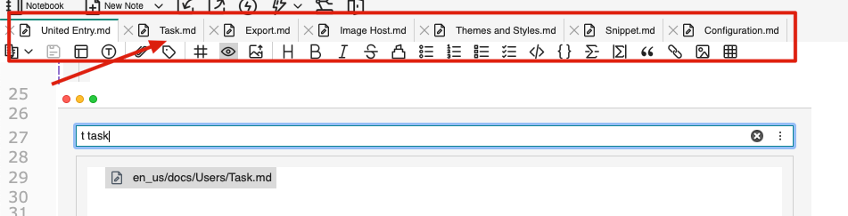
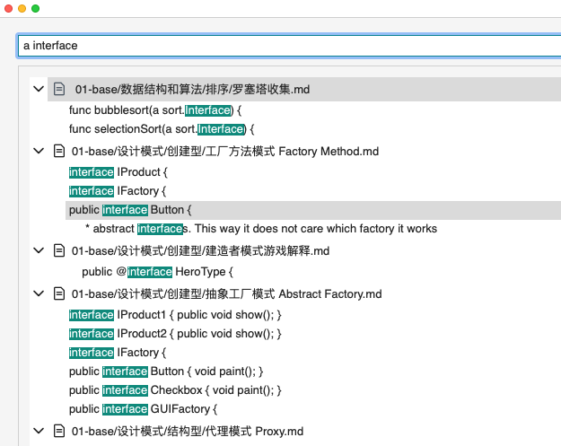
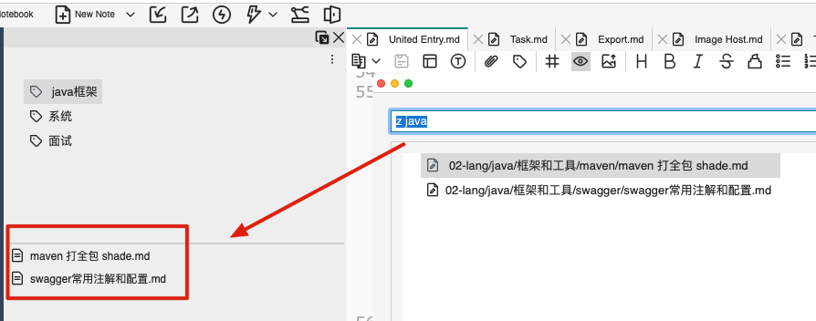

# United Entry

VNote supports not only `search` in the left navigation bar, but also quick search in the `United Entry` in a command only way.

Use an `Entry command` + `Search criteria` can quickly search notes folder or notes and files.

## Activation

By default, the shortcut key `Ctrl+G, G` is used to activate it. After triggering, you can see the following interface:

You can also change the `"UnitedEntry": "Ctrl+G, G"` in the configuration file to replace it with the shortcut you are used to.

When entering the corresponding `Entry command`, the unified entrance will be automatically filtered, and the effect is as follows:

After entering a command, adding a `Space` will trigger a two-paragraph display, usually for detailed help.

## Command Introduction

VNote provides the following `Entry command` to complete the quick query.

| Entry Command |                     Description                      |
| ------------- | ---------------------------------------------------- |
| a             | Search for files by content in all notebooks         |
| c             | Search for files by tag in current notebook          |
| d             | Search for files by content in current notebook      |
| e             | Search for folders/files by name in current notebook |
| f             | Search for files by content in current folder        |
| find          | Search for files in notebook                         |
| g             | Search for files by content in buffers               |
| help          | help                                                 |
| q             | Search for folders/files by name in all notebooks    |
| r             | Search for folders/files by name in current folder   |
| t             | Search for files by name in buffers                  |
| v             | Search for files by tag in current folder            |
| w             | Search for notebooks by name in all notebooks        |
| z             | Search for files by tag in all notebooks             |

## Example

Find all folders/files containing `02` in all notebooks:

Find the file containing `task` in the current buffer:

Search all notebooks for notes containing the keyword `interface`:

Search all tags for notes that belong to the keyword `java` tag:

## Location

<mark>WARNING! This varies by operating system.</mark>

### macos

When the search result is found, you need to press the `Tab` key, move the cursor position to the search result bar below, and then press `Enter` to locate the corresponding target.

### windows

After the search in win, it will stay in the first place in the result bar by default. You can directly press `Enter` to locate the first place. You can also move and reposition.
