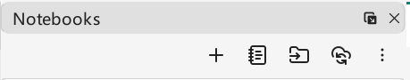

# Welcome to VNote
A pleasant note-taking platform.

For more information, please visit [**VNote's Home Page**](https://vnotex.github.io/vnote).

## VNote 4
VNote 4 is a brand-new refactor of VNote 3, with a polished interface and more powerful features, including:

* A git based notebook sync backend
* Opening notebooks from remote URL
* Raw Notebook to browse any documents on disk freely

Just click buttons here to create notebooks, open notebooks, or convert and import VNote 3 notebooks. Enjoy!

