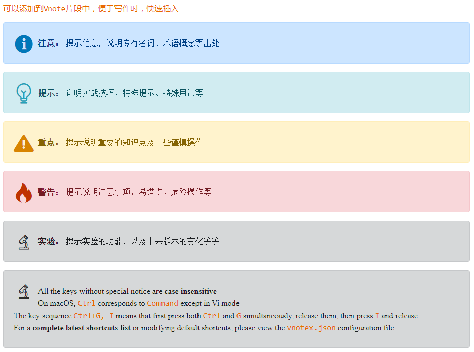
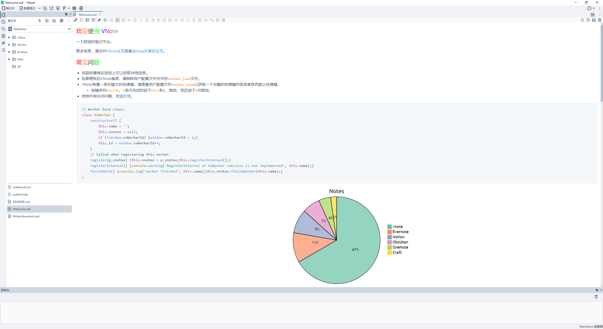

<div style="font-size:50px"><span style="color: #ff0000">v</span><span style="color: #ff4000">n</span><span style="color: #ff7f00">o</span><span style="color: #00d2ff">t</span><span style="color: #00e980">e</span><span style="color: #4460a6">X</span><span style="color: #00ff00"> </span><span style="color: #00ff80">i</span><span style="color: #00ffff">d</span><span style="color: #5f9090">e</span><span style="color: #7548c8">a</span><span style="color: #8b00ff"> </span><span style="color: #c50080">t</span><span style="color: #ff0000">h</span><span style="color: #ff7f00">e</span><span style="color: #de4d67">m</span><span style="color: #bc1bce">e</span></div>


自定义方式参考[Vnote](https://tamlok.github.io/vnote/zh_cn/)官方文档：[主题和样式](https://tamlok.github.io/vnote/zh_cn/#!docs/%E7%94%A8%E6%88%B7/%E4%B8%BB%E9%A2%98%E5%92%8C%E6%A0%B7%E5%BC%8F.md)

`vx-idea`主题又名`石板灰`，适用于新版本[vnotex](https://vnotex.github.io/vnote/zh_cn/#!vnotex.md)版本；vnote 2.0` 版本请前往源仓库切换至` vnote 分支。


👉 尝鲜体验，请移步源仓库：https://gitee.com/uRick/vnote-idea-theme

## 1. 可选配置

### 1.1 适配2套代码高亮主题

详见主题目录 `code_higlight` 文件夹内容，因人而异，可根据需求参考官方自定义。

主题默认样式为`highlight-one-light.css`，当前提供：`highlight-dark.css`、`highlight-one-light.css`两款代码样式；主题样式基于仓库[PrismJS Themes](https://github.com/PrismJS/prism-themes)样式微调而来，具体支持语言样式请参考[Prism.js](https://prismjs.com)。

使用主题时，请将`code_highlight`文件夹下样式，复制重命名替换主题根目录下`highlight.css`样式，重启Vnotex即可生效。

主题首选字体是`YaHei Consolas Hybrid`，可自行搜索下载安装。

```ini
highlight-dark.css #dark样式
highlight-one-light.css #light样式
```


### 1.2 alert组件增强

> 基于`vnotex`原生 `alert` 组件支持，引入图标增强，主要为编写技术文档适配，当前不支持 `alert-light`、`alert-success`。
效果如下：



复制 `tips_components/style.css` 中样式然后追加至 `web.css` 文件尾即可。

## 2. 预览



## 3. 鸣谢

- [tamlok](https://github.com/tamlok) - [VNote](https://github.com/tamlok/vnote)
