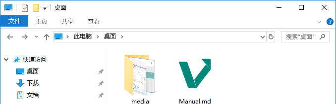
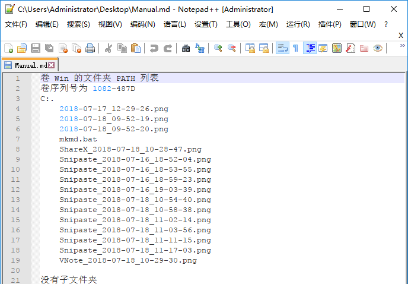
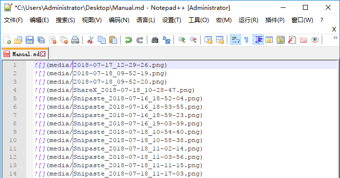
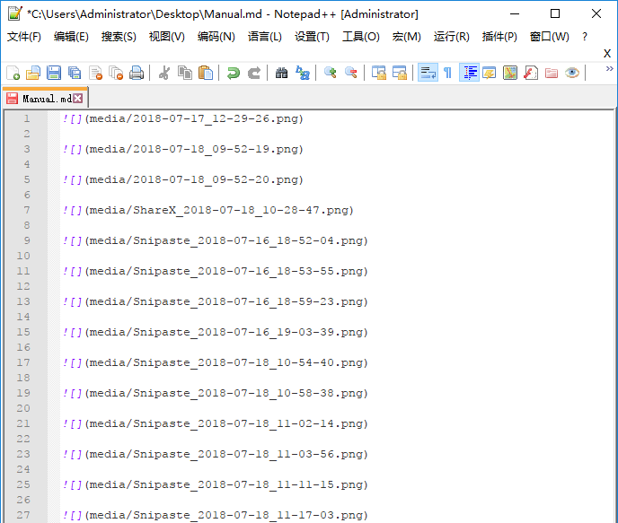

# VNote 插入图片

孙建虎 2018-07-18 Rev 2018-08-14

以前用 MS Word 写图文教程的时候，图片往往被压缩了，而文中的图片要么删除了，要么早就不知去向了，后期需要再次使用图片的时候往往因为没有了原始图片而懊恼。自从使用 Markdown 编写图文教程之后就再也没有这个烦恼了。

图文教程，顾名思义，要有图的，而且往往有很多图。那在 VNote 中怎样插入图片最省力呢？这也许没有固定的答案吧，不同应用场景应该有不同的处理方式，而且对于每个人也许不同的插入方式效率也是不一样的。

我使用 VNote 的内部笔记，而不是独立文件，后文的文件路径基于 `笔记本` > `文件夹` > `笔记` 层次为 `D:\MyVNote\2018\July\笔记`。

## 边用 Shinpaste 截图，边插入图片

### 新建片段

该操作在 VNote 软件右侧 `工具` 窗格中完成。

如果没有看到 `工具` 窗格，可以使用快捷键 `Ctrl+E, T` 或菜单操作 `查看` > `工具` 来打开此窗格。

单击 `片段` 选项卡图标 ，再单击 `片段` 选项卡下的 `新建片段` 图标 ，在弹出的 `新建片段` 对话框中建立 `media` 片段。


### 截图

启动 Snipaste，截图快捷键默认为 `F1`，截图后按下快捷键 `Ctrl+S`，弹出 `图像另存为` 对话框，第一次设置保存路径为 `D:\MyVNote\2018\July\media`，之后默认为此路径，进入 `图像另存为` 对话框的焦点自动在 `文件名`，按下快捷键 `Ctrl+C` 复制文件名，单击 `保存` 按钮。


### 插入图片

在 VNote 中，双击右侧 `工具` 窗格中 `片段` 选项卡下刚刚新建的 `media` 片段，插入片段 `meida`，再按下快捷键 `Ctrl+V`，在弹出的 `粘贴选项` 对话框中选择 `作为文本插入`。


### 更快捷的插入图片

启动 Snipaste，截图快捷键默认为 `F1`，截图后，可以进行一些编辑和标，然后按下快捷键 `Ctrl+C`注复制截图到剪贴板，在 VNote 中，按下快捷键 `Ctrl+V`，在弹出的 `从剪贴板中插入图片` 对话框中输入图片标题。


## 插入外部图片

复制单个图片文件，在 VNote 中，按下快捷键 `Ctrl+V`，在弹出的 `粘贴选项` 对话框中选择 `作为图片插入`。


在弹出的 `Insert Image From File` 对话框输入图片标题，图片文件会被 **复制** 到 `D:\MyVNote\2018\July\media`，并且文件名也会自动修改为以图片标题为前缀的新文件名，在 VNote 中插入形如 `` 的内容段。


或者使用快捷键 `Ctrl+'`，界面操作为工具栏的 `插入图片` 按钮 ，在弹出的 `插入图片` 对话框中选择图片、输入图片标题，然后单击 `确定`  按钮。


## 快速插入大量外部图片

有时候需要根据已有的一堆截图来制作图文教程，这里最麻烦的当属插入图片了。

将图片放入一个文件夹，例如 `media` 文件夹，将 [mkmd.bat](file/mkmd.bat) 文件也放入这个文件夹。


`mkmd.bat` 文件内容为：`tree/f>../Manual.md`，双击运行 `mkmd.bat` 文件，将在 `media` 文件夹同级目录下生成一个 `Manual.md` 文档，即 `Manual.md` 和 `media` 文件夹同级。



使用 Notepad++ 打开与 `media` 文件夹同级的 `Manual.md` ，通过列操作迅速将文本整理成 `` 的形式，`[]` 内可以添加图片说明，这个可以在后续的行文中逐个完成。





对于 Windows 用户，可以直接下载 [32 位Notepad++](https://notepad-plus-plus.org/repository/7.x/7.5.5/npp.7.5.5.Installer.exe) 或 [64 位Notepad++](https://notepad-plus-plus.org/repository/7.x/7.5.5/npp.7.5.5.Installer.x64.exe) 安装使用。

Notepad++ 下进行列编辑，单击 `编辑(E)` > `列块模式...`，即按下键盘 `Alt` 键同时拖动鼠标。


或者单击 `编辑(E)` > `列块编辑... Alt+C` 进行列编辑。

最后再通过查找替换功能将每行后添加空行。




现在的 `Manual.md` 就可以用来写图文教程用了，图片文件也要复制到 `D:\MyVNote\2018\July\media` 路径下，毕竟我们还是要使用内部笔记的。

## 管理文件

除了使用 VNote 来编辑图文教程，我还用 VNote 来管理文档，例如，我用 VNote 编辑一个名为 [法律](file\法律.md) 的 Markdown 文档，以此来管理我搜集到的一些法律相关的文件（使用相对路径），文档内容举例如下：

```Markdown
# 法律

* [中华人民共和国建筑法 2011/7/1](中华人民共和国建筑法.txt)

* [中华人民共和国城乡规划法 2008/1/1](中华人民共和国城乡规划法.txt)
废止《中华人民共和国城市规划法》

* [中华人民共和国合同法 1999/10/1](中华人民共和国合同法.txt)
废止《中华人民共和国经济合同法》
《中华人民共和国涉外经济合同法》
《中华人民共和国技术合同法》

* [中华人民共和国招标投标法 2000/1/1](中华人民共和国招标投标法.txt)

……
```

## 收尾

简述了三种不同应用场景下的插入图片方式，当然方式远远不止这几种，Vnote 粉可以不断尝试各种方法，找到适合自己的舒适、高效的方法。

保存的时候，没有用到的图片会被清理的。

VNote 支持原位预览插入的图片，并且在阅读模式下可以双击图片实现图片在弹出的窗口中预览，可以进行放大、缩小、平移等操作，十分方便。