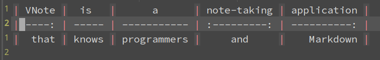
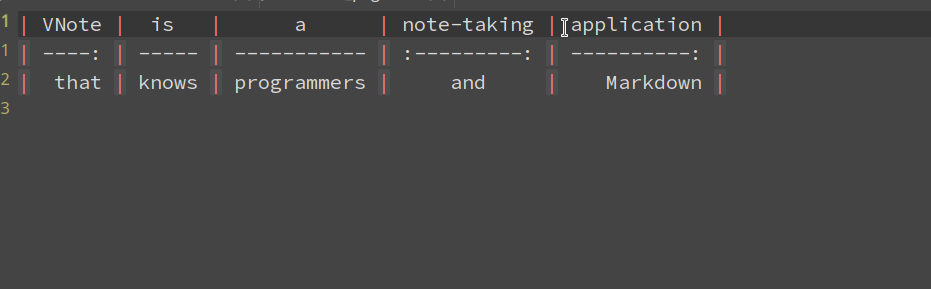
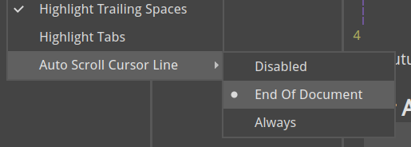
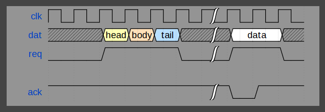

# VNote 2.2 发布
经过将近两个月的开发，很高兴为大家带来VNote 2.2！

在介绍2.2激动人心的更新之前，先给大家介绍一下VNote最新的[网站](https://tamlok.github.io/vnote) 。现在起，这里将会合并VNote的主页和文档。该网站是由另一个我开发的开源项目[Viki](https://tamlok.github.io/viki)生成的。

Viki的部署不需要服务器，而且能识别VNote笔记本的结构。只需要将Viki的几个文件放在VNote笔记本里面，就可以将该笔记本的内容以优美的方式展现给所有人。

下面给大家介绍一下VNote 2.2带来的更新！

## 表格
在VNote发布不久，就一直有很多用户希望能够优化VNote的表格编辑功能。该来的终于来了！

现在在工具栏中有一个插入表格的按钮，可以方便插入一个表格框架。

VNote现在能对GFM表格进行语法高亮以及自动对齐：



非常方便地添加单元格、列和行：



将来会持续添加表格相关的快捷键和上下文菜单。

## 自动滚动光标行

VNote可以锁定光标所在行在编辑器的中央，包括光标在文档末尾的情况下。



## WaveDrom
支持通过WaveDrom来绘制数字时序图。



## 其他
久违的双列模式现在回来了：


新增了几个方便的设置选项：

- 设置编辑器字体，从而覆盖样式文件的配置；
- Windows上面可以设置openGL的配置，再也无需增加系统变量；

对于编辑器：

- VNote会尝试根据文件名字猜测图片标题；
- 支持`~~~`作为代码块的标记；

MathJax：

- 支持公式序号；
- 支持直接书写`\begin` 和 `\end`，而无需`$$`；
- 在`$$..$$`中支持`\text{}`内使用`$..$`；

添加了[markdown-it-container](https://github.com/markdown-it/markdown-it-container) 插件，支持添加一些警告信息：

```
::: alert-info

VNote 2.2 is released!

:::
```

效果如下：


