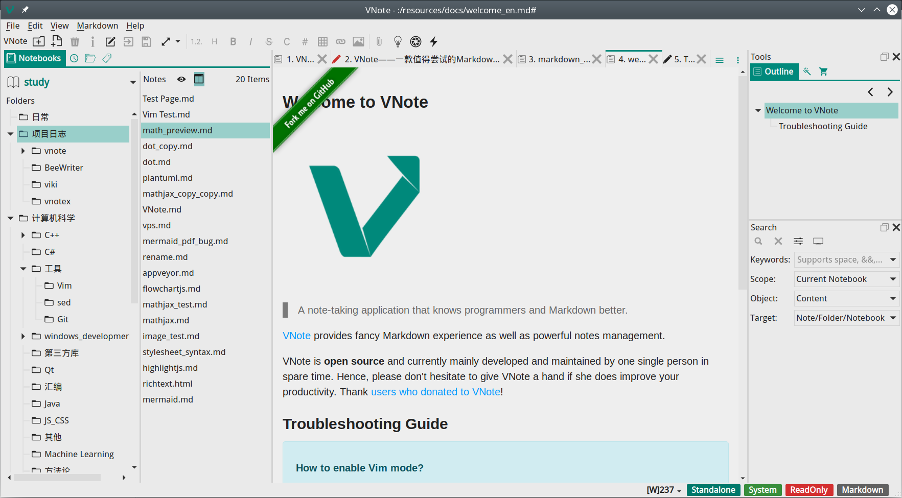
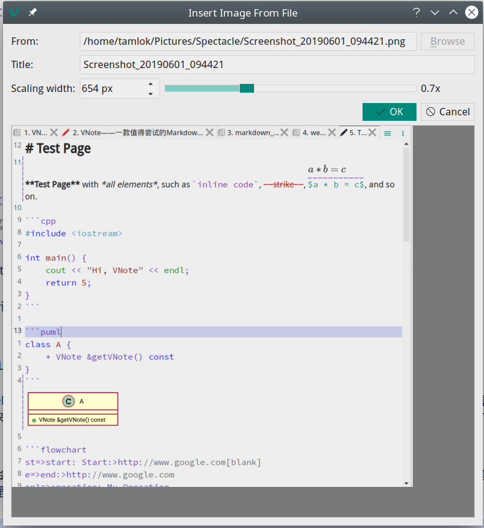
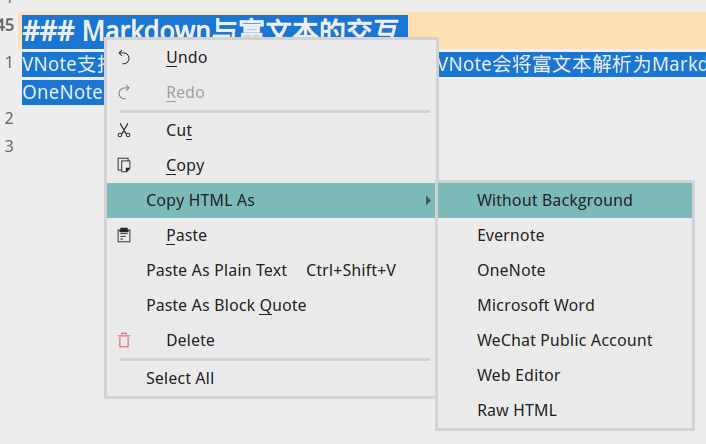
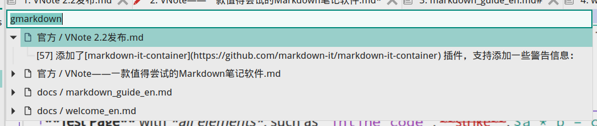
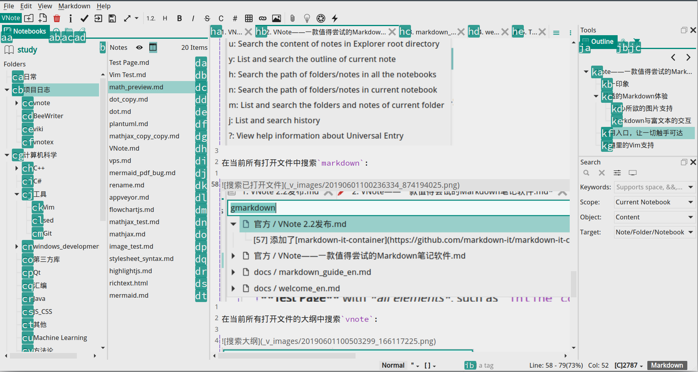

# VNote——一款值得尝试的Markdown笔记软件
[VNote](https://tamlok.github.io/vnote)是一款跨平台的开源Markdown笔记软件（[项目地址](https://github.com/tamlok/vnote) ）。不像其他多数宣称跨平台的软件，VNote将Linux和Windows都作为主要支持平台，在Linux上提供非常优秀的体验。VNote的目标是做一个带有舒适Markdown编辑体验的笔记软件，或者带有强大文件管理功能的Markdown编辑器。VNote借鉴了程序员日常使用的代码编辑器的很多优点，特别是Vim的很多优秀思想，尽力成为一款更懂程序员和Markdown的笔记软件。

需要强调的是，VNote是一款**笔记软件**，而不是一款Markdown编辑器。所以，对比的应该是为知笔记或VSCode或Vim等笔记软件，而不是Typora等编辑器。

## 第一印象

VNote界面的设计原则是尽量利用所有空间，因此没有当前流行的大额头或者侧边栏大按钮，占据主要空间的就是编辑区域。

- 左侧是导航栏，支持笔记本导航、历史文件、浏览外部文件系统以及标签导航；
- 中间是编辑区域，支持多个标签；
- 右侧是工具栏，包括大纲、片段以及小推车；
- 右下角是全文搜索，支持针对当前已打开文件、当前文件夹、当前笔记文本以及所有笔记本的搜索，包括文件名、内容、标签以及大纲搜索；
- 底部是状态栏，包括Vim状态栏、标签栏、编辑器状态栏以及字数统计；
- 顶部是工具栏，其中包括附件、通用入口、灵犀页等常用功能；

左右两侧的栏目都可以通过一个快捷键隐藏或显示，从而可以将编辑区域最大化。VNote使用`笔记本-文件夹-笔记`的层级结构来维护数据，所有数据都是开放的纯文本，因此可以使用其他任意标准工具来编辑或阅读VNote的笔记。VNote不提供数据同步功能，用户需要自己使用第三方的同步软件将数据同步到其他PC上，然后重新导入到VNote中。

## 舒适的Markdown体验
Markdown有着天生的编辑和阅读的割裂感。当前主流的处理方式主要有三种：

1. 单纯按纯文本处理，代表软件是为知笔记，其缺点是只有黑压压的文字；
2. 双边实时预览，左侧编辑模式，右侧实时预览阅读效果，代表软件就很多了，其缺点是仍然割裂，而且浪费空间。现在如果一个软件还采用双边实时预览来编辑Markdown，那基本是拿不出手了；
3. 类富文本实时渲染模式，代表软件是Typora，其缺点是矫枉过正，和Markdown的设计理念背道而驰；

VNote采用的是一种折中的方案——语法高亮和原地预览。通过精心的语法高亮以及图片原地预览，希望能在保证Markdown简洁的前提下，尽可能帮助用户掌握文章信息和脉络。

VNote区分编辑和阅读模式，这是VNote编辑模式的一个界面。该界面展示了VNote支持的主要Markdown元素：

- 所有文本都没有隐藏，而且可以直接访问；
- 语法高亮标题、粗体、斜体；
- 代码块语法高亮；
- 公式、图片原地预览，支持PlantUML、Flowchart等图表增强；
- 行号，包括相对行号或绝对行号；

刚从双边实时预览的软件迁移到VNote时，可能会觉得不太习惯，但随着对Markdown的熟悉，对阅读的效果会越来越有信心，基本能做到在编辑模式下看到的是什么效果，在阅读模式就是这样的效果。如果是刚从Typora迁移过来，则很多人可能都会写错语法，因为使用Typora基本不用关注Markdown的语法，这算是Typora的利弊吧。

### 随心所欲的图片支持
VNote支持直接粘贴插入图片，包括下载并插入网络图片。VNote会将图片保存到与笔记文件同文件夹下面的一个文件夹，所以用其他编辑器打开VNote的笔记，一般都是可以正常显示图片的。另外，VNote还会管理插入的图片，将不再需要的图片自动清理。

### Markdown与富文本的交互
VNote支持直接粘贴复制的富文本（如网页），VNote会将富文本解析为Markdown，并自动下载图片到本地。另外，VNote也支持将Markdown文本复制为富文本，包括微信公众号、Word或OneNote等。

## 通用入口，让一切触手可达
VNote借鉴了代码编辑器里面的模糊搜索功能，提供了**通用入口**功能。通过一个简单的快捷键即可唤出一个输入框，输入内容，即可实现全文搜索、大纲搜索等功能。

在当前所有打开文件中搜索`markdown`：

在当前所有打开文件的大纲中搜索`vnote`：

在VNote中，我基本很少使用工具栏那个传统的全文搜索了。要打开一个文件？通用入口！要查找一个关键字？通用入口！搜索所有大纲？通用入口！列出指定标签的文件？通用入口！全程快捷键高速操作，C++实现的全文搜索引擎即刻为你呈现所有结果！

## Vim的疯狂
VNote名字的由来是: “A Vim-inspired note-taking application”，后面有EMACS用户抱怨所以才慢慢把这个标语去掉了，但Vim思想对VNote的影响可以说得上是疯狂。

VNote编辑器是自己实现了一个简单的Vim模式，基本的操作都支持，标记、寄存器等也有支持，唯一可惜的是还没有支持`.`操作。

VNote对Vim的疯狂可以体现在：

- 所有列表都支持`Ctrl+J/K`上下导航；
- 所有编辑框都支持`Ctrl+U/W/H`向前删除；
- 借鉴Vim的前导键，引入`舰长模式`，基本主要快捷键都通过`Ctrl+E`前导键开始，避免和其他软件的冲突；
- 借鉴Vim的`easy-motion`插件，引入`导航模式`，所有部件都能通过快捷键来获取焦点。

## 细节周到，惊喜不断
由于是个人作品，因此VNote能非常灵活地提供一些非常有趣的巧妙的小功能，例如：

- 灵犀页：一个可以用快捷键打开的临时的页面；
- 快速访问：可以设置一个笔记通过快捷键打开；
- 小推车：任意多选笔记，然后统一处理，例如导出；
- 片段：通过快捷键插入常用文本；
- 幻词：快速插入当前日期等信息，支持编辑器以及新建笔记等输入框；
- 高亮光标行，锁定光标行到编辑区域中央；
- 编辑PlantUML图表时，能双向同步编辑与预览；

VNote还有很多贴心和强大的功能，有兴趣的可以下载尝试。VNote提供了AppImage格式打包的文件，直接下载运行即可。希望这款基于Qt框架开发的笔记软件，能给你带来有别于一众基于Electron开发的其他编辑器的全新体验！
