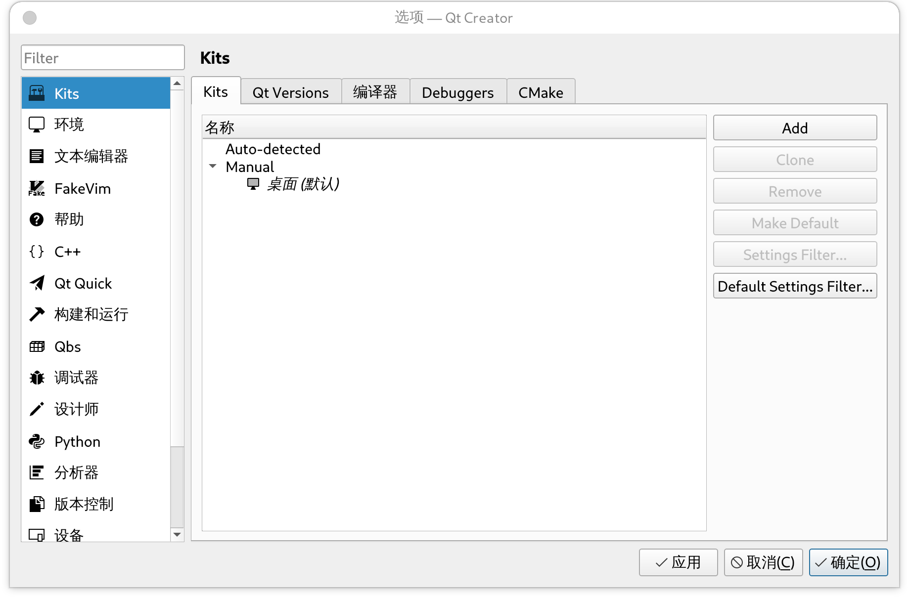
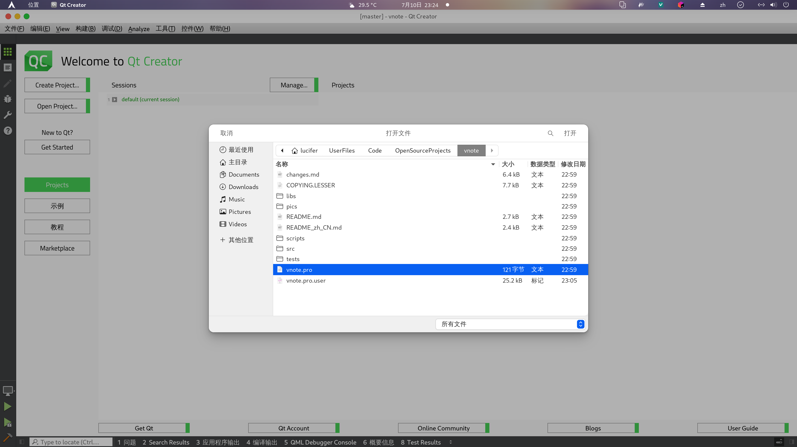
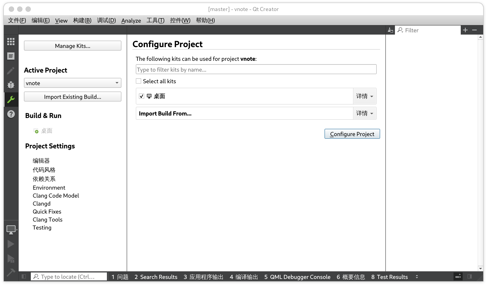
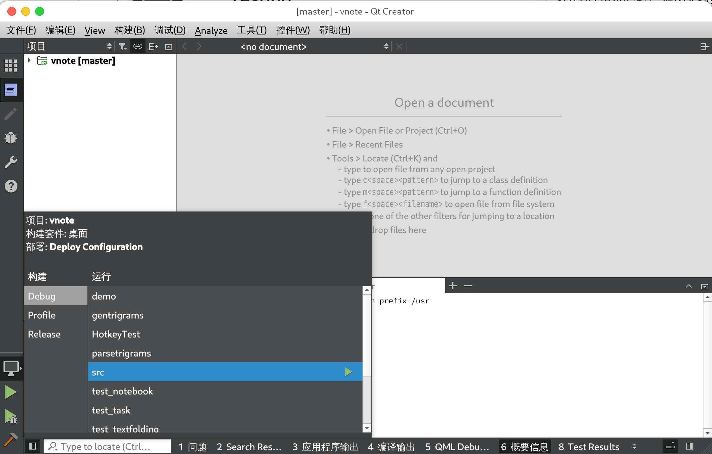
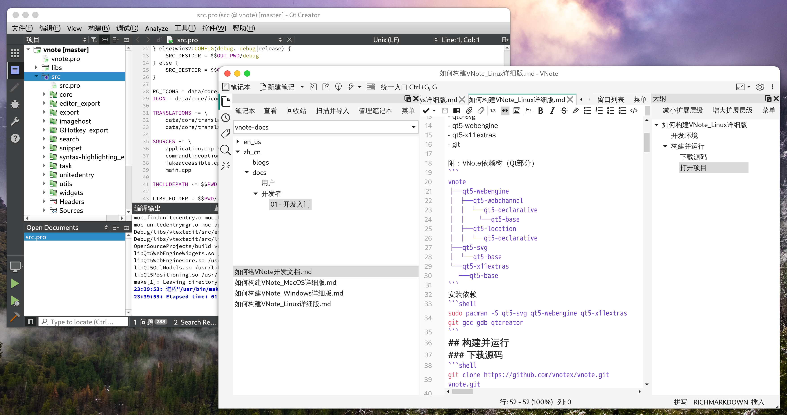

# 如何构建VNote_Linux详细版
本文是对构建VNote 文章中的 Linux (Arch Linux) 系统中构建 VNote 详细图文描述。

## 开发环境
```
OS: Arch Linux Rolling
IDE: Qt Creator 7.0.2-4
Framework: Qt 5.15.5
Tool Chain: qmake-qt5, make 4.3, gcc 12.1.0, gdb 12.1
```

VNote 依赖
- qt5-svg
- qt5-webengine
- qt5-x11extras
- git

附：VNote依赖树（Qt部分）
```
vnote
├─qt5-webengine
│ ├─qt5-webchannel
│ │ └─qt5-declarative
│ │   └─qt5-base
│ ├─qt5-location
│ │ └─qt5-declarative
├─qt5-svg
│ └─qt5-base
└─qt5-x11extras
  └─qt5-base
```
安装依赖
```shell
sudo pacman -S qt5-svg qt5-webengine qt5-x11extras git gcc gdb qtcreator
```
## 构建并运行
### 下载源码
```shell
git clone https://github.com/vnotex/vnote.git vnote.git
cd vnote.git
git submodule update --init --recursive
```
### 使用 Qt Creator
#### 打开项目
打开 Qt Creator 设置，确认Qt Kits配置无误（以上操作正确的话，Qt Creator会自动识别出已安装的Qt Kits）

打开 VNote项目 `vnote.pro` 文件，选择要使用的Qt Kits


#### 编译运行
开始构建VNote

点击按钮即可编译运行

### 使用命令行
```shell
# 假设当前目录为VNote源码目录
# 创建编译目录并切换路径
mkdir ../build && cd ../build
# 生成 Makefile
qmake-qt5 ../vnote/vnote.pro
# 编译
make -j$(nproc)
# 启动 VNote
./src/vnote
# 安装 VNote
sudo make install
# 卸载 VNote
sudo make uninstall
```