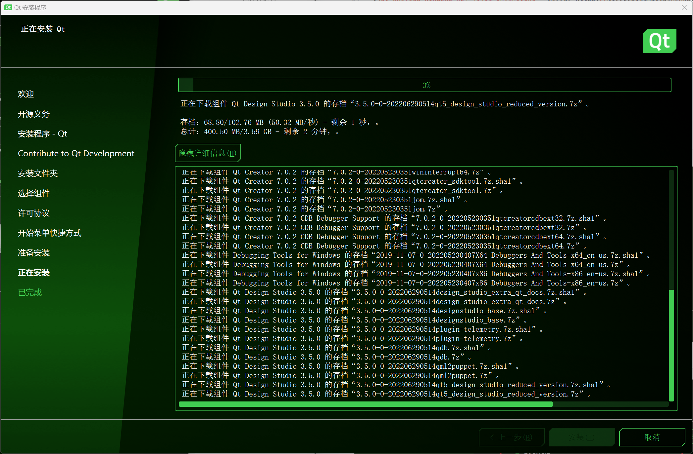

# 如何构建VNote_Windows详细版

本文是对 `构建VNote` 文章中的 `Windows` 系统中构建 `VNote` 详细图文描述。

需要安装 3 个工具，`Visual Studio` 2015或更新版本、`Git`、`Qt 5.15`。

## 安装 Visual Studio

下载 Visual Studio
```
https://visualstudio.microsoft.com/zh-hans/vs/
```

安装 Visual Studio Community 2022，必选组件为
> 使用 C++ 的桌面开发
> 通用 Windows 平台开发


::: alert-danger
切勿修改 Visual Studio 的安装路径，否则影响后面的 Qt Kit配置
:::
## 安装 Git

下载 Git For Windows
```
https://git-scm.com/download/win
```
或者采用 winget 安装
```powershell
winget install --id Git.Git -e --source winget
```
## 安装 Qt

下载在线安装器
```
# qt-unified-windows-x64-online.exe 中科大镜像
https://mirrors.ustc.edu.cn/qtproject/archive/online_installers/4.4/qt-unified-windows-x64-4.4.1-online.exe
```
启动安装器
```powershell
# qt 镜像使用指南: https://mirrors.tuna.tsinghua.edu.cn/help/qt/
.\qt-unified-windows-x64-4.4.1-online.exe --mirror https://mirrors.tuna.tsinghua.edu.cn/qt
```


尽量选择 5.15 的最高版本, 组件根据个人需求选择



Qt环境检查，确保 Qt Kits 配置无误


## 构建并运行
### 下载源码
```shell
git clone https://github.com/vnotex/vnote.git vnote.git
cd vnote.git
git submodule update --init --recursive
```
### 打开项目

打开Qt Creator，点击Open Project按钮，选择源码根目录下的 vnote.pro文件
选择为项目使用的 Qt Kit

然后就可以开始构建VNote了


