# 如何给VNote开发文档

## 获取文档

首先在 https://github.com/vnotex/vnote Fork 项目。

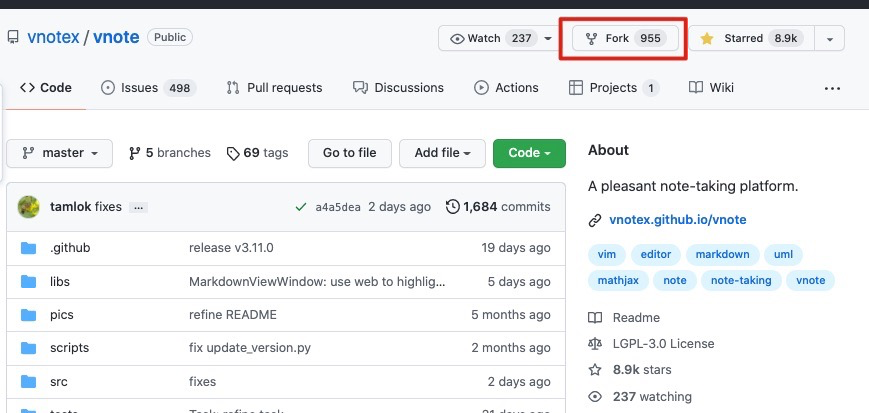

然后在自己的页面里，获得 Clone 地址。

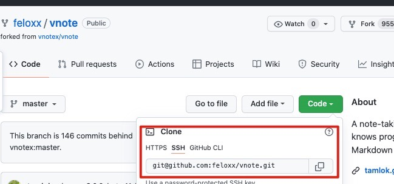

因为 `文档` 与 `源码` 是两个分支。这里在 Clone 的时候建议，起一个别名。

比如 `git@github.com:${YOU_NAME}/vnote.git vnote-document`

然后添加 Remote `git remote add vnotex git@github.com:vnotex/vnote.git`

添加完后效果如下

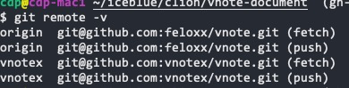

此时我们切换到文档的专用 `分支`。

`git checkout origin/gh-pages`

然后再起一个本地的别名，我一般就与原始同名

`git checkout -b gh-pages`

最后再获取一下远端仓库的更新，并合并到当前分支中

`git fetch vnotex && git pull vnotex gh-pages`

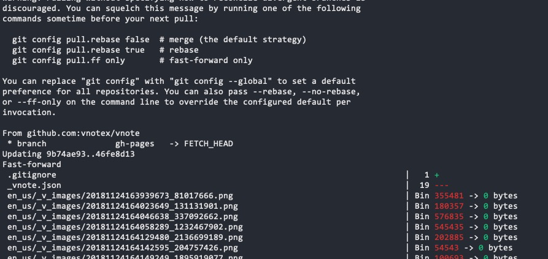

此时你就获得了最新的 `文档` 了。并且该文档是可以使用 `VNote` 开发！

## 开发文档

我们打开 `VNote`，然后选择 `打开其他笔记本`。

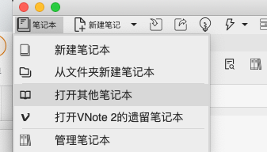

定位到我们刚才获取最新的文档目录。

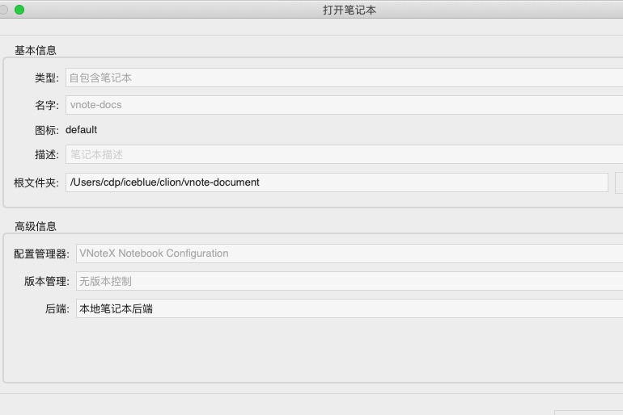

打开后，默认会显示所有文件，这里我们为了方便 `文档` 开发，把 `显示外部文件` 的勾去掉。

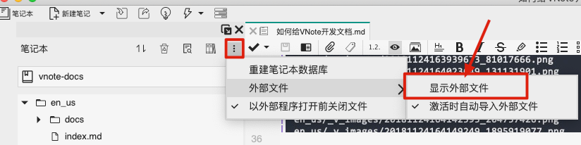

然后我们就可以创建文档啦，比如我现在这篇，`如何给 VNote 开发文档`！

## 提交文档

开发完成后，当然是要进行提交呀。

**注意！我们现在是在文档主分支下开发的，按照 Git 开发约定，我们需要 checkout 一个新分支出来，然提 PR**

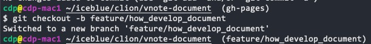

切换到新分支后，我们将进行 `add、commit、push` 一条龙操作。

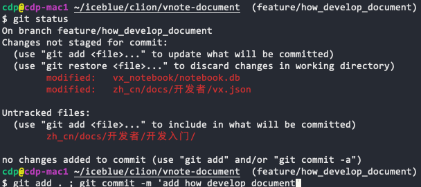

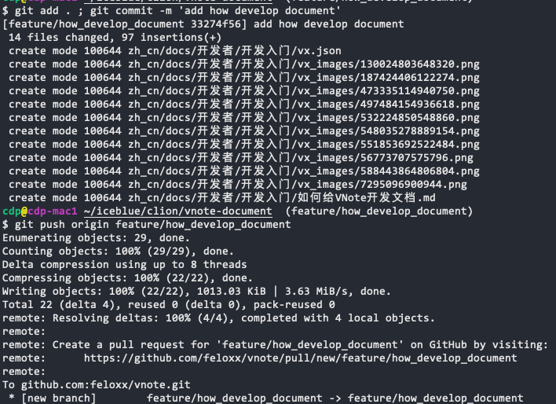

注意，此时是提交到了自己的 Github 中，需要到页面上去发起 PR 合并申请。

发起 PR 合并申请的时候，**千万！ 千万！ 注意选对分支**

::: alert-danger
分支请选择gh-pages  
分支请选择gh-pages  
分支请选择gh-pages  
:::

标题和内容，不做强要求，但是最好用简单好理解的英文表示。

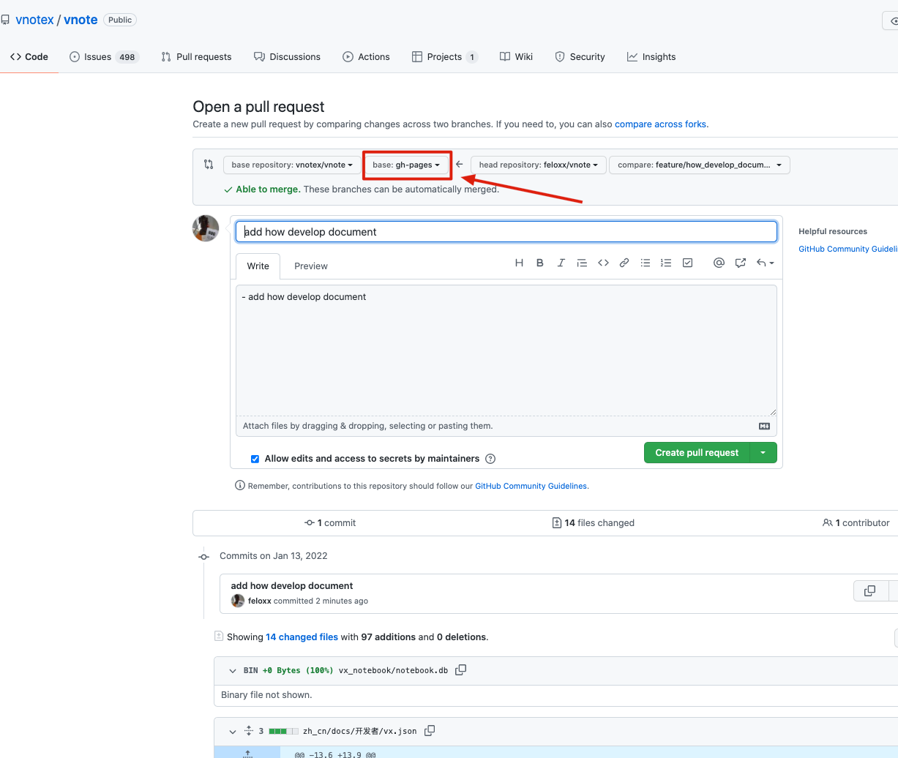

最后，我们点击 `Create pull request`，发起你的第一个 `PR` 吧！