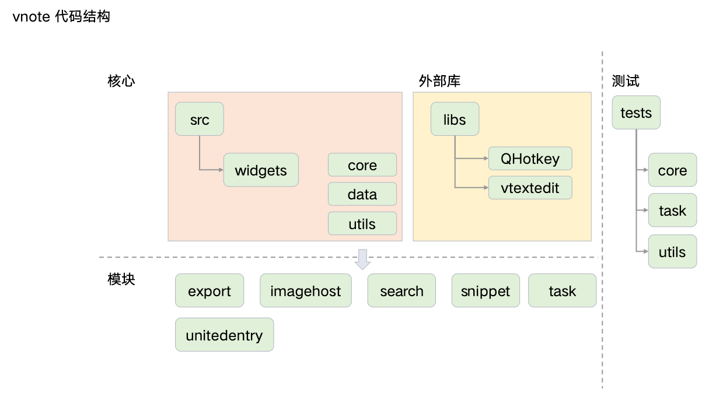

# 工程结构


## 代码结构图




## 结构解析

```
/
├── scripts                                        本地小脚本 更新版本所用
├── .github                                        github CI/CD 流程编排，issues 模板
├── .gitmodules                                    github 规范的 modules 依赖文件
│
├── libs                                           引用的外部库
│     ├── QHotkey                                      跨平台的全局热键
│     ├── vtextedit                                    VNote 自己开源的编辑器
│     └── libs.pro                                     外部库的工程索引文件
│
├── src                                            VNote 源码文件夹
│     ├── core                                     核心源码
│     │     ├── ***                                    其他核心文件
│     │     ├── versioncontroller                      版本管理
│     │     ├── buffer                                 缓存模块
│     │     ├── notebook                               笔记本
│     │     ├── notebookbackend                        笔记本后台
│     │     └── notebookconfigmgr                      笔记本配置管理
│     ├── data                                     VNote 工程数据
│     │     ├── core                                   运行所需要的默认配置
│     │     └── extra                                  额外的资源文件
│     ├── export                                   导出模块
│     ├── imagehost                                图床模块
│     ├── search                                   搜索模块
│     ├── snippet                                  片段模块
│     ├── task                                     任务模块
│     ├── unitedentry                              统一入口模块
│     ├── utils                                    工具模块
│     └── widgets                                  窗体
│         ├── ***                                      其他窗体文件
│         ├── dialogs                                  对话框
│         ├── editors                                  编辑器
│         └── framelessmainwindow                      无边框的窗口
├── pics                                           README所需的图片
│
├── main.cpp                                       程序主入口
├── COPYING.LESSER                                 开源协议
├── README.md
├── README_zh_CN.md
├── build
├── changes.md
├── tests                                          测试
└── vnote.pro                                      Qt 工程文件
```


## 源码模块简单介绍


### libs

依赖的外部库，以 gitmodules 的形式管理，会将一些开源库 fork 到我们自己的仓库中，方便依赖和后续开发。主要也是担心库会莫名其妙消失。

```
[submodule "libs/vtextedit"]
	path = libs/vtextedit
	url = https://github.com/vnotex/vtextedit.git
[submodule "libs/QHotkey"]
	path = libs/QHotkey
	url = https://github.com/vnotex/QHotkey.git
```

更新方式可以使用如下命令：

```
git submodule update --init --recursive
```


### src/core

核心代码文件夹，主要包含以下 `功能性` 内容：

其他在 `src/core` 根目录下的文件

| 名称                  | 解释                                                                             |
| :------------------- | :------------------------------------------------------------------------------- |
| vnotex               | vnote总入口，对核心的功能进行初始化等                                               |
| global               | 全局通用枚举、内联方法                                                             |
| buffermgr            | 缓冲管理器，当前打开的笔记都会进入到缓存中，笔记打开、缓存的增删                      |
| configmgr            | 配置管理器，主配置、当前会话配置、核心配置、编辑器配置、窗体配置的总入口               |
| historymgr           | 操作历史管理器，以json的格式将历史操作数据存储到session.json中                       |
| templatemgr          | 模板管理器，把模板理解为一个笔记即可，获得模板基础信息、文件夹，主题，路径             |
| thememgr             | 主题管理器，调色、高亮、编辑、md配色、icon图标等                                    |
| notebookmgr          | 笔记本管理器，笔记本的CRUD，版本控制、后端、配置、导入等                             |
| mainconfig           | 主配置，版本、核心配置、编辑器配置、窗体配置等入口                                   |
| coreconfig           | 核心配置，设置中的快捷键、主题、检查更新、默认打开                                   |
| editorconfig         | 编辑器配置，设置中的编辑器、文本编辑、markdown编辑、自动保存等                        |
| markdowneditorconfig | markdown编辑器配置，文本、uml、graphviz、mathjax、图片、缩放、代码、链接跳转         |
| texteditorconfig     | 文本编辑器配置，插入模式、光标、折叠、制表符、特殊高亮                                |
| widgetconfig         | 窗体配置，标题自动扩展、序号、查询和替换、 资源视图、搜索、窗体保持、窗体拆分、统一入口 |
| sessionconfig        | 当前会话配置，opengl，当前笔记打开状态、窗体布局等                                   |
| clipboarddata        | 剪切板数据，TODO                                                                  |
| externalfile         | 外部文件，读取、路径、图片等                                                       |
| file                 | 文件，这里主要是对图片操作                                                         |
| historyitem          | 操作历史的item，记录历史的变动                                                     |
| logger               | 日志                                                                             |
| htmltemplatehelper   | html模板帮助                                                                     |
| quickaccesshelper    | 快速访问帮助                                                                      |
| singleinstanceguard  | 窗体的单例，只能打开一个vnote                                                      |
| theme                | 主题的实际应用                                                                    |

文件夹 `buffer` 缓冲区，就是已经打开的笔记

| 名称                   | 解释                                                                                 |
| :-------------------- | :----------------------------------------------------------------------------------- |
| buffer                | 缓冲区的CRUD、视图                                                                    |
| bufferprovider        | 缓冲区供应者，对接vnote自己的笔记的缓冲区，缓冲区的虚方法，TODO为什么这里要定义这些虚方法呢 |
| filebufferprovider    | 文件缓冲区供应者，对接外部文件的缓存区                                                  |
| filetypehelper        | 文件类型帮助                                                                          |
| markdownbuffer        | markdown缓冲区，图片增删，过时图片删除                                                  |
| markdownbufferfactory | marodkwn缓冲区工厂类，创建所用                                                         |
| nodebufferprovider    | 笔记缓冲区提供者 TODO 这块没太懂                                                       |
| textbuffer            | 文本缓冲区                                                                            |
| textbufferfactory     | 文本缓冲区工厂类，创建所用                                                             |

文件夹 `notebook` 笔记的索引、笔记索引的嵌入式数据库操作、标签、参数、外部文件

| 名称                    | 解释                                                                              |
| :--------------------- | :-------------------------------------------------------------------------------- |
| bundlenotebook         | 笔记本打包，会将所有笔记和笔记本拍平后的数据结构、标签、以及对应关系读写到SQLite数据库中 |
| bundlenotebookfactory  | 笔记本打包工厂类                                                                   |
| externalnode           | vnote 未管理的外部节点                                                             |
| node                   | 笔记 (笔记本的节点)  兼容2                                                          |
| nodeparameters         | 笔记的参数，id，创建时间，修改时间，标签，附件                                        |
| notebook               | 笔记本和回收站                                                                     |
| notebookdatabaseaccess | 笔记本和笔记的数据库读写操作                                                         |
| notebookparameters     | 笔记本的参数                                                                       |
| notebooktagmgr         | 笔记本标签管理器                                                                   |
| tag                    | 标签                                                                              |
| vxnode                 | vnotex3的节点                                                                     |
| vxnodefile             | vnotex3的文件                                                                      |

文件夹 `notebookbackend` 笔记后端，如存储等，尚未实现

| 名称                         | 解释                               |
| :-------------------------- | :-------------------------------- |
| inotebookbackend            | 笔记本后端的抽象类，文件的访问和同步 |
| localnotebookbackend        | 笔记本后端的本地文件系统            |
| localnotebookbackendfactory | 笔记本后端工厂类                    |

文件夹 `notebookconfigmgr` 笔记索引配置管理

| 名称                        | 解释                                                 |
| :------------------------- | :-------------------------------------------------- |
| bundlenotebookconfigmgr    | 笔记本配置管理器打包，获取数据库、本地文件索引信息等配置 |
| inotebookconfigmgr         | 笔记本配置管理器的抽象类，配置文件的读写                |
| notebookconfig             | 笔记本配置                                           |
| vxnodeconfig               | vx节点配置                                           |
| vxnotebookconfigmgr        | vx笔记本配置管理器                                    |
| vxnotebookconfigmgrfactory | vx笔记本配置管理器工厂类                              |


文件夹 `versioncontroller` 笔记版本管理(未开发)

| 名称                           | 解释                |
| :---------------------------- | :------------------ |
| dummyversioncontroller        | 虚拟版本控制器       |
| dummyversioncontrollerfactory | 虚拟版本控制器工厂类 |
| versioncontrollerserver       | 版本控制器服务       |


### src/data

资源文件夹，主要包含 `核心资源` 和 `额外资源`，因为是资源文件，所有会有对应的 `.qrc` 工程资源文件，可以理解为在打包时需要哪些资源文件：

core `核心资源`

| 名称           | 解释                                                                                                             |
| :------------ | :--------------------------------------------------------------------------------------------------------------- |
| icons         | 默认的图标文件                                                                                                    |
| logo          | 各尺寸的logo、启动标示图、最小化图标                                                                                |
| translations  | 多语言，目前支持了中文、英文、日文，用 qt 的 languist 先制作好 ts 文件，再生成 qm 文件，其他地方使用 `tr("***")` 来调用 |
| core.qrc      | 工程资源文件，可以理解为打包的时候会将哪些文件打包进去，同时在增删一些文件的时候，也需要调整这里                         |
| Info.plist    | TODO不知道干嘛                                                                                                    |
| vnote.desktop | 桌面快捷方式                                                                                                      |
| vnote.json    | 默认配置                                                                                                          |

extra `额外资源`

| 名称                 | 解释                            |
| :------------------ | :------------------------------ |
| dicts               | 语法检查的字典                   |
| docs                | 文档                            |
| syntax-highlighting | 语法检测的规则文件               |
| tasks               | 任务功能，目前内置了 git 简单操作 |
| themes              | 主题                            |
| web                 | TODO 不知道                     |


### export

导出模块，目前支持 `HTML`、`PDF`、`Markdown`、`自定义` 。

| 名称             | 解释                                      |
| :-------------- | :--------------------------------------- |
| exportdata      | 导出数据转换                               |
| exporter        | 导出器，将对应的数据导出生成其相应格式的文件 |
| webviewexporter | TODO 不知道干嘛                           |


### imagehost

图床模块，目前是支持了 `本地`、`gitee`、`github`。

| 名称             | 解释                |
| :-------------- | :------------------ |
| giteeimagehost  | 码云图床            |
| githubimagehost | github图床          |
| imagehost       | 图床                |
| imagehostmgr    | 图床管理、增删、改名 |
| imagehostutils  | 图床工具类          |
| repoimagehost   | 图床解析、测试、使用 |


### search

搜索模块

| 名称              | 解释                                                      |
| :--------------- | :-------------------------------------------------------- |
| filesearchengine | 文件搜索引擎                                               |
| searchdata       | 搜索条件的转换，把界面上的搜索条件转换成可以进行实际搜索的条件 |
| searcher         | 搜索者，干活开始搜索                                        |
| searchhelper     | 搜索帮助，提供搜索反馈，比如无效关键词等等                    |
| searchresultitem | 搜索结果，这位置列表那里显示出来的那些                       |
| searchtoken      | 搜索令牌、全文检索、正则匹配                                |


### snippet

片段模块

| 名称            | 解释                             |
| :------------- | :------------------------------- |
| dynamicsnippet | 动态片段 TODO 没懂为什么叫动态片段 |
| snippet        | 片段、目前只支持了文本片段         |
| snippetmgr     | 片段管理器、增删改查               |


### task

任务模块

| 名称             | 解释                                                    |
| :-------------- | :------------------------------------------------------ |
| shellexecution  | 脚本执行器，默认为 win：`PowerShell`、其他为：`/bin/bash` |
| task            | 任务、实现了与外部程序的交互                              |
| taskmgr         | 任务管理器、任务刷新、加载                                |
| taskvariablemgr | 任务变量管理器                                           |


### unitedentry

统一入口模块

| 名称                | 解释            |
| :----------------- | :-------------- |
| entrypopup         | 统一入口的弹出框 |
| entrywidgetfactory | 窗口工厂类       |
| findunitedentry    | 统一入口查找     |
| helpunitedentry    | 统一入口帮助     |
| iunitedentry       | 统一入口的接口   |
| unitedentry        | 统一入口         |
| unitedentryalias   | 统一入口别名     |
| unitedentryhelper  | 统一入口帮助     |
| unitedentrymgr     | 统一入口管理器   |


### utils

工具模块

| 名称               | 解释                                         |
| :---------------- | :------------------------------------------- |
| asyncworker       | 异步工作 TODO 不知道                          |
| callbackpool      | 回调池                                        |
| clipboardutils    | 剪切板工具                                    |
| contentmediautils | 媒介内容工具、主要还是对图片的操作              |
| docsutils         | 文档工具，TODO 内部文档所用                    |
| fileutils         | 文件工具，读写文件                             |
| htmlutils         | html工具，解析html辅助所用                     |
| iconutils         | icon工具，icon文件获取、单色渲染               |
| imageutils        | 图片工具，猜测图片格式与后缀 TODO 但是没明白    |
| pathutils         | 路径工具，文件、文件夹路径管理、相对路径管理     |
| printutils        | TODO什么打印呢                                |
| processutils      | 内部程序工具、辅助缓冲、导出、预览、搜索、绘图等 |
| urldragdroputils  | Url拖拽工具，TODO不知道是哪里拖拽              |
| utils             | 其他工具                                      |
| webutils          | 网页工具                                      |
| widgetutils       | 窗体工具                                      |


### widget

窗体模块


| 名称                             | 解释                                                                   |
| :------------------------------ | :--------------------------------------------------------------------- |
| attachmentdragdropareaindicator | TODO 不知道                                                            |
| attachmentpopup                 | 附件弹出框                                                             |
| biaction                        | TODO bi动作                                                            |
| buttonpopup                     | 按钮弹出框                                                             |
| combobox                        | 解决间距的下拉菜单                                                      |
| consoleviewer                   | 控制台预览                                                             |
| dockwidgethelper                | 左侧导航坞窗体帮助                                                      |
| dragdropareaindicator           | 拖放区域指示部件                                                        |
| editreaddiscardaction           | (阅读模式、编辑模式、放弃)动作                                           |
| filesystemviewer                | 文件系统观察者                                                          |
| findandreplacewidget            | 查找和替换窗体                                                          |
| floatingwidget                  | 浮动窗体                                                               |
| fullscreentoggleaction          | 全屏切换                                                               |
| historypanel                    | 历史记录面板                                                            |
| itemproxystyle                  | TODO 不知道                                                            |
| labelwithbuttonswidget          | 标签按钮小部件                                                          |
| lineedit                        | 行编辑部件                                                             |
| lineeditdelegate                | 行编辑部件代理                                                          |
| lineeditwithsnippet             | 行编辑与片段                                                            |
| listwidget                      | 列表窗体                                                               |
| locationinputwithbrowsebutton   | TODO                                                                   |
| locationlist                    | 位置列表                                                               |
| mainwindow                      | 主窗体，窗体总入口                                                      |
| markdownviewwindow              | markdown视图                                                           |
| messageboxhelper                | 消息推送帮助                                                            |
| navigationmode                  | 导航模式接口，如果一个小部件想要支持导航模式，则需要继承这个类。            |
| navigationmodemgr               | 导航模式管理器                                                          |
| notebookexplorer                | 笔记本资源管理器                                                        |
| notebookexplorersession         | 笔记本资源管理器当前会话，用与重新打开后的会话恢复                         |
| notebooknodeexplorer            | 笔记本中的笔记资源管理器                                                 |
| notebookselector                | 笔记本选择器                                                            |
| outlinepopup                    | 笔记中弹出的大纲                                                        |
| outlineprovider                 | 大纲提供者                                                             |
| outlineviewer                   | 大纲视图                                                               |
| propertydefs                    | 定义用于QSS的属性。                                                     |
| quickselector                   | TODO                                                                   |
| searchinfoprovider              | 搜索提供者                                                             |
| searchpanel                     | 搜索面板                                                               |
| simplesegmenthighlighter        | TODO                                                                   |
| snippetpanel                    | 片段面板                                                               |
| statusbarhelper                 | 状态栏帮助                                                             |
| styleditemdelegate              | 样式代理                                                               |
| systemtrayhelper                | 系统托盘                                                               |
| tagexplorer                     | 标签资源管理器                                                          |
| tagpopup                        | 笔记中的标签弹出框                                                      |
| tagviewer                       | 标签视图                                                               |
| textviewwindow                  | 文本视图窗体                                                            |
| titlebar                        | 标题栏                                                                 |
| titletoolbar                    | 标题工具栏                                                             |
| toolbarhelper                   | 工具栏帮助                                                             |
| toolbox                         | TODO                                                                   |
| treeview                        | TODO                                                                   |
| treewidget                      | vnotex修改后的树窗体                                                    |
| treewidgetitem                  | vnotex修改后的树窗体的选项，修改了默认排序                                |
| viewarea                        | 视图区域  TODO                                                         |
| viewareasession                 | TODO                                                                   |
| viewsplit                       | 视图拆分                                                               |
| viewwindow                      | 视图拆分后的窗体                                                        |
| viewwindowsession               | TODO                                                                   |
| viewwindowtoolbarhelper         | 视图工具栏帮助                                                          |
| webpage                         | TODO                                                                   |
| webviewer                       | TODO                                                                   |
| widgetsfactory                  | 窗体工厂类，菜单、行编辑、行编辑片段、单选框、多选框、下拉框、旋转、纯文本等 |
| windowspanel                    | 窗体面板                                                               |
| windowsprovider                 | 窗体提供者                                                             |
| wordcountpopup                  | 字数统计弹出框                                                          |

dialogs 对话框

| 名称                         | 解释                    |
| :-------------------------- | :--------------------- |
| deleteconfirmdialog         | 需要确认的删除项信息     |
| dialog                      | vnotex修改后的对话框     |
| exportdialog                | 导出对话框              |
| filepropertiesdialog        | 文件配置对话框           |
| folderfilesfilterwidget     | 文件夹过滤窗体           |
| folderpropertiesdialog      | 文件夹设置对话框         |
| imageinsertdialog           | 图片插入对话框           |
| importfolderdialog          | 导入文件夹对话框         |
| importfolderutils           | 导入文件夹工具类         |
| importlegacynotebookdialog  | 导入旧版的笔记本对话框   |
| importnotebookdialog        | 导入笔记本对话框         |
| legacynotebookutils         | 旧版笔记本工具类         |
| levellabelwithupbutton      | TODO                   |
| linkinsertdialog            | 链接插入对话框           |
| managenotebooksdialog       | 笔记本管理对话框         |
| newfolderdialog             | 新建文件夹对话框         |
| newnotebookdialog           | 新建笔记本对话框         |
| newnotebookfromfolderdialog | 从文件夹新建笔记本对话框 |
| newnotedialog               | 新建笔记对话框           |
| newsnippetdialog            | 新建片段对话框           |
| newtagdialog                | 新建标签对话框           |
| nodeinfowidget              | 节点(笔记)信息窗体       |
| notebookinfowidget          | 笔记本信息窗体           |
| notepropertiesdialog        | 笔记属性对话框           |
| renametagdialog             | 名称变更对话框           |
| scrolldialog                | 滚动条对话框            |
| selectdialog                | 选择对话框              |
| selectionitemwidget         | 选择项窗体              |
| snippetinfowidget           | 片段窗体                |
| snippetpropertiesdialog     | 片段属性对话框           |
| sortdialog                  | 排序对话框              |
| tableinsertdialog           | 表格插入对话框           |
| updater                     | 自动更新                |
| viewtagsdialog              | TODO                   |

editors 编辑器

| 名称                         | 解释                     |
| :-------------------------- | :----------------------- |
| editormarkdownvieweradapter | markdown 编辑器视图适配器 |
| graphhelper                 | 图帮助                    |
| graphvizhelper              |                          |
| markdowneditor              | markdown编辑器            |
| markdowntable               | markdown中的智能表格      |
| markdowntablehelper         | markdown表格帮助          |
| markdownviewer              | TODO                     |
| markdownvieweradapter       | TODO                     |
| plantumlhelper              | uml帮助                  |
| previewhelper               | 预览帮助                  |
| statuswidget                | 状态窗体                  |
| texteditor                  | 纯文本编辑器              |

framelessmainwindow 无边框窗口

| 名称                      | 解释      |
| :----------------------- | :-------- |
| framelessmainwindow      | 主窗体     |
| framelessmainwindowlinux | 针对linux |
| framelessmainwindowwin   | 针对win   |

