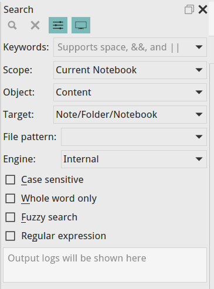

# 全文搜索
VNote提供强大的内置的全文搜索功能，以搜索您的笔记。

按`Ctrl+E C` 或`Ctrl+Alt F` 激活**搜索**坞小部件。您也可以通过`编辑`或`查看`菜单激活它。

## 关键词
- 指定要搜索的关键字；
- 支持`&&`和`||` 用于AND和OR逻辑，例如`markdown && vnote`；
- 以空格分隔的关键字表示AND，例如 `markdown vnote`；

### Magic Switch
VNote支持关键字中的**Magic Switch**来打开/关闭搜索的某些选项：

- `\f`或`\F`：禁用或启用**模糊搜索**；
- `\c`或`\C`：不区分大小写或敏感；
- `\r`或`\R`：禁用或启用**正则表达式**；
- `\w`或`\W`：禁用或启用**仅限全字**；

例子：`vnote \C \W`用于`不区分大小写`并且`仅限全字`搜索vnote。

## 范围
限制搜索有四个范围：

-  `已打开笔记`；
- `当前文件夹`；
- `当前笔记本`；
- `所有笔记本`；

## 对象
指定是否应对**内容**或**名称**执行搜索。

## 目标
我们可以搜索：

- `笔记`；
- `文件夹`；
- `笔记本`；
- `笔记/文件夹/笔记本`；

## 文件模式
我们可以指定文件模式来过滤以获得我们感兴趣的文件，例如`*.md`以仅搜索Markdown文件。