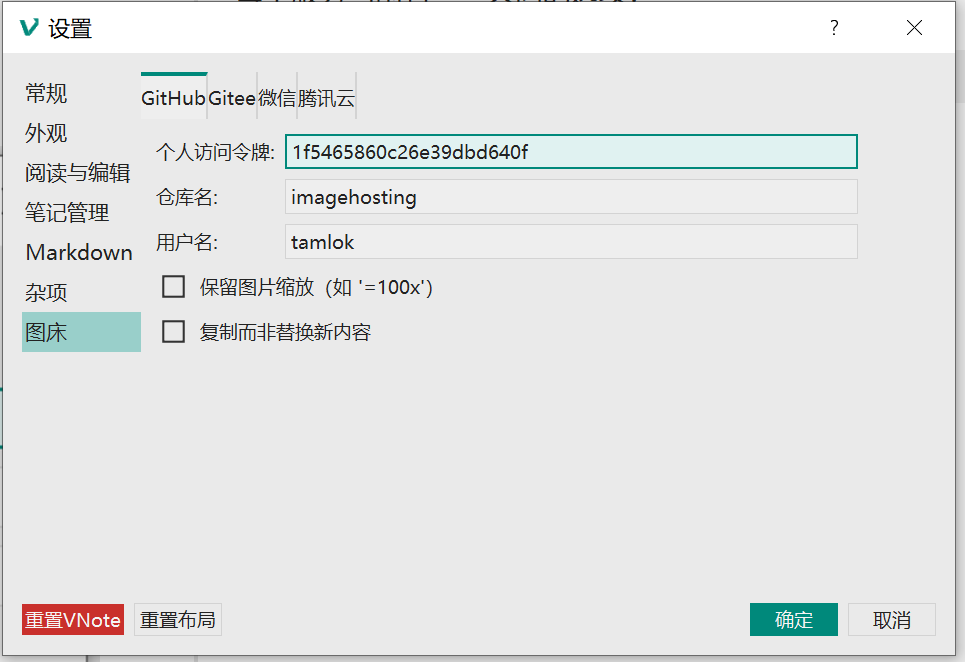
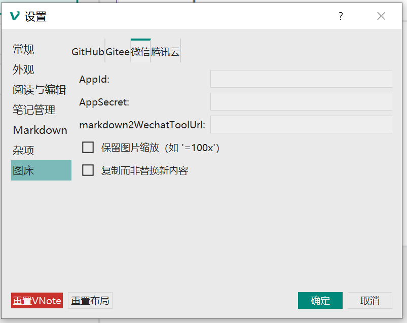
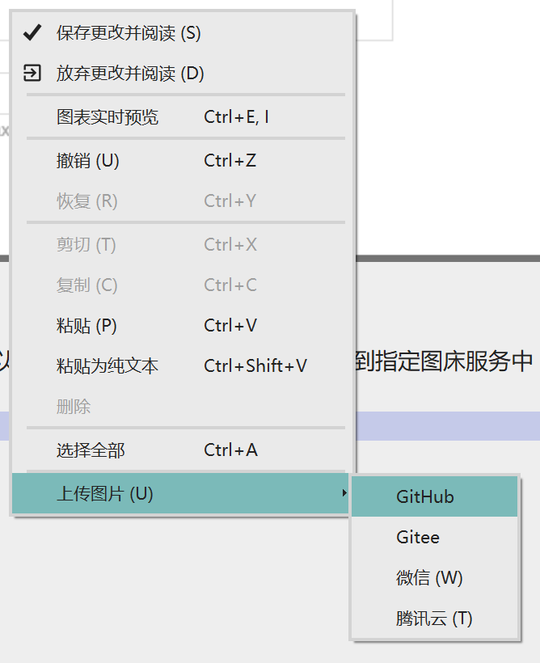

# 图床
从v2.8开始，VNote支持多个图床服务，将本地图片上传到云服务。

当前VNote支持4个服务：

- GitHub;
- Gitee;
- 微信公众平台；
- 腾讯云；

对于每个服务，您都需要配置服务提供商并向VNote提供相关令牌以访问这些服务。

每个服务当前有一些共同的选项：

- `保留图片缩放`： 新的图片链接中是否保留缩放；
- `复制而非替换新内容`： 上传图片后，只复制带有新链接的内容，不要替换原文件；

## 配置
### GitHub

对于GitHub，需要提供：

- `个人访问令牌`： 访问GitHub的`Settings`，`Developer Settings`，`Personal Access Tokens`，然后生成一个新的令牌（需要提供仓库的全部访问权限）。  

- `仓库名`：用于保存图片的GitHub仓库名；
- `用户名`：GitHub用户名；

### Gitee
Gitee的配置和GitHub大同小异。

### 微信公众平台

访问[微信公众平台](https://mp.weixin.qq.com/)，`开发`，`基本配置`，找到`开发者ID`和`开发者密码`即可。

另外，还需要在`IP白名单`中添加当前电脑的IP地址。

`markdown2WechatToolUrl` 可以填写一个链接，VNote在复制内容后自动打开该链接，方便后续发布。

### 腾讯云

访问[腾讯云管理后台](https://console.cloud.tencent.com/)，`云产品`，`对象存储`。

在`密钥管理`中新建密钥，拿到`SecretId`和`SecretKey`。

回到`对象存储`，选择`存储桶列表`，`创建存储桶`，访问权限选择`公有读私有写`即可。

在左侧`基础配置`，可以看到VNote需要的`访问域名`。

最后，还需要添加一个CORS规则：

## 如何使用
完成编写一篇笔记后，可以在上下文菜单中选择上传本地图片到指定图床服务中（在编辑模式下）。

VNote会遍历所有的本地图片并上传。

- 如果选择了替换原文件，则上传完成后会修改文件内容。保存的时候，VNote会提示是是否删除不再被引用的图片。
- 否则，VNote只会复制新的内容，但不会修改原文件。

感谢@fengwenhua提供该功能实现！