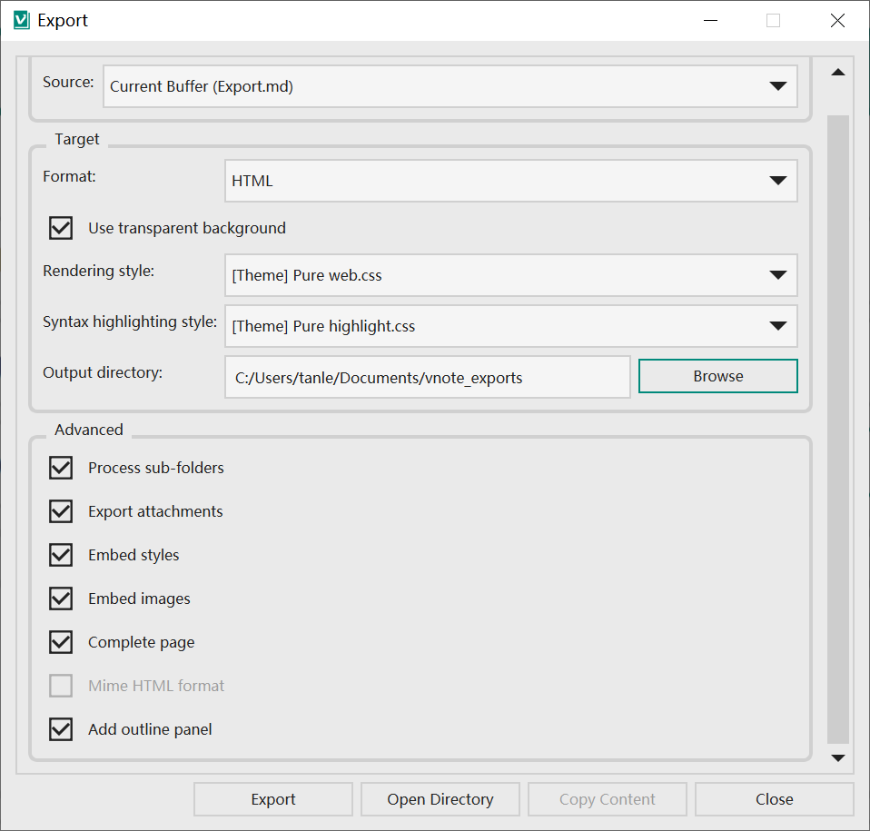
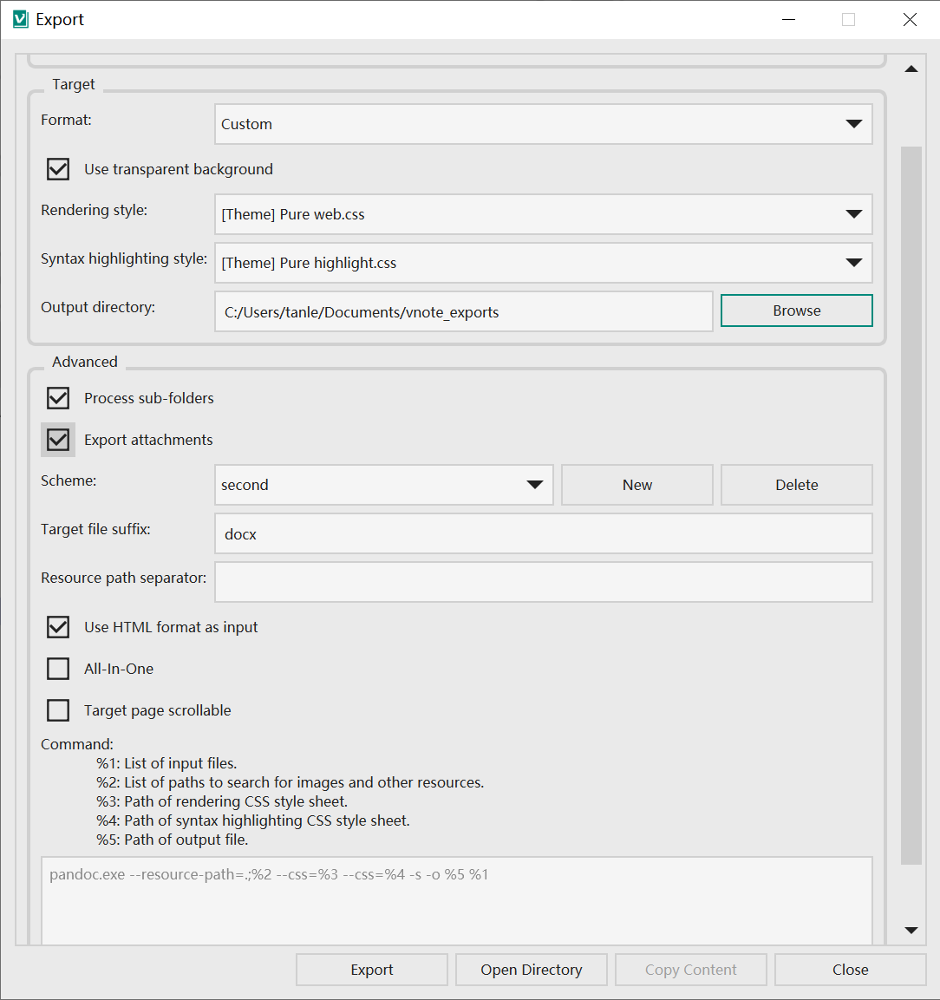

# 导出
VNote支持将笔记导出为多种格式，如`Markdown`，`PDF`和`HTML`。通过使用[Pandoc](https://pandoc.org/)，可以支持更多目标格式。

## 通用设置


* VNote支持导出当前笔记、当前文件夹的笔记以及当前笔记本的所有笔记。
* 目前格式包括`Markdown`,`HTMl`,`PDF`和`自定义`。
* VNote支持指定导出时使用不同的渲染样式。

## Markdown
VNote会将文件导出为`Markdown`格式到一个单独的目录，其中包含对应的图片和附件。

## HTML


VNote允许将文件导出为一个单独的`HTML`页面，其中会嵌入用到的样式和图片，方便分享。

## PDF


VNote支持直接导出为`PDF`或者通过`wkhtmltopdf`工具进行导出。后者支持大纲。

`多合一`选项运行将多个文件导出并合并为一个目标文件。

## 自定义


VNote允许使用自定义的命令来导出文件。一个常用的工具是`pandoc`。请参考该工具的文档以获取详细用法。我们甚至可以使用脚本来处理笔记。

在Windows上，以下命令通过使用`pandoc`可以将文件导出为几乎任意格式。只需要修改`目标文件后缀`为`docx`或者`epub`等即可。

```
"c:\your\path\to\the\downloaded\executable\pandoc.exe" --resource-path=.;%2 --css=%3 --css=%4 -s -o %5 %1
```

在非Windows平台上，请将分隔符`;`改为`:`。
