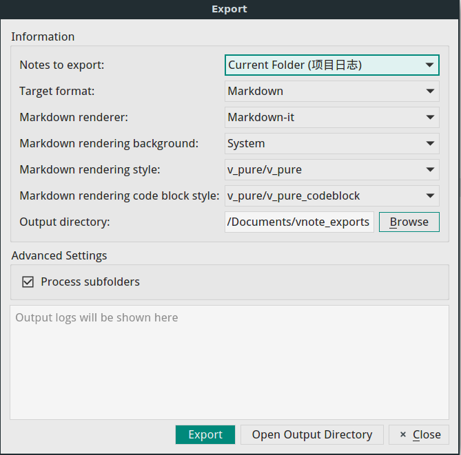

# 导出
VNote支持丰富且可扩展的导出。



## 来源
有四种来源可供选择需要导出的笔记。

- **当前笔记**
    - 导出当前笔记；
- **当前文件夹**
    - 导出当前文件夹中的所有笔记；
    - 支持递归导出子文件夹；
- **当前笔记本**
    - 导出当前笔记本的所有笔记；
- **小推车**
    - 小推车是一个收集随机笔记以便进一步处理的工具。

## 选项
我们可以为导出指定**Markdown渲染器**，**Markdown渲染背景**，**Markdown渲染样式**和**Markdown渲染代码块样式**。例如，我们可以在导出为PDFs时指定*透明*背景。

## 格式
### Markdown
我们可以将Markdown类型的笔记导出为Markdown格式。对于名为`vnote.md`的笔记，VNote将创建名为`vnote_md`的文件夹，然后将`vnote_md`复制到此文件夹，然后复制此笔记的本地图像，然后复制此笔记的附件。在此之后，我们可以压缩此文件夹并共享它。

### HTML
将注释导出为HTML格式时，VNote将首先呈现笔记的Markdown格式，然后将HTML作为文件输出。HTML格式的高级设置包括：

- **嵌入CSS样式**
    - 在导出的HTML文件中嵌入CSS样式。
- **完整页面**
    - 选中后，VNote还将导出除HTML文件之外的相关图像。如果未选中，则可能会丢失本地图像。
- **MIME HTML**
    - 导出MIME HTML格式。

### PDF
VNote支持将笔记导出为PDF文件。页面大小和边距是可配置的。有两个引擎可供选择执行导出。

#### 内置引擎
内置引擎可以更好地处理内容，但在生成的PDF文件中缺少书签。

#### wkhtmltopdf
[wkhtmltopdf](https://wkhtmltopdf.org/)是将HTML转换为PDF的第三方工具。您需要额外安装这个VNote将使用的工具。使用此引擎时，VNote将首先将Markdown注释转换为HTML格式，然后使用生成的HTML文件作为输入调用*wkhtmltopdf*。


高级设置包括：

- **wkhtmltopdf** 路径
    - wkhtmltopdf可执行文件的路径。
- **标题**
    - 生成的PDF的标题。它仅在启用**All In One**时有效。
- **输出的文件名**
    - 生成的PDF文件的名称。它仅在启用**All In One**时有效。
- **页码**
    - 是否将页码附加到每个页面及其位置。
- **启用背景**
    - 是否启用HTML的背景。
- **其他选项**
    - 其他全局选项将传递给wkhtmltopdf。有关可用选项，请参阅wkhtmltopdf的文档。

### PDF（All In One）
选择此格式时，VNote将使用wkhtmltopdf工具将多个Markdown笔记转换为**一个**PDF文件。为了使这项工作顺利进行，一个实用技巧是从二级标题作为**标题序列**的开始，并将每个笔记的名称以一级标题形式插入。

### 自定义
**自定义**格式使用户可以选择他们喜欢的任何工具来处理笔记。


高级设置：

- **格式来源**
    - VNote支持使用Markdown或HTML格式作为输入的工具。
- **输出后缀**
    - 输出文件的后缀，例如docx，pdf或ppt。
- **启用All In One**
    - 是否将多个笔记一次性输入到您的工具中。它们由空格分隔。
- **输出的文件名**
    - 输出的文件名。它仅在启用**All In One**时有效。
- **输入目录分隔符**
    - VNote可以将输入笔记的目录传递给您的工具。您可以使用这些目录作为来源文件夹。此选项指定用于连接这些目录的分隔符。
- 命令
    - 该命令由VNote执行。您可以使用的一些特殊占位符：
        - ％0：输入文件；
        - ％1：输出文件；
        - ％2：要使用的渲染CSS样式的文件；
        - ％3：输入文件目录；
        - ％4：渲染代码块要使用的CSS样式的文件；

使用[pandoc](http://pandoc.org)导出笔记的示例：

```sh
pandoc --resource-path=.:"%3" --css="%2" --css="%4" -s -o "%1" "%0"
```

::: alert-info

根据Pandoc语法，Windows上，需要将分隔符`:`改为`;`。

:::

如果输出的后缀是`pdf`，它将生成PDF文件；如果是`docx`，它将生成DOCX文件；如果是`pptx`，它将生成PPTX文件。