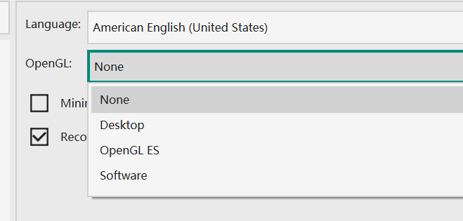

# 常见问题
## 如何指定自定义MathJax脚本？
VNote使用MathJax 3渲染数学公式。要指定使用的MathJax脚本，请执行以下步骤：

1. 打开默认配置文件夹，复制其中的`web/js/mathjax.js`到用户配置文件夹，保留路径`web/js/mathjax.js`，然后就可以修改该`mathjax.js`文件了。这样，VNote就会使用复制后的文件，而不是默认的文件。
2. 编辑`mathjax.js`文件。使用的MathJax脚本由这一行指定：
    ```js
            this.mathJaxScript = 'https://cdn.jsdelivr.net/npm/mathjax@3/es5/tex-svg.js';
    ```

您可以[下载MathJax](https://docs.mathjax.org/en/latest/web/hosting.html)并指定一个本地的MathJax脚本：

```js
this.mathJaxScript = 'file://c:/Users/foo/mathjax/tex-svg.js';
```

## 更新后启动失败
一般是由于跨多个版本号进行更新引起的。打开用户配置文件夹，并删除其中的`vnotex.json`即可。

## 界面无响应
## 编辑模式中光标不可见
## 打开一个笔记时程序崩溃
当出现在Windows上时，以上三个问题都可能是因为显卡驱动的原因。可以逐步尝试以下3个步骤：

1. 尝试更新显卡驱动；
2. 尝试将VNote指定使用集成显卡；
3. 尝试在`设置`对话框里面指定`OpenGL`的值，逐个值进行尝试。  


每一步操作都需要重启VNote来验证是否有用。
