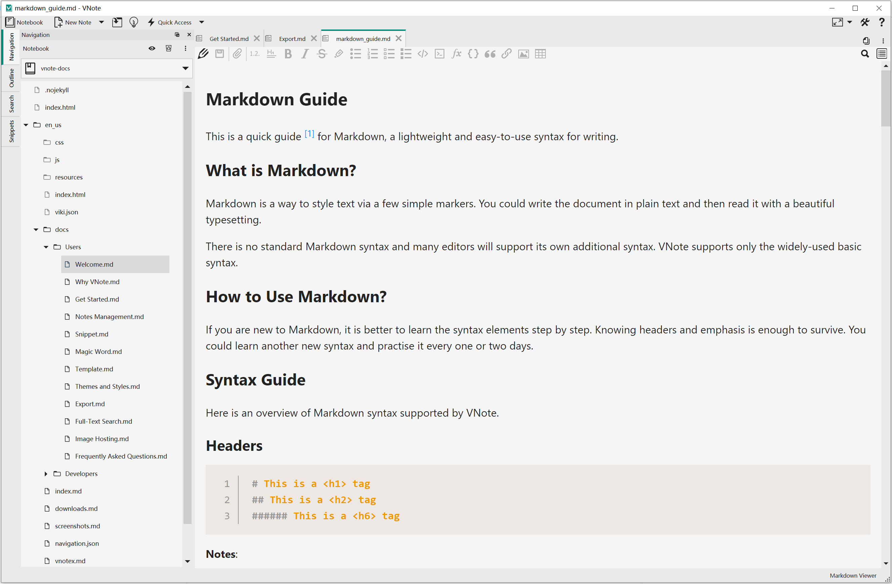

# 快速上手
VNote适用于**Linux**，**Windows**和**macOS**操作系统。您可以从[下载](https://github.com/vnotex/vnote#downloads)页面获取独立软件包。

建议下载并使用VNote的**稳定版本**。如果您更喜欢使用VNote的一些最新功能，可以尝试使用从`master`分支产生的最新版本。

除了独立的安装包之外，一些包管理者可能已经打包和分发VNote，例如*AUR*和*homebrew cask*。

## 主界面
这是VNote主界面的截图。

### 笔记本，文件夹和笔记
VNote使用**笔记本**、**文件夹**和**笔记**层次结构进行笔记管理。左侧面板用于浏览笔记本，文件夹和笔记。

笔记本对应于文件系统中的目录。您应该选择一个空目录作为您的*笔记本根文件夹*。此笔记本的所有内容都将被存储在笔记本根文件夹中。

一旦您有了一个笔记本，就可以在这个笔记本中创建文件夹。VNote支持无限级别的文件夹。

### 内容区域
占据大部分空间的中间区域是**内容区域**，用于阅读和编辑笔记。VNote支持通过选项卡打开多个笔记。

### 停靠部件
在左侧，有多个停靠部件，包括**导航**，**大纲**，**搜索**等。它们可以被自由拖拽并放置到主窗口的上下左右部分。

### 准备开始
这就是VNote了！现在，您可以在VNote中阅读、编辑和管理您的笔记了！
