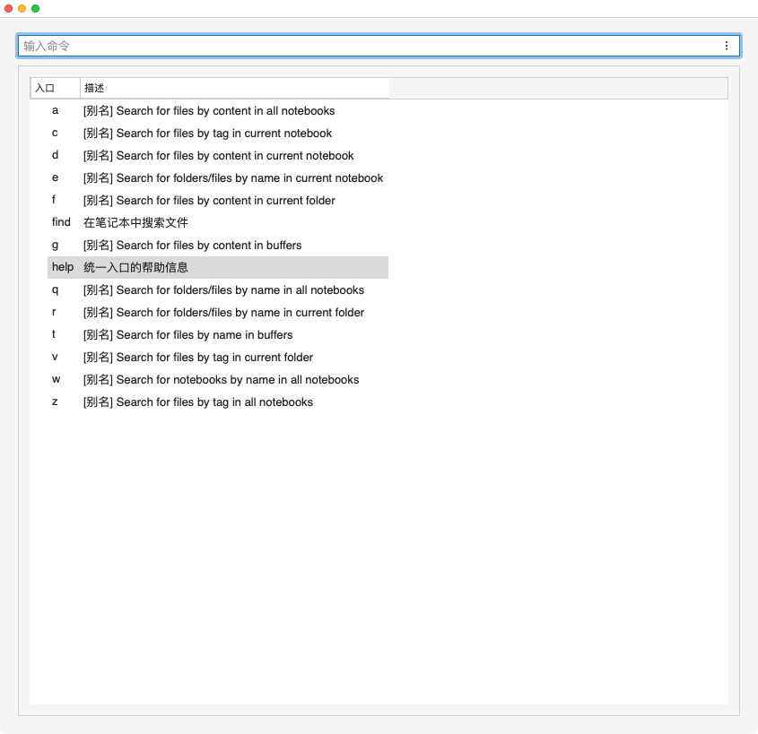
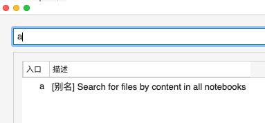
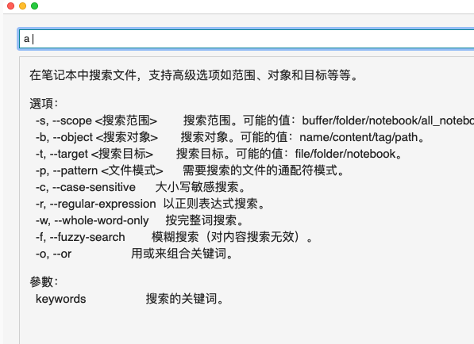
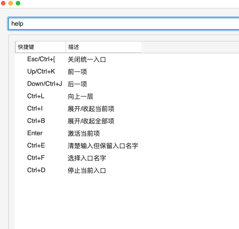
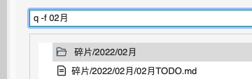
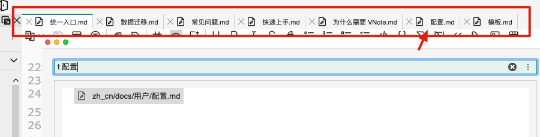
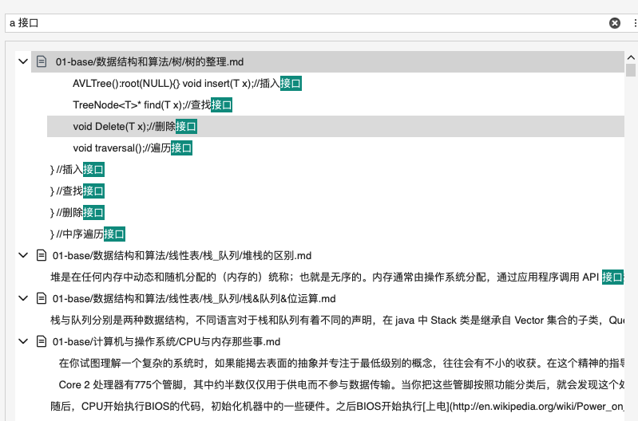
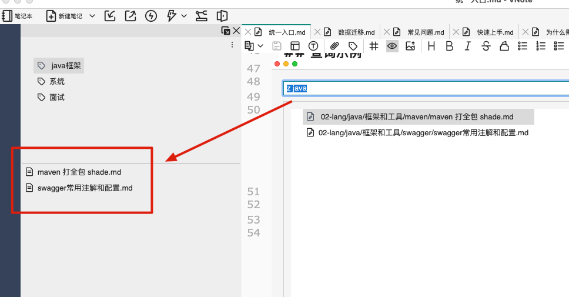

# 统一入口

VNote 支持除了在左侧导航栏使用 `搜索` 以外，还支持在 `统一入口` 中用纯命令的方式快捷搜索。

简单的说就是使用一个 `入口命令` + `搜索条件` 就可以快速搜索对应笔记文件夹或笔记以及文件。

## 激活方式

默认使用快捷键 `Ctrl+G, G` 激活，触发后可以看到如下界面：

同时也可以修改配置文件中的 `"UnitedEntry": "Ctrl+G, G"` 来更换成你习惯的快捷键。

输入相应的 `入口命令` 时，统一入口会进行自动筛选，效果如下：

输入命令后，再加一个 `空格` 会触发二段显示，一般为详细的帮助。

## 命令介绍

VNote 提供了一下 `入口命令` 来完成快速查询

| 入口命令 |             描述             | 
| ------ | --------------------------- |
| a       | 在所有笔记本中按内容搜索文件       |
| c       | 在当前笔记本中按标签搜索文件       |
| d       | 根据当前笔记本中的内容搜索文件      |
| e       | 在当前笔记本中按名称搜索文件夹/文件 |
| f       | 在当前文件夹中按内容搜索文件       |
| find    | 在笔记本中搜索文件              |
| g       | 根据缓冲区中的内容搜索文件         |
| help    | 统一入口的帮助信息                 |
| q       | 在所有笔记本中按名称搜索文件夹/文件 |
| r       | 在当前文件夹中按名称搜索文件夹/文件 |
| t       | 在缓冲区中按名称搜索文件          |
| v       | 在当前文件夹中按标签搜索文件       |
| w       | 在所有笔记本中按名称搜索笔记本      |
| z       | 在所有笔记本中按标签查找文件        |

## 查询示例

在所有笔记本中找到所有包含 `02月` 的 `文件夹/文件`：

在当前缓冲区找到包含 `配置` 的 `文件`：

在所有笔记本中搜索包含关键字 `接口` 的笔记：

在所有标签中搜索属于关键字 `java` 标签中的笔记：

## 定位

<mark>注意！不同的操作系统触发定位的方式可能有些区别。</mark>

### macos 下的定位

当搜索到结果后，需要按一下 `Tab` 键，将光标的定位移动到下面的搜索结果栏中，再按 `Enter` 即可定位到对应目标。

### windows 下的定位

windows 下搜索完后默认是停留在结果栏的第一位中，可以直接按 `Enter` 既定位第一个。 也可以进行移动再定位。
