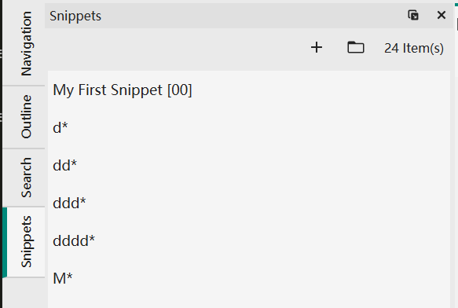
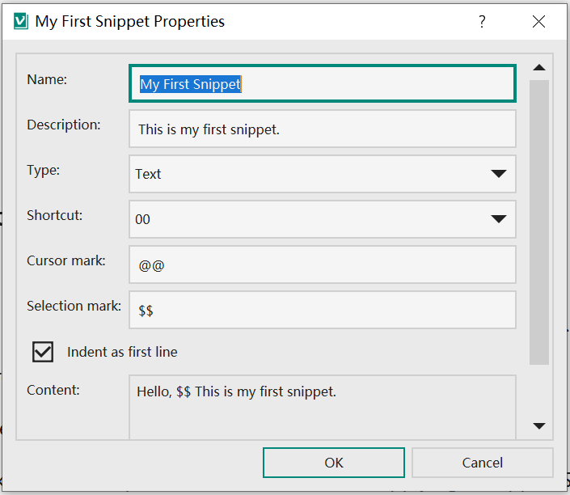

# 片段
片段旨在方便重复输入一些内容。

## 片段管理
每个用户自定义的片段都会对应一个`json`文件。VNote自带内建的片段，例如输入当前日期的片段。内建片段是只读的，并且在名字后面会带有一个`*`后缀。



## 定义一个片段


- 片段名称：一个片段的标识符，用于搜索一个片段。
- 快捷键：可以为片段指定一个两位数的快捷键以便快速输入。
- 光标标记：插入片段后，VNote使用光标标记表示光标的位置。应该只在内容中出现一次。
- 选择标记：VNote使用选择标记来标记插入应用片段前所选文本的位置。选择标记可以在内容中出现多次。插入片段后，所有选择标记都将替换为所选文本。

## 应用片段
### 片段面板
将编辑器光标放在合适的位置，然后双击片段面板中的片段以应用一个片段。

### 快捷键
编辑器中，按`Ctrl+G, I`可以唤出一个包含所有片段的面板。如下图，此时可以直接输入`00`来应用片段`My First Snippet`。或者输入关键字`my`来按名字搜索片段，然后按回车来应用第一个片段。

可以按`Tab`来将焦点转移到片段列表中，此时可以使用`Ctrl+H/J/K/L`来遍历这些项目并按回车应用当前片段。


### 符号
另一个应用片段的简单方法是在编辑器中直接输入`%片段名字%`然后按`Ctrl+G, I`来将该符号翻译到对应的片段`片段名字`。

此外，VNote中很多行编辑框是支持通过符号来应用片段的，例如：

* 新建笔记对话框；
* 新建笔记本对话框；
* 笔记模板；

## 例子
### 插入C++代码块
    ```cpp
    @@
    ```

### 注释掉所选文本
```
<!-- $$@@ -->
```

### 颜色标记
```
<font color=red>$$@@</font>
```

或：

```
<mark>$$@@</mark>
```
